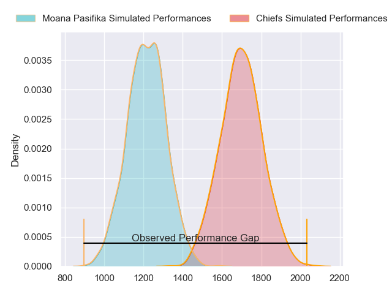
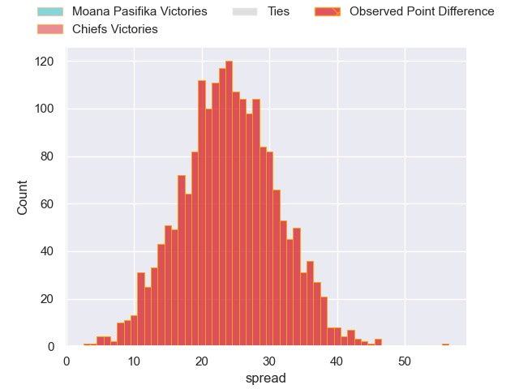
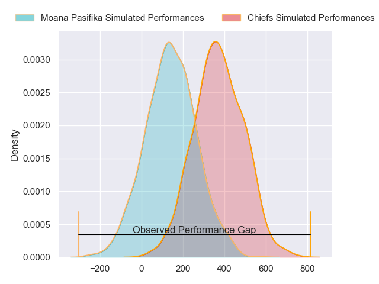
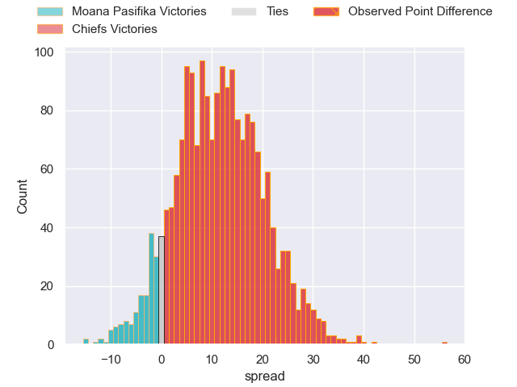
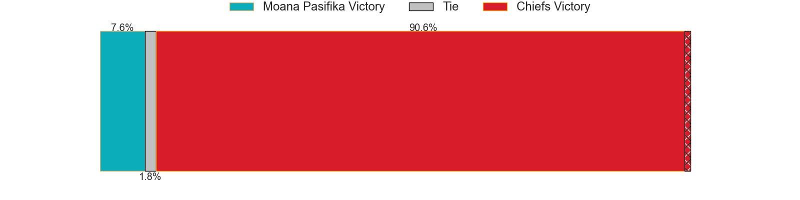

---  
layout: page  
title: Moana Pasifika at Chiefs; 12-68  
date: 2024-04-06 18:00:00 -0500  
categories: "Super Rugby Pacific 2024" match review  
---
# Moana Pasifika at Chiefs; 12-68

# Club Level Predictions

The first set of predictions treats a club as the smallest object, as the club develops its members, organizes a gameplan, and deploys its players as needed for each match. This club model has a prediction of 0.933, which translates to predicting Chiefs to win by 23.9.

Our Over/Under is 71.5 - and combined with the spread above, we have a predicted scoreline of 24 to 48

Each club has a rating and a rating deviation (similar to a Glicko rating), and expected performances can be generated. This allows for simulated matches and spreads like the ones below.
## Projected Performances - Club Model

## Projected Spreads - Club Model

## Projected Results - Club Model

# Player Level Predictions - Version 2

Treating teams instead as an entity made up of the currently active players, I have ratings for each player in an altogether different system. These can be combined to form team ratings once teamsheets are announced, weighting starters a bit higher than the reserves. After the match is played, players can be weighted by their minutes on the field, allowing for an accurate measure of the team's composition. With these compiled team ratings, we can make predictions, measure inaccuracy, and update the individual player ratings.
## Prediction without Player Minutes: Chiefs by 10.7

Chiefs by 6.0 on a neutral pitch

## Projected Performances - Player Model

## Projected Spreads - Player Model

## Projected Results - Player Model

|   Away Minutes | Away Player       |   Away Percentile |   Number |   Home Percentile | Home Player            |   Home Minutes |
|---------------:|:------------------|------------------:|---------:|------------------:|:-----------------------|---------------:|
|             41 | Donald Brighouse  |             10.73 |        1 |             97.44 | Aidan Ross             |             81 |
|             61 | Sama Malolo       |             57.45 |        2 |             91.96 | Samisoni Taukei'aho    |             55 |
|             59 | Sekope Kepu       |             83    |        3 |             26.31 | Reuben O'Neill         |             52 |
|             81 | Tom Savage        |             92    |        4 |             30.55 | Jimmy Tupou            |             59 |
|             54 | Ola Tauelangi     |             35.2  |        5 |             86.4  | Tupou Vaa'i            |             81 |
|             81 | Irie Papuni       |             41.37 |        6 |             91.66 | Samipeni Finau         |             81 |
|             81 | Niko Jones        |             32.1  |        7 |             34.18 | Simon Parker           |             81 |
|             44 | Semisi Paea       |             64.88 |        8 |             27.07 | Wallace Sititi         |             81 |
|             54 | Melani Matavao    |             33.12 |        9 |             68.54 | Te Toiroa Tahuriorangi |             65 |
|             81 | William Havili    |             30.5  |       10 |             97.25 | Damian McKenzie        |             81 |
|             81 | Viliami Fine      |              4.53 |       11 |             16.99 | Peniasi Malimali       |             59 |
|             54 | Julian Savea      |             97.24 |       12 |             66.99 | Rameka Poihipi         |             81 |
|             81 | Fine Inisi        |              6.57 |       13 |             68.91 | Daniel Rona            |             59 |
|             81 | Nigel Ah Wong     |             73.84 |       14 |             88.56 | Emoni Narawa           |             81 |
|             56 | Kyren Taumoefolau |             31.42 |       15 |             33.52 | Etene Nanai-Seturo     |             81 |
|             20 | Samiuela Moli     |              5.69 |       16 |             79.41 | Bradley Slater         |             26 |
|             40 | Abraham Pole      |             20.99 |       17 |             28.11 | Jared Proffit          |             26 |
|             22 | Suetena Asomua    |            nan    |       18 |            nan    | Sione Ahio             |             29 |
|             27 | Michael Curry     |             74.7  |       19 |             93.44 | Naitoa Ah Kuoi         |             22 |
|             37 | Miracle Faiilagi  |             66.05 |       20 |             34.3  | Kaylum Boshier         |              0 |
|             27 | Aisea Halo        |            nan    |       21 |             65.62 | Cortez Ratima          |             16 |
|             25 | Otumaka Mausia    |             69.08 |       22 |             47.13 | Josh Ioane             |             22 |
|             27 | D'Angelo Leuila   |             22.45 |       23 |             86.67 | Anton Lienert-Brown    |             22 |

