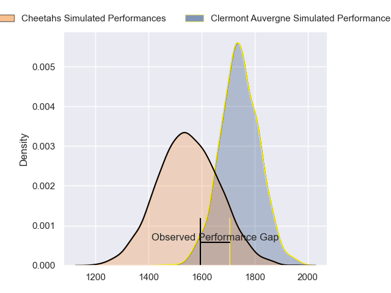
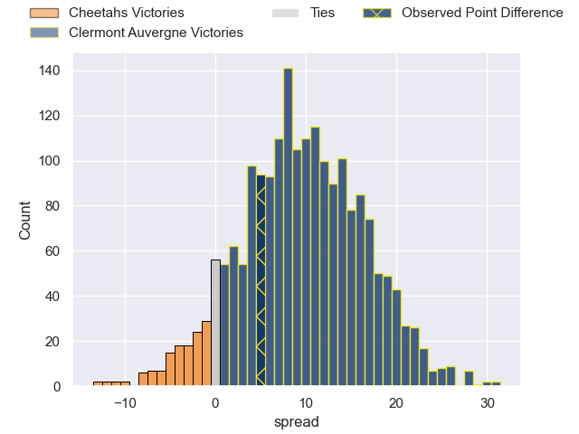
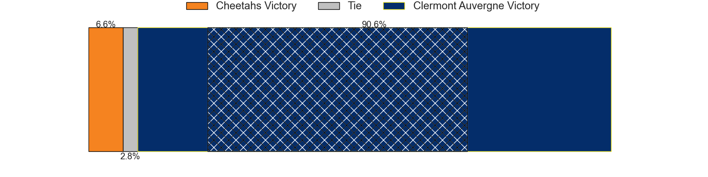
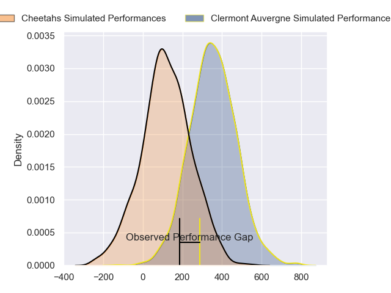
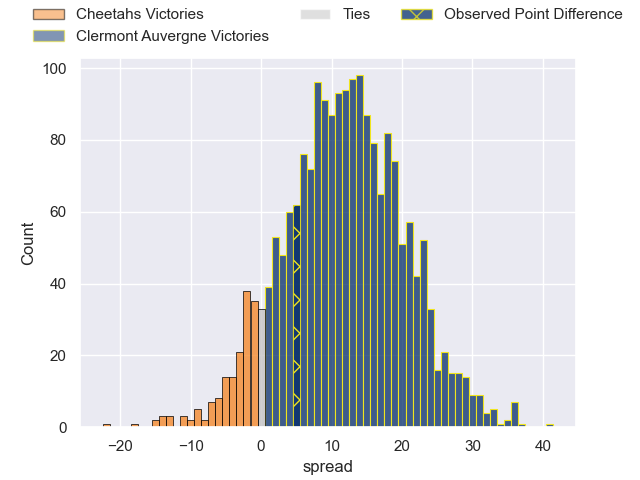
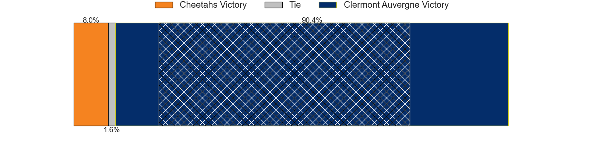

---  
layout: page  
title: Cheetahs at Clermont Auvergne; 22-27  
date: 2024-04-06 18:00:00 -0500  
categories: "European Rugby Challenge Cup 2023" match review  
---
# Cheetahs at Clermont Auvergne; 22-27

# Club Level Predictions

The first set of predictions treats a club as the smallest object, as the club develops its members, organizes a gameplan, and deploys its players as needed for each match. This club model has a prediction of 0.738, which translates to predicting Clermont Auvergne to win by 9.6.

Our Over/Under is 62.5 - and combined with the spread above, we have a predicted scoreline of 27 to 36

Each club has a rating and a rating deviation (similar to a Glicko rating), and expected performances can be generated. This allows for simulated matches and spreads like the ones below.
## Projected Performances - Club Model

## Projected Spreads - Club Model

## Projected Results - Club Model

# Player Level Predictions - Version 2

Treating teams instead as an entity made up of the currently active players, I have ratings for each player in an altogether different system. These can be combined to form team ratings once teamsheets are announced, weighting starters a bit higher than the reserves. After the match is played, players can be weighted by their minutes on the field, allowing for an accurate measure of the team's composition. With these compiled team ratings, we can make predictions, measure inaccuracy, and update the individual player ratings.
## Prediction without Player Minutes: Clermont Auvergne by 13.6

Clermont Auvergne by 6.0 on a neutral pitch

## Projected Performances - Player Model

## Projected Spreads - Player Model

## Projected Results - Player Model

|   Away Minutes | Away Player              |   Away Percentile |   Number |   Home Percentile | Home Player         |   Home Minutes |
|---------------:|:-------------------------|------------------:|---------:|------------------:|:--------------------|---------------:|
|             46 | Schalk Ferreira          |             50.62 |        1 |             18.8  | Giorgi Beria        |             55 |
|             80 | Louis van der Westhuizen |             80    |        2 |             29.8  | Etienne Fourcade    |             80 |
|             68 | Aranos Coetzee           |             14.53 |        3 |             75.69 | Rabah Slimani       |             55 |
|             68 | Carl Wegner              |             51.79 |        4 |             91.53 | Rob Simmons         |             74 |
|             80 | Victor Sekekete          |             60.5  |        5 |             91.65 | Tomas Lavanini      |             54 |
|             48 | Jeandre Rudolph          |             49.94 |        6 |             17.15 | Peceli Yato         |             72 |
|             80 | Oupa Mohoje              |             49.59 |        7 |             69.29 | Alexandre Fischer   |             46 |
|             61 | Friedle Olivier          |             46.34 |        8 |             82.2  | Pita Gus Sowakula   |             80 |
|             80 | Ruan Pienaar             |             50    |        9 |             83.33 | Sebastien Bezy      |             48 |
|             55 | George Lourens           |             43.5  |       10 |             91    | Anthony Belleau     |             80 |
|             80 | Litha Nkula              |             51.98 |       11 |             71.69 | Joris Jurand        |             70 |
|             80 | Andell Loubser           |             45.08 |       12 |             52.94 | Julien Heriteau     |             80 |
|             80 | Munier Hartzenberg       |             45.08 |       13 |             54.98 | Leon Darricarrere   |             80 |
|             68 | Daniel Kasende           |             50.96 |       14 |             76.78 | Bautista Delguy     |             80 |
|             80 | Tapiwa Mafura            |             45.89 |       15 |             69.58 | Alex Newsome        |             80 |
|              0 | Marko Janse van Rensburg |            nan    |       16 |             32.94 | Yohan Beheregaray   |              8 |
|             34 | Alulutho Tshakweni       |            nan    |       17 |             13.77 | Daniel Bibi Biziwu  |             25 |
|             12 | Laurence Victor          |            nan    |       18 |            nan    | Giorgi Dzmanashvili |             25 |
|             12 | Mzwanele Zito            |            nan    |       19 |             11.81 | Paul Jedrasiak      |             32 |
|             32 | Gideon van der Merwe     |            nan    |       20 |             79.37 | Lucas Dessaigne     |             34 |
|             19 | Sibabalo Qoma            |            nan    |       21 |             25.21 | Baptiste Jauneau    |             32 |
|             25 | Abner van Reenen         |            nan    |       22 |            nan    | Theo Giral          |              0 |
|             12 | Rewan Kruger             |            nan    |       23 |             14.95 | Alivereti Raka      |             10 |

