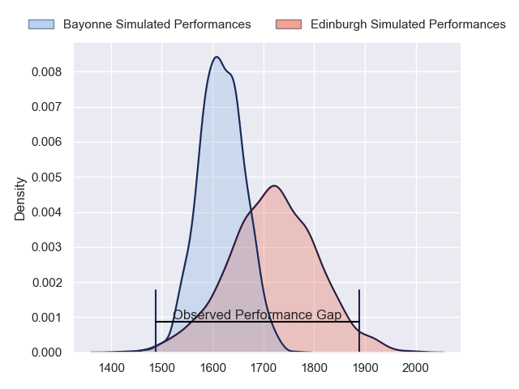
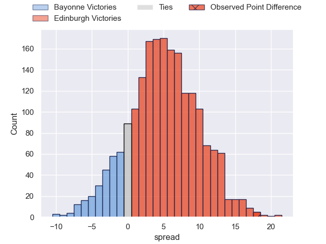
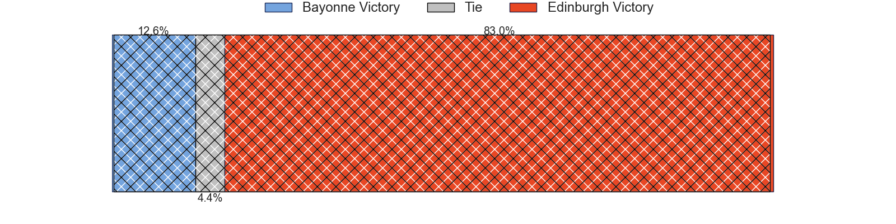
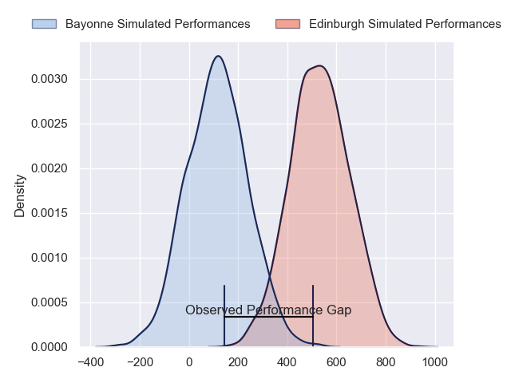
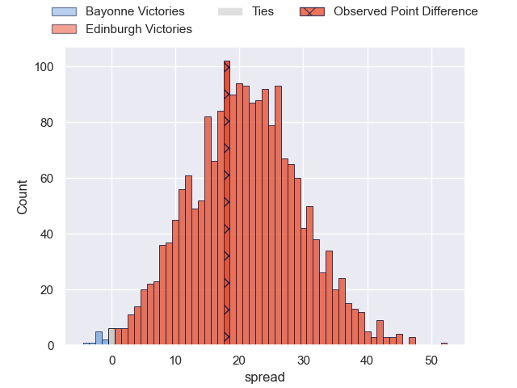
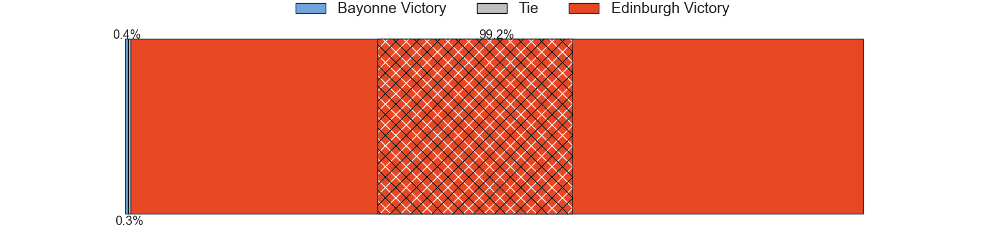

---  
layout: page  
title: Bayonne at Edinburgh; 15-33  
date: 2024-04-06 18:00:00 -0500  
categories: "European Rugby Challenge Cup 2023" match review  
---
# Bayonne at Edinburgh; 15-33

# Club Level Predictions

The first set of predictions treats a club as the smallest object, as the club develops its members, organizes a gameplan, and deploys its players as needed for each match. This club model has a prediction of 0.641, which translates to predicting Edinburgh to win by 5.1.

Our Over/Under is 62.5 - and combined with the spread above, we have a predicted scoreline of 29 to 34

Each club has a rating and a rating deviation (similar to a Glicko rating), and expected performances can be generated. This allows for simulated matches and spreads like the ones below.
## Projected Performances - Club Model

## Projected Spreads - Club Model

## Projected Results - Club Model

# Player Level Predictions - Version 2

Treating teams instead as an entity made up of the currently active players, I have ratings for each player in an altogether different system. These can be combined to form team ratings once teamsheets are announced, weighting starters a bit higher than the reserves. After the match is played, players can be weighted by their minutes on the field, allowing for an accurate measure of the team's composition. With these compiled team ratings, we can make predictions, measure inaccuracy, and update the individual player ratings.
## Prediction without Player Minutes: Edinburgh by 22.2

Edinburgh by 15.6 on a neutral pitch

## Projected Performances - Player Model

## Projected Spreads - Player Model

## Projected Results - Player Model

|   Away Minutes | Away Player           |   Away Percentile |   Number |   Home Percentile | Home Player         |   Home Minutes |
|---------------:|:----------------------|------------------:|---------:|------------------:|:--------------------|---------------:|
|             51 | Quentin Bethune       |             66.1  |        1 |             21.84 | Luan de Bruin       |             76 |
|             51 | Vincent Giudicelli    |             12.16 |        2 |             81.76 | Ewan Ashman         |             58 |
|             65 | Pieter Scholtz        |              2.47 |        3 |             98.96 | WP Nel              |             67 |
|             80 | Thomas Ceyte          |             73.87 |        4 |             77.33 | Sam Skinner         |             80 |
|             51 | Manuel Leindekar      |              8.23 |        5 |             94.75 | Grant Gilchrist     |             66 |
|             80 | Remi Bourdeau         |             93.86 |        6 |            100    | Jamie Ritchie       |             80 |
|             71 | Baptiste Heguy        |             85.17 |        7 |             54.35 | Hamish Watson       |             58 |
|             80 | Manex Ariceta         |             42.93 |        8 |             75.85 | Viliame Mata        |             80 |
|             60 | Guillaume Rouet       |             24.58 |        9 |             77.29 | Ben Vellacott       |             66 |
|             80 | Tom Spring            |             12.75 |       10 |             76.75 | Ben Healy           |             80 |
|             80 | Nadir Megdoud         |             44.73 |       11 |             82.67 | Duhan van der Merwe |             80 |
|             65 | Yan Lestrade          |             91.84 |       12 |             80.07 | Matt Currie         |             80 |
|             80 | Guillaume Martocq     |             16.33 |       13 |             64.35 | Mark Bennett        |             63 |
|             80 | Bastien Pourailly     |              9.29 |       14 |             25.48 | Jacob Henry         |             75 |
|             60 | Aurelien Callandret   |             77.31 |       15 |             92.52 | Wes Goosen          |             80 |
|             29 | Thomas Acquier        |             85.49 |       16 |             56.27 | Dave Cherry         |             22 |
|             29 | Pierre Castillon      |            nan    |       17 |            nan    | Mikey Jones         |              4 |
|             15 | Martin Villar         |            nan    |       18 |             53.18 | D'Arcy Rae          |             13 |
|             29 | Konstantin Mikautadze |              3.82 |       19 |             88.78 | Jamie Hodgson       |             14 |
|              9 | Pierre Huguet         |             38.47 |       20 |             93.74 | Luke Crosbie        |             22 |
|             20 | Kleo Labarbe          |            nan    |       21 |             83.75 | Ali Price           |             14 |
|             20 | Thomas Dolhagaray     |             48.5  |       22 |             92.44 | James Lang          |             17 |
|             15 | Eneriko Buliruarua    |              6.6  |       23 |              9.36 | Chris Dean          |              5 |

