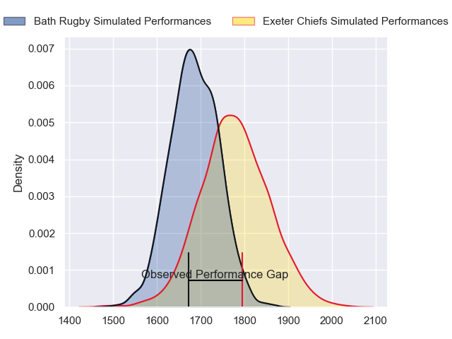
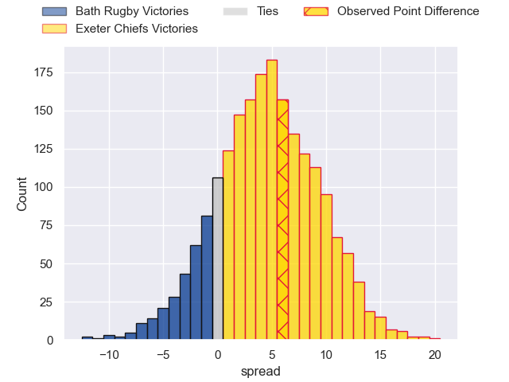
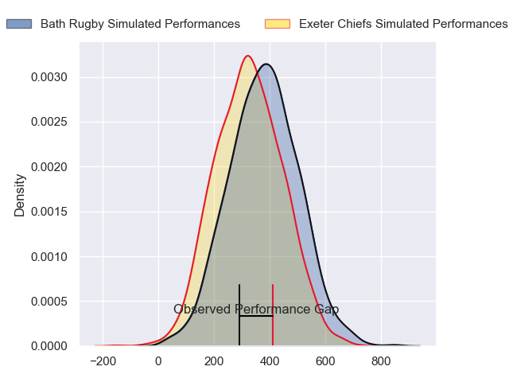
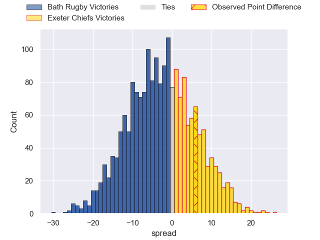

---  
layout: page  
title: Bath Rugby at Exeter Chiefs; 15-21  
date: 2024-04-06 18:00:00 -0500  
categories: "European Rugby Champions Cup 2023" match review  
---
# Bath Rugby at Exeter Chiefs; 15-21

# Club Level Predictions

The first set of predictions treats a club as the smallest object, as the club develops its members, organizes a gameplan, and deploys its players as needed for each match. This club model has a prediction of 0.63, which translates to predicting Exeter Chiefs to win by 4.7.

Our Over/Under is 49.5 - and combined with the spread above, we have a predicted scoreline of 22 to 27

Each club has a rating and a rating deviation (similar to a Glicko rating), and expected performances can be generated. This allows for simulated matches and spreads like the ones below.
## Projected Performances - Club Model

## Projected Spreads - Club Model

## Projected Results - Club Model

# Player Level Predictions - Version 2

Treating teams instead as an entity made up of the currently active players, I have ratings for each player in an altogether different system. These can be combined to form team ratings once teamsheets are announced, weighting starters a bit higher than the reserves. After the match is played, players can be weighted by their minutes on the field, allowing for an accurate measure of the team's composition. With these compiled team ratings, we can make predictions, measure inaccuracy, and update the individual player ratings.
## Prediction without Player Minutes: Bath Rugby by 4.7

Bath Rugby by 9.8 on a neutral pitch

## Projected Performances - Player Model

## Projected Spreads - Player Model

## Projected Results - Player Model

|   Away Minutes | Away Player     |   Away Percentile |   Number |   Home Percentile | Home Player          |   Home Minutes |
|---------------:|:----------------|------------------:|---------:|------------------:|:---------------------|---------------:|
|             62 | Beno Obano      |             84.52 |        1 |             95.63 | Scott Sio            |             49 |
|             62 | Tom Dunn        |             94.71 |        2 |             92.16 | Jack Yeandle         |             68 |
|             62 | Thomas du Toit  |             93.16 |        3 |             53.85 | Ehren Painter        |             49 |
|             69 | Quinn Roux      |             92.72 |        4 |             29    | Rusiate Tuima        |             58 |
|             80 | Charlie Ewels   |             42.6  |        5 |             91.17 | Dafydd Jenkins       |             80 |
|             52 | Ted Hill        |             73.35 |        6 |             76.36 | Ethan Roots          |             80 |
|             70 | Sam Underhill   |             85.75 |        7 |             54    | Christ Tshiunza      |             80 |
|             68 | Alfie Barbeary  |             62.68 |        8 |             66.83 | Ross Vintcent        |             50 |
|             70 | Ben Spencer     |             72.5  |        9 |             69.17 | Tom Cairns           |             58 |
|             15 | Finn Russell    |             99.75 |       10 |             28    | Harvey Skinner       |             80 |
|             80 | Will Muir       |              7.36 |       11 |             90.6  | Olly Woodburn        |             80 |
|             54 | Cameron Redpath |             49.34 |       12 |             33.25 | Ollie Devoto         |             77 |
|             80 | Ollie Lawrence  |             80.31 |       13 |             96.76 | Henry Slade          |             80 |
|             80 | Joe Cokanasiga  |             88.9  |       14 |             80.07 | Immanuel Feyi-Waboso |             80 |
|             80 | Matt Gallagher  |             95.01 |       15 |              2.49 | Josh Hodge           |             80 |
|             28 | Niall Annett    |             53.33 |       16 |             54.51 | Jack Innard          |             12 |
|             18 | Juan Schoeman   |             34    |       17 |            nan    | Danny Southworth     |             31 |
|             18 | Will Stuart     |             18.42 |       18 |             21.75 | Marcus Street        |             31 |
|             11 | Elliott Stooke  |             86.63 |       19 |             43.2  | Lewis Pearson        |             22 |
|             28 | Miles Reid      |             94.55 |       20 |             68.29 | Greg Fisilau         |             30 |
|             36 | Louis Schreuder |             66.67 |       21 |             81.25 | Stu Townsend         |             22 |
|             65 | Orlando Bailey  |             23.25 |       22 |            nan    | Will Haydon-Wood     |              0 |
|             12 | Jaco Coetzee    |             34.88 |       23 |             29.05 | Zack Wimbush         |              3 |

