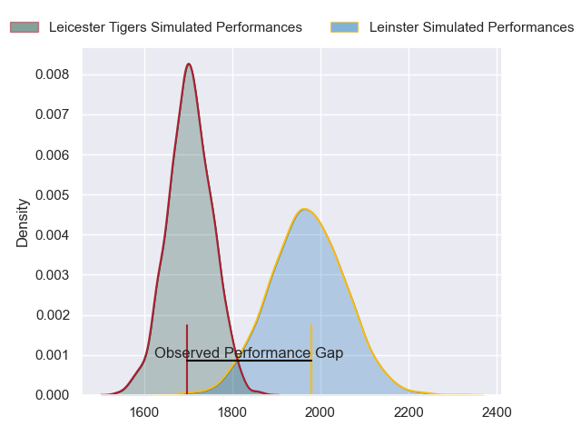
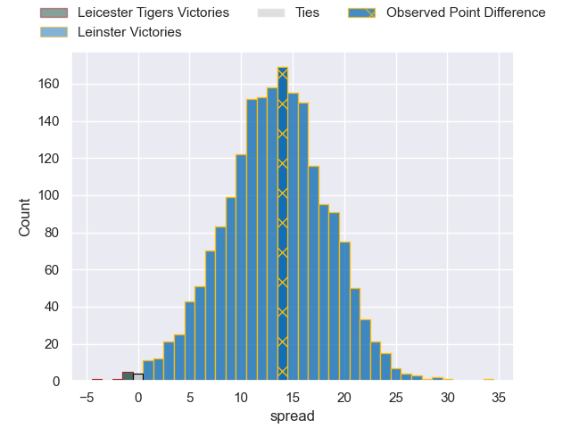
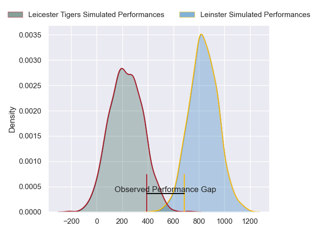
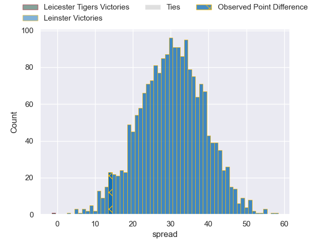
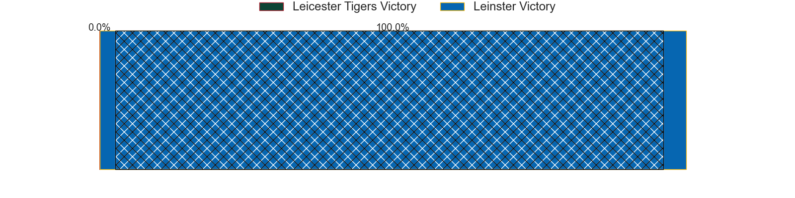

---  
layout: page  
title: Leicester Tigers at Leinster; 22-36  
date: 2024-04-06 18:00:00 -0500  
categories: "European Rugby Champions Cup 2023" match review  
---
# Leicester Tigers at Leinster; 22-36

# Club Level Predictions

The first set of predictions treats a club as the smallest object, as the club develops its members, organizes a gameplan, and deploys its players as needed for each match. This club model has a prediction of 0.82, which translates to predicting Leinster to win by 13.3.

Our Over/Under is 50.5 - and combined with the spread above, we have a predicted scoreline of 18 to 32

Each club has a rating and a rating deviation (similar to a Glicko rating), and expected performances can be generated. This allows for simulated matches and spreads like the ones below.
## Projected Performances - Club Model

## Projected Spreads - Club Model

## Projected Results - Club Model

# Player Level Predictions - Version 2

Treating teams instead as an entity made up of the currently active players, I have ratings for each player in an altogether different system. These can be combined to form team ratings once teamsheets are announced, weighting starters a bit higher than the reserves. After the match is played, players can be weighted by their minutes on the field, allowing for an accurate measure of the team's composition. With these compiled team ratings, we can make predictions, measure inaccuracy, and update the individual player ratings.
## Prediction without Player Minutes: Leinster by 33.9

Leinster by 27.7 on a neutral pitch

## Projected Performances - Player Model

## Projected Spreads - Player Model

## Projected Results - Player Model

|   Away Minutes | Away Player           |   Away Percentile |   Number |   Home Percentile | Home Player         |   Home Minutes |
|---------------:|:----------------------|------------------:|---------:|------------------:|:--------------------|---------------:|
|             51 | James Cronin          |             90.69 |        1 |             92.5  | Andrew Porter       |             50 |
|             73 | Julian Montoya        |             95.1  |        2 |             78.43 | Dan Sheehan         |             53 |
|             56 | Dan Cole              |             44.82 |        3 |             97.91 | Tadhg Furlong       |             53 |
|             80 | Harry Wells           |             78.64 |        4 |             95.11 | Ross Molony         |             80 |
|             71 | Kyle Hatherell        |              1.67 |        5 |             87.47 | Joe McCarthy        |             62 |
|             80 | Hanro Liebenberg      |             85.4  |        6 |             89.11 | Ryan Baird          |             80 |
|             71 | Olly Cracknell        |             31.52 |        7 |             98.73 | Josh van der Flier  |             53 |
|             80 | Jasper Wiese          |             83.66 |        8 |             96.83 | Caelan Doris        |             80 |
|             68 | Jack van Poortvliet   |             73.12 |        9 |             96.88 | Jamison Gibson-Park |             73 |
|             80 | Handre Pollard        |             88.5  |       10 |             96.25 | Ross Byrne          |             68 |
|             80 | Ollie Hassell-Collins |             69.76 |       11 |            100    | James Lowe          |             80 |
|             80 | Solomone Kata         |             39.26 |       12 |             92.68 | Jamie Osborne       |             80 |
|             68 | Dan Kelly             |             82.47 |       13 |             92.8  | Robbie Henshaw      |             80 |
|             73 | Freddie Steward       |             44.51 |       14 |             91.85 | Jordan Larmour      |             80 |
|             80 | Jamie Shillcock       |             28.43 |       15 |             99.25 | Hugo Keenan         |             66 |
|              7 | Charlie Clare         |              7.25 |       16 |             93.73 | Ronan Kelleher      |             27 |
|             29 | Francois van Wyk      |             74.74 |       17 |             94.49 | Cian Healy          |             30 |
|             24 | Will Hurd             |             38.94 |       18 |             95.44 | Michael Ala'alatoa  |             27 |
|              9 | Finn Carnduff         |            nan    |       19 |             80.91 | Jason Jenkins       |             18 |
|              9 | Emeka Ilione          |             35.92 |       20 |             98.54 | Jack Conan          |             27 |
|             12 | Tom Whiteley          |             41.04 |       21 |            nan    | Ben Murphy          |              7 |
|             12 | Phil Cokanasiga       |            nan    |       22 |             89    | Harry Byrne         |             12 |
|              7 | Mike Brown            |             94.68 |       23 |             70.32 | Ciaran Frawley      |             14 |

