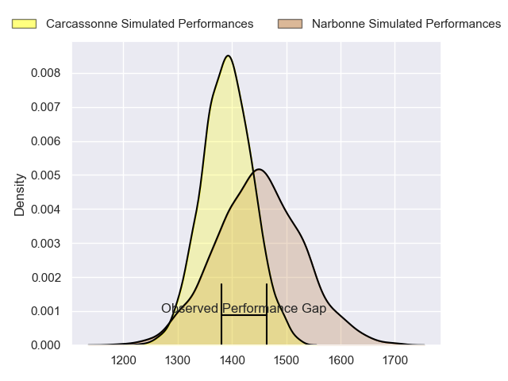
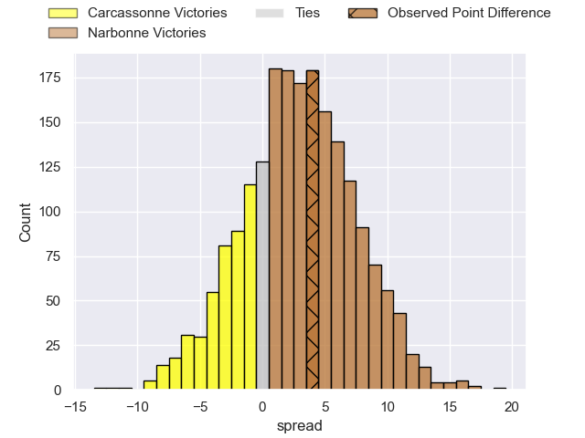
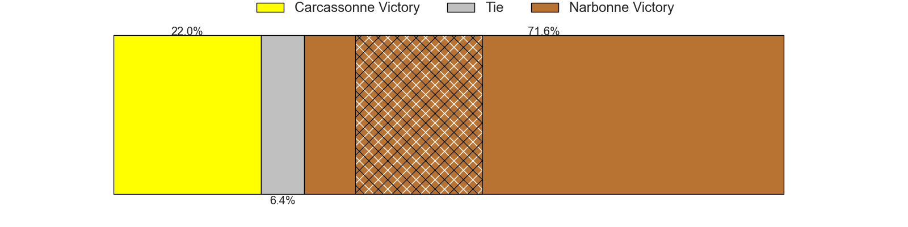
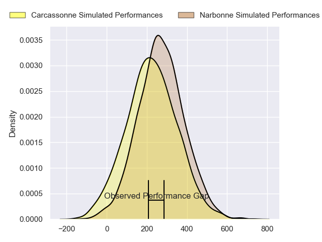
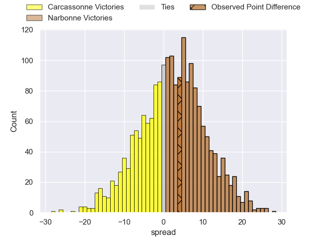
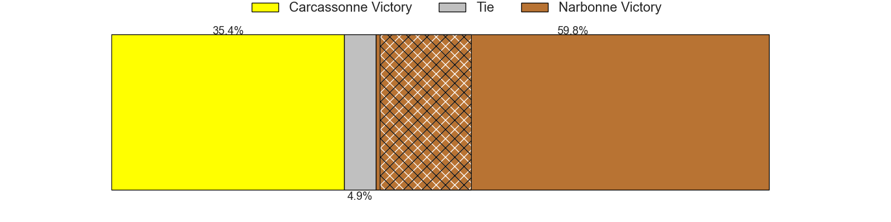

---  
layout: page  
title: Carcassonne at Narbonne; 10-14  
date: 2024-04-06 18:00:00 -0500  
categories: "Nationale 2023" match review  
---
# Carcassonne at Narbonne; 10-14

# Club Level Predictions

The first set of predictions treats a club as the smallest object, as the club develops its members, organizes a gameplan, and deploys its players as needed for each match. This club model has a prediction of 0.581, which translates to predicting Narbonne to win by 2.9.

Our Over/Under is 46.5 - and combined with the spread above, we have a predicted scoreline of 22 to 25

Each club has a rating and a rating deviation (similar to a Glicko rating), and expected performances can be generated. This allows for simulated matches and spreads like the ones below.
## Projected Performances - Club Model

## Projected Spreads - Club Model

## Projected Results - Club Model

# Player Level Predictions - Version 2

Treating teams instead as an entity made up of the currently active players, I have ratings for each player in an altogether different system. These can be combined to form team ratings once teamsheets are announced, weighting starters a bit higher than the reserves. After the match is played, players can be weighted by their minutes on the field, allowing for an accurate measure of the team's composition. With these compiled team ratings, we can make predictions, measure inaccuracy, and update the individual player ratings.
## Prediction without Player Minutes: Narbonne by 2.4

Carcassonne by 5.4 on a neutral pitch

## Projected Performances - Player Model

## Projected Spreads - Player Model

## Projected Results - Player Model

|   Away Minutes | Away Player       |   Away Percentile |   Number |   Home Percentile | Home Player            |   Home Minutes |
|---------------:|:------------------|------------------:|---------:|------------------:|:-----------------------|---------------:|
|             59 | Andrei Ursache    |             95.82 |        1 |             60.21 | Geoffrey Moise         |             48 |
|             72 | Raphael Carbou    |             74.9  |        2 |              9.02 | Clément Esteriola      |             63 |
|             61 | Nikoloz Narmania  |             17.85 |        3 |             76.07 | Levi Tikoipau          |             36 |
|             52 | Romain Manchia    |             55.49 |        4 |              9.31 | Leva Fifita            |             80 |
|             65 | Clément Fontaine  |             34.73 |        5 |             50.95 | Dennis Visser          |             80 |
|             80 | Valentin Sese     |              5.56 |        6 |             80.3  | Thibault Clauzade      |             80 |
|             80 | Etienne Herjean   |             84.24 |        7 |             69.02 | Baptiste Abescat-Leroy |             72 |
|             63 | Shaun Adendorff   |             61.22 |        8 |              2.44 | Charles Malet          |              4 |
|             67 | Gaetan Pichon     |             64.79 |        9 |             55.83 | Pierrick Nova          |             61 |
|             59 | Gabin Michet      |             56.5  |       10 |              3    | Gilles Bosch           |             80 |
|             80 | Clement Egiziano  |             94.56 |       11 |             61.83 | Ambrose Curtis         |             41 |
|             80 | Jordan Puletua    |             70.83 |       12 |             99.4  | Peter Betham           |             80 |
|             80 | Mathys Barka      |              7.56 |       13 |             26.17 | Pierre Nueno           |             80 |
|             80 | Léo Darrelatour   |             92.19 |       14 |              5.78 | Pierre-Hugo Ducom      |             80 |
|             80 | Maxime Gianet     |             91.77 |       15 |             79.8  | Paul Auradou           |             74 |
|             21 | Yan Arnold        |            nan    |       16 |             80.25 | Théo Castinel          |             32 |
|              8 | Baptiste Moreno   |            nan    |       17 |             87.65 | Christophe David       |             17 |
|             19 | Fabien Lorenzon   |             88.41 |       18 |             46.15 | Jamie Hagan            |             44 |
|             28 | Romain Guyot      |             55.01 |       19 |              8.46 | Arthur Christienne     |             76 |
|             15 | Corentin Bousquet |             22.25 |       20 |             48.09 | Morgan Maga            |              8 |
|             17 | Ferdinand Dreno   |             42.18 |       21 |             44.58 | Pablo Barbaste         |             19 |
|             13 | Martin Landajo    |              1.25 |       22 |             56.63 | Sébastien Giorgis      |             39 |
|             21 | Damien Añon       |             74.06 |       23 |             34.5  | Tom Chauvet            |              6 |

