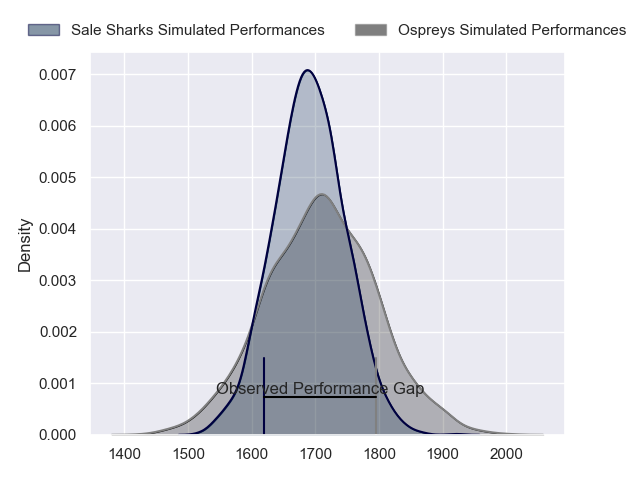
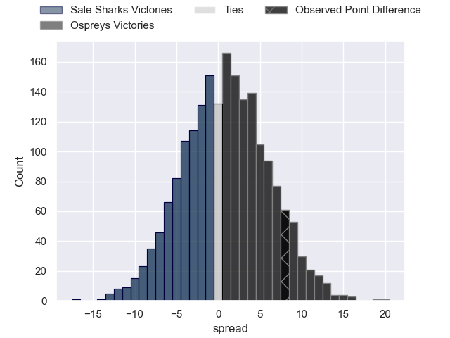
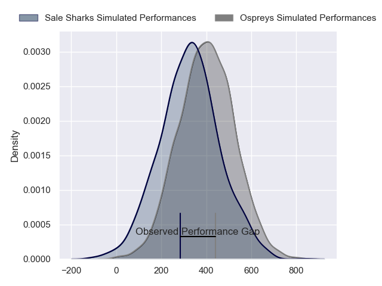
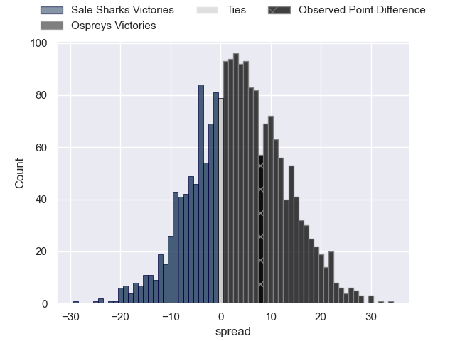

---  
layout: page  
title: Sale Sharks at Ospreys; 15-23  
date: 2024-04-06 18:00:00 -0500  
categories: "European Rugby Challenge Cup 2023" match review  
---
# Sale Sharks at Ospreys; 15-23

# Club Level Predictions

The first set of predictions treats a club as the smallest object, as the club develops its members, organizes a gameplan, and deploys its players as needed for each match. This club model has a prediction of 0.53, which translates to predicting Ospreys to win by 1.1.

Our Over/Under is 52.5 - and combined with the spread above, we have a predicted scoreline of 26 to 27

Each club has a rating and a rating deviation (similar to a Glicko rating), and expected performances can be generated. This allows for simulated matches and spreads like the ones below.
## Projected Performances - Club Model

## Projected Spreads - Club Model

## Projected Results - Club Model

# Player Level Predictions - Version 2

Treating teams instead as an entity made up of the currently active players, I have ratings for each player in an altogether different system. These can be combined to form team ratings once teamsheets are announced, weighting starters a bit higher than the reserves. After the match is played, players can be weighted by their minutes on the field, allowing for an accurate measure of the team's composition. With these compiled team ratings, we can make predictions, measure inaccuracy, and update the individual player ratings.
## Prediction without Player Minutes: Ospreys by 4.3

Sale Sharks by 1.5 on a neutral pitch

## Projected Performances - Player Model

## Projected Spreads - Player Model

## Projected Results - Player Model

|   Away Minutes | Away Player          |   Away Percentile |   Number |   Home Percentile | Home Player            |   Home Minutes |
|---------------:|:---------------------|------------------:|---------:|------------------:|:-----------------------|---------------:|
|             50 | Ross Harrison        |             89.17 |        1 |             65.81 | Gareth Thomas          |             53 |
|             50 | Agustin Creevy       |             94.12 |        2 |             58.24 | Lewis Lloyd            |             79 |
|             50 | Asher Opoku-Fordjour |             48.05 |        3 |             78.44 | Tom Botha              |             64 |
|             70 | Ben Bamber           |             22.55 |        4 |             65.99 | James Ratti            |             80 |
|             56 | Hyron Andrews        |             23.63 |        5 |             94.51 | Adam Beard             |             80 |
|             80 | Ben Curry            |             31.4  |        6 |             81.69 | Harri Deaves           |             64 |
|             80 | Sam Dugdale          |             12.05 |        7 |             98.38 | Justin Tipuric         |             80 |
|             80 | Jean-Luc du Preez    |             98.78 |        8 |              9.27 | Morgan Morris          |             80 |
|             56 | Raffi Quirke         |             59.17 |        9 |             68.75 | Reuben Morgan-Williams |             56 |
|             80 | Robert du Preez      |             44.5  |       10 |             92.5  | Owen Williams          |             80 |
|             80 | Arron Reed           |             69.08 |       11 |             10.53 | Keelan Giles           |             77 |
|             80 | Rekeiti Ma'asi-White |             31.21 |       12 |             97.6  | Owen Watkin            |             80 |
|             80 | Sam James            |             82.11 |       13 |             80.43 | Keiran Williams        |             80 |
|             80 | Tom O'Flaherty       |             92.07 |       14 |             13.59 | Luke Morgan            |             80 |
|             74 | Telusa Veainu        |             99.75 |       15 |             64.34 | Jack Walsh             |             80 |
|             30 | Tommy Taylor         |             13.92 |       16 |            nan    | Chris Moore            |              1 |
|             30 | Simon McIntyre       |             90.5  |       17 |             50.52 | Nicky Smith            |             27 |
|             30 | James Harper         |             11.21 |       18 |             84.33 | Rhys Henry             |             16 |
|             34 | Tom Ellis            |            nan    |       19 |            nan    | Huw Owen-Sutton        |              0 |
|              0 | Cameron Neild        |            nan    |       20 |            nan    | Morgan Morse           |             16 |
|             24 | Nye Thomas           |            nan    |       21 |             56.88 | Luke Davies            |             24 |
|              6 | Connor Doherty       |            nan    |       22 |             58    | Dan Edwards            |              0 |
|              0 | Alex Wills           |            nan    |       23 |             72.82 | Max Nagy               |              3 |

