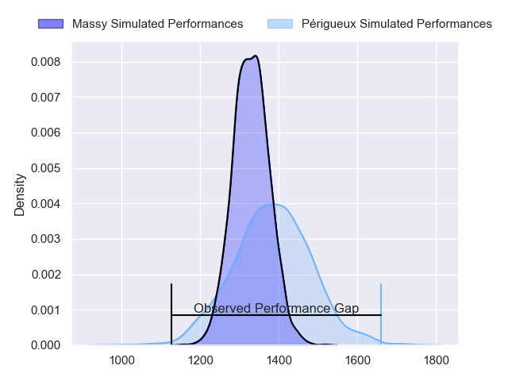
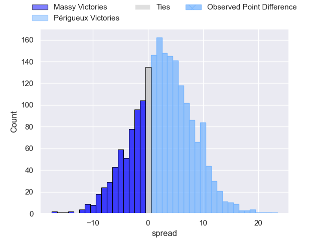
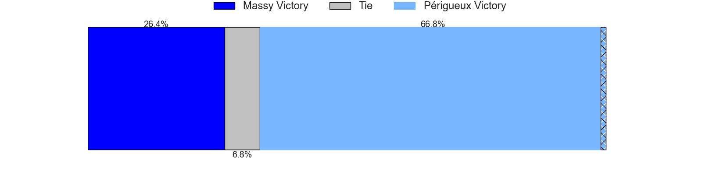
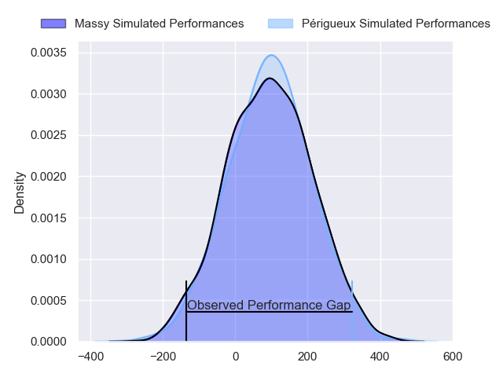
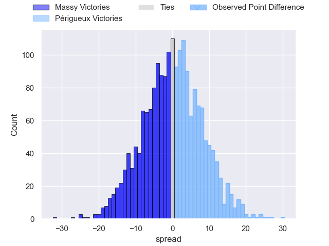
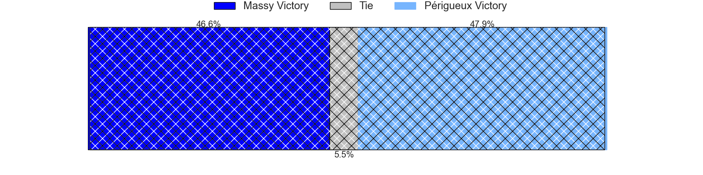

---  
layout: page  
title: Massy at Perigueux; 3-26  
date: 2024-04-06 18:00:00 -0500  
categories: "Nationale 2023" match review  
---
# Massy at Perigueux; 3-26

# Club Level Predictions

The first set of predictions treats a club as the smallest object, as the club develops its members, organizes a gameplan, and deploys its players as needed for each match. This club model has a prediction of 0.579, which translates to predicting Périgueux to win by 2.8.

Our Over/Under is 45.5 - and combined with the spread above, we have a predicted scoreline of 21 to 24

Each club has a rating and a rating deviation (similar to a Glicko rating), and expected performances can be generated. This allows for simulated matches and spreads like the ones below.
## Projected Performances - Club Model

## Projected Spreads - Club Model

## Projected Results - Club Model

# Player Level Predictions - Version 2

Treating teams instead as an entity made up of the currently active players, I have ratings for each player in an altogether different system. These can be combined to form team ratings once teamsheets are announced, weighting starters a bit higher than the reserves. After the match is played, players can be weighted by their minutes on the field, allowing for an accurate measure of the team's composition. With these compiled team ratings, we can make predictions, measure inaccuracy, and update the individual player ratings.
## Prediction without Player Minutes: Périgueux by 0.7

Massy by 1.8 on a neutral pitch

## Projected Performances - Player Model

## Projected Spreads - Player Model

## Projected Results - Player Model

|   Away Minutes | Away Player              |   Away Percentile |   Number |   Home Percentile | Home Player       |   Home Minutes |
|---------------:|:-------------------------|------------------:|---------:|------------------:|:------------------|---------------:|
|             47 | Fernandez Correa         |              1.23 |        1 |             41.88 | Jason Tindiliere  |             40 |
|             47 | Pierre-Alexandre Duclieu |             27.06 |        2 |             56.67 | Lucas Marijon     |             40 |
|             47 | Nolan Pienaar            |             40.65 |        3 |             40.93 | Martin Augeix     |             40 |
|             80 | Lilian Rousset           |             30.07 |        4 |             16.23 | Richard Fourcade  |             59 |
|             55 | Saba Pesvianidze         |             70.76 |        5 |             66.47 | Mathieu Pace      |             40 |
|             55 | Tony Tissot              |             44.26 |        6 |             15.41 | Hendri Storm      |             40 |
|             80 | Alexandre Loubiere       |             66.28 |        7 |             14.72 | Madioke Konate    |             80 |
|             80 | Samuel Nollet            |             22.2  |        8 |             50.73 | Clement Lanen     |             80 |
|             47 | Lucas Rubio              |             29.38 |        9 |              7.5  | Matteo Bordenave  |             59 |
|             80 | Hugo Verdu               |             14    |       10 |             71.25 | Greg Hutley       |             80 |
|             80 | Yanis Dit Robaglia       |             14.5  |       11 |              8.27 | Benjamin Yarde    |             80 |
|             80 | Victorien Jacomme        |             66.51 |       12 |             74.43 | Fred Hickes       |             59 |
|             47 | Kimami Sitauti           |              0.36 |       13 |             34.57 | Cyril Couturier   |             80 |
|             80 | Alex Preira              |             79.5  |       14 |             92.64 | Vincent Fouillade |             80 |
|             34 | Tom Deleuze              |             24.94 |       15 |             46.38 | Djamel Ouchene    |             80 |
|             46 | Giorgi Gogoladze         |             56.74 |       16 |             36.27 | Baptiste Arvouet  |             40 |
|             33 | Robin Poipy              |             45.2  |       17 |             12.89 | Jaco Willemse     |             40 |
|             33 | Jayson Rodrigues         |            nan    |       18 |             36.18 | Anthony Pelmard   |             40 |
|             33 | Benjamin Prier           |             76.46 |       19 |             82.73 | Afaesetiti Amosa  |             40 |
|             33 | Tom Cusson               |             27.01 |       20 |            nan    | Emilien Borges    |             40 |
|             33 | Nicolas Ferrer           |             62.96 |       21 |             36.46 | Enzo Hardy        |             21 |
|             25 | Clément Vidoni           |             54.46 |       22 |             82.11 | Arthur Duhau      |             21 |
|             25 | Marius Ruyffelaere       |             36.38 |       23 |             24.39 | Karl Lambert      |             21 |

