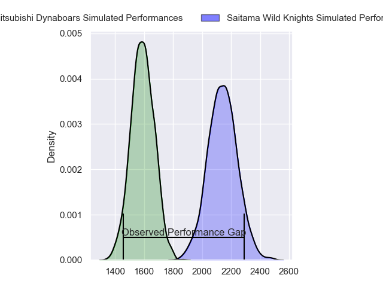
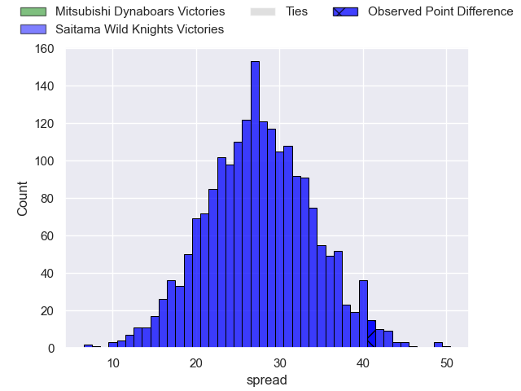
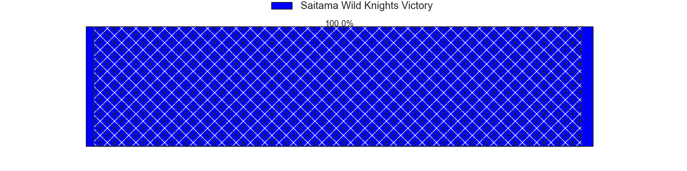
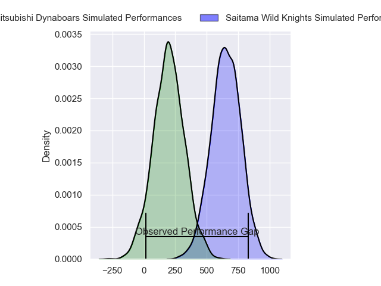
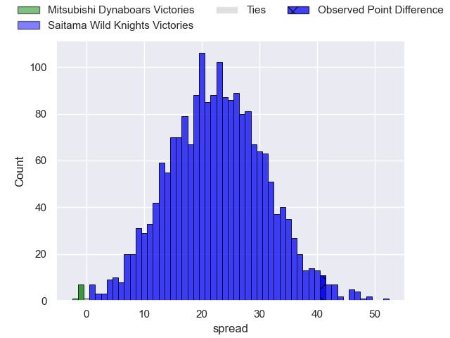
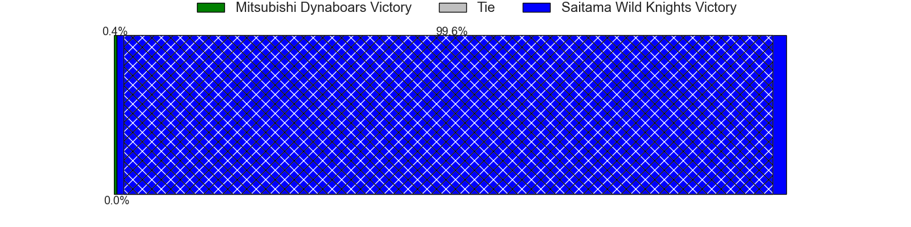

---  
layout: page  
title: Mitsubishi Dynaboars at Saitama Wild Knights; 12-53  
date: 2024-04-06 18:00:00 -0500  
categories: "Japan Rugby League One 2023" match review  
---
# Mitsubishi Dynaboars at Saitama Wild Knights; 12-53

# Club Level Predictions

The first set of predictions treats a club as the smallest object, as the club develops its members, organizes a gameplan, and deploys its players as needed for each match. This club model has a prediction of 0.956, which translates to predicting Saitama Wild Knights to win by 27.6.

Our Over/Under is 61.5 - and combined with the spread above, we have a predicted scoreline of 17 to 45

Each club has a rating and a rating deviation (similar to a Glicko rating), and expected performances can be generated. This allows for simulated matches and spreads like the ones below.
## Projected Performances - Club Model

## Projected Spreads - Club Model

## Projected Results - Club Model

# Player Level Predictions - Version 2

Treating teams instead as an entity made up of the currently active players, I have ratings for each player in an altogether different system. These can be combined to form team ratings once teamsheets are announced, weighting starters a bit higher than the reserves. After the match is played, players can be weighted by their minutes on the field, allowing for an accurate measure of the team's composition. With these compiled team ratings, we can make predictions, measure inaccuracy, and update the individual player ratings.
## Prediction without Player Minutes: Saitama Wild Knights by 26.3

Saitama Wild Knights by 22.8 on a neutral pitch

## Projected Performances - Player Model

## Projected Spreads - Player Model

## Projected Results - Player Model

|   Away Minutes | Away Player            |   Away Percentile |   Number |   Home Percentile | Home Player       |   Home Minutes |
|---------------:|:-----------------------|------------------:|---------:|------------------:|:------------------|---------------:|
|             44 | Mototsugu Hachiya      |             13.87 |        1 |             58.78 | Daniel Perez      |             56 |
|             44 | Yoshimitsu Yasue       |             76.47 |        2 |             88.43 | Atsushi Sakate    |             46 |
|             44 | Kanzo Schinckel        |             43.49 |        3 |             97.63 | Asaeli Ai Valu    |             52 |
|             47 | Walt Steenkamp         |             69.93 |        4 |             64.44 | Liam Mitchell     |             80 |
|             80 | Epineri Uluiviti       |             10.62 |        5 |             21.96 | Mark Abbott       |             80 |
|             80 | Kyo Yoshida            |             78.22 |        6 |             95.71 | Ben Gunter        |             56 |
|             53 | Masataka Tsuruya       |             89.8  |        7 |             98.61 | Lachlan Boshier   |             60 |
|             80 | Marino Mikaele-Tu'u    |             20.73 |        8 |             96.59 | Jack Cornelsen    |             80 |
|             63 | Kota Iwamura           |             77.71 |        9 |             93.96 | Taiki Koyama      |             56 |
|             80 | James Grayson          |             68    |       10 |             99    | Rikiya Matsuda    |             67 |
|             80 | Honeti Taumoha'apai    |             69.31 |       11 |             95.02 | Marika Koroibete  |             80 |
|             47 | Curtis Rona            |             84.75 |       12 |             98.8  | Damian de Allende |             28 |
|             65 | Joichiro Iwashita      |             63.75 |       13 |             98.44 | Dylan Riley       |             80 |
|             80 | Ben Paltridge          |             59.46 |       14 |             96.76 | Ryuji Noguchi     |             80 |
|             80 | Kazuki Ishida          |             10.97 |       15 |             82.29 | Kyohei Yamasawa   |             80 |
|             36 | Hayato Hosoda          |              7.41 |       16 |             69.15 | Tomoki Osada      |             52 |
|             36 | Yuki Miyazato          |             40.2  |       17 |             97.06 | Shota Horie       |             34 |
|             36 | Chinen Yu              |             45.01 |       18 |             85.94 | Taiki Fujii       |             28 |
|             33 | Daniel Linde           |             31.98 |       19 |             73.69 | Craig Millar      |             24 |
|             33 | Matt Vaega             |             52.58 |       20 |             98.12 | Keisuke Uchida    |             24 |
|             27 | Shunsuke Sakamoto      |             21.94 |       21 |             75.78 | Shota Fukui       |             24 |
|             17 | Ryoto Fukuyama         |            nan    |       22 |             92.93 | Itsuki Onishi     |             20 |
|             15 | To'o Junior (TJ) Vaega |            nan    |       23 |             94.76 | Takuya Yamasawa   |             13 |

