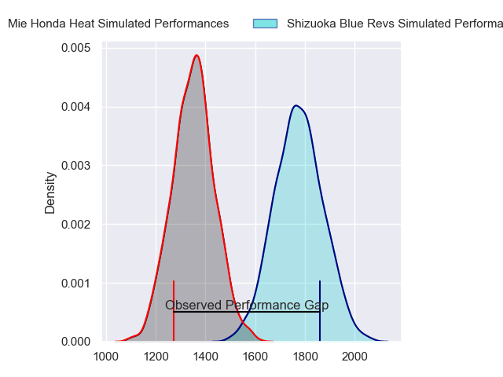
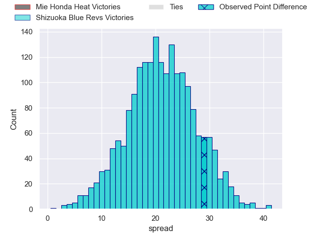
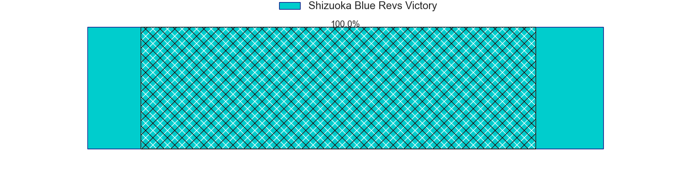
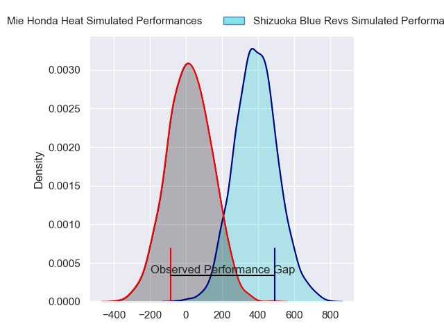
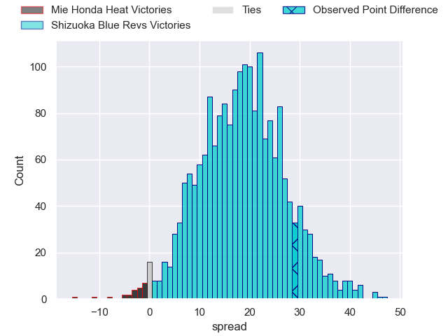
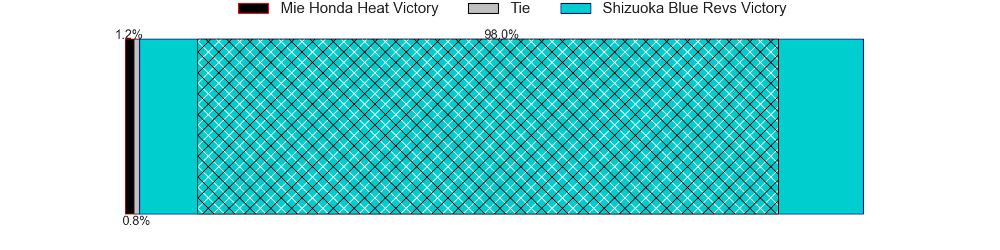

---  
layout: page  
title: Mie Honda Heat at Shizuoka Blue Revs; 14-43  
date: 2024-04-06 18:00:00 -0500  
categories: "Japan Rugby League One 2023" match review  
---
# Mie Honda Heat at Shizuoka Blue Revs; 14-43

# Club Level Predictions

The first set of predictions treats a club as the smallest object, as the club develops its members, organizes a gameplan, and deploys its players as needed for each match. This club model has a prediction of 0.913, which translates to predicting Shizuoka Blue Revs to win by 21.1.

Our Over/Under is 70.5 - and combined with the spread above, we have a predicted scoreline of 24 to 46

Each club has a rating and a rating deviation (similar to a Glicko rating), and expected performances can be generated. This allows for simulated matches and spreads like the ones below.
## Projected Performances - Club Model

## Projected Spreads - Club Model

## Projected Results - Club Model

# Player Level Predictions - Version 2

Treating teams instead as an entity made up of the currently active players, I have ratings for each player in an altogether different system. These can be combined to form team ratings once teamsheets are announced, weighting starters a bit higher than the reserves. After the match is played, players can be weighted by their minutes on the field, allowing for an accurate measure of the team's composition. With these compiled team ratings, we can make predictions, measure inaccuracy, and update the individual player ratings.
## Prediction without Player Minutes: Shizuoka Blue Revs by 19.5

Shizuoka Blue Revs by 16.3 on a neutral pitch

## Projected Performances - Player Model

## Projected Spreads - Player Model

## Projected Results - Player Model

|   Away Minutes | Away Player           |   Away Percentile |   Number |   Home Percentile | Home Player        |   Home Minutes |
|---------------:|:----------------------|------------------:|---------:|------------------:|:-------------------|---------------:|
|             40 | Tatsuhiko Tsurukawa   |              2.85 |        1 |             44.92 | Takayoshi Mohara   |             64 |
|             58 | Lee Seung Hyok        |              5.49 |        2 |             96.27 | Takeshi Hino       |             64 |
|              8 | Taiki Yoshioka        |             11.11 |        3 |             56.6  | Sean Vete          |             43 |
|             51 | Tetuhi Roberts        |             12.29 |        4 |             85.92 | Eishin Kuwano      |             64 |
|             80 | Franco Mostert        |             89.98 |        5 |             94.27 | Murray Douglas     |             80 |
|             80 | Ryota Kobayashi       |              3.71 |        6 |             95.02 | Yuya Odo           |             80 |
|             80 | Kosuke Hattori        |             49.25 |        7 |             49.71 | Shoji Takuma       |             66 |
|              8 | Heiden Bedwell-Curtis |             15.85 |        8 |             51.95 | Malgene Ilaua      |             64 |
|             40 | Kenta Yamaji          |             19.17 |        9 |             96.67 | Bryn Hall          |             66 |
|             80 | Gwangtee Oh           |             17.5  |       10 |             25.75 | Kakeru Okumura     |             80 |
|             80 | Kanta Watanabe        |             23.22 |       11 |             81.88 | Malo Tuitama       |             80 |
|             65 | Fraser Quirk          |              4.8  |       12 |             76.11 | Jonathan Faauli    |             80 |
|             51 | Tevita Li             |             93.88 |       13 |             87.39 | Charles Piutau     |             80 |
|             80 | Haruhiko Uemura       |             14.38 |       14 |             62.85 | Keagan Faria       |             62 |
|             80 | Tom Banks             |             81.05 |       15 |             71.07 | Futo Yamaguchi     |             80 |
|             72 | Matthys Basson        |             21.37 |       16 |             88.6  | Heiichiro Ito      |             37 |
|             72 | Ryo Furuta            |              2.2  |       17 |            nan    | Shunsuke Ito       |             18 |
|             40 | Takumi Fuji           |             14.81 |       18 |             32.19 | Kenta Yamashita    |             16 |
|             40 | Taichi Takenaka       |            nan    |       19 |            nan    | Richmond Tongatama |             16 |
|             29 | Connor Wihongi        |            nan    |       20 |            nan    | Jack Wright        |             16 |
|             29 | Mitch Hunt            |             64    |       21 |            nan    | Riki Sugihara      |             16 |
|             22 | Koki Hida             |            nan    |       22 |             51.1  | Richard Goh Jones  |             14 |
|             15 | Soki Watanabe         |             15.73 |       23 |             50.62 | Yuki Yatomi        |             14 |

