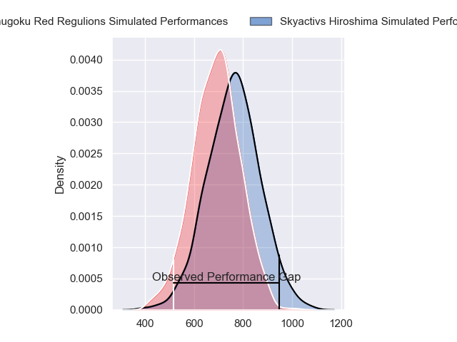
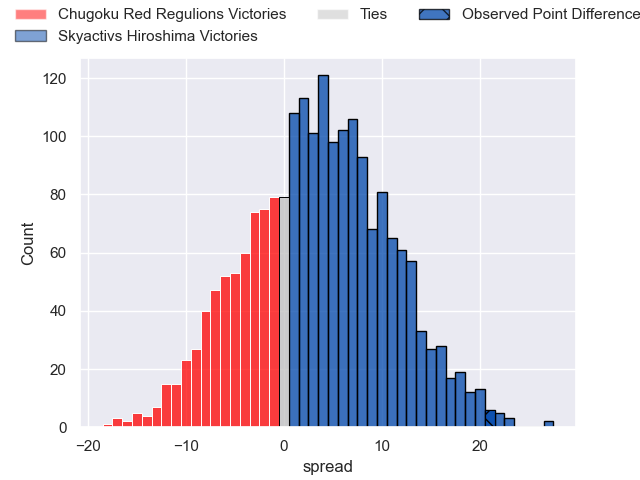
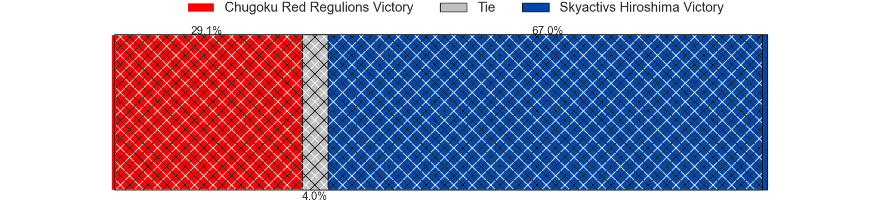
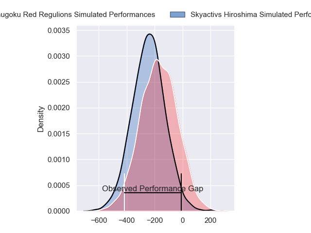
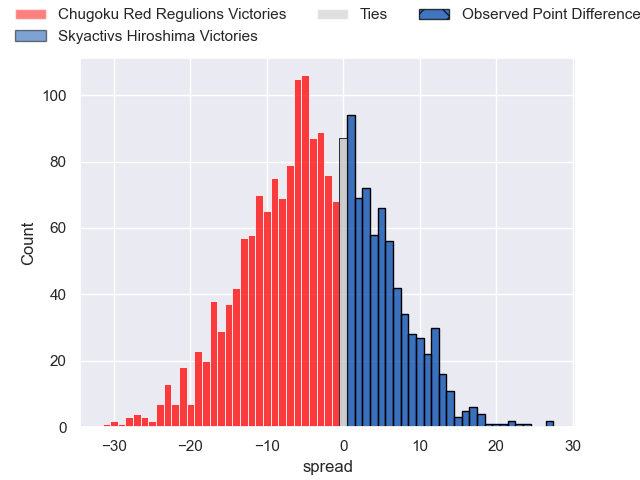
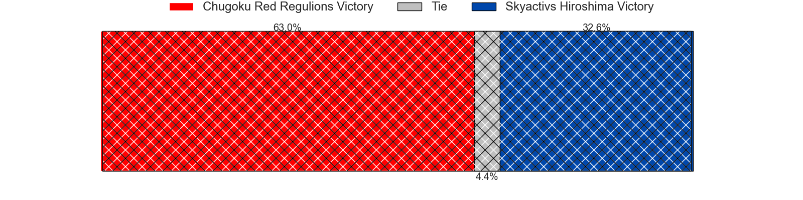

---  
layout: page  
title: Chugoku Red Regulions at Skyactivs Hiroshima; 22-43  
date: 2024-04-06 18:00:00 -0500  
categories: "Japan Rugby League One D3 2023" match review  
---
# Chugoku Red Regulions at Skyactivs Hiroshima; 22-43

# Club Level Predictions

The first set of predictions treats a club as the smallest object, as the club develops its members, organizes a gameplan, and deploys its players as needed for each match. This club model has a prediction of 0.601, which translates to predicting Skyactivs Hiroshima to win by 3.7.

Our Over/Under is 64.5 - and combined with the spread above, we have a predicted scoreline of 31 to 34

Each club has a rating and a rating deviation (similar to a Glicko rating), and expected performances can be generated. This allows for simulated matches and spreads like the ones below.
## Projected Performances - Club Model

## Projected Spreads - Club Model

## Projected Results - Club Model

# Player Level Predictions - Version 2

Treating teams instead as an entity made up of the currently active players, I have ratings for each player in an altogether different system. These can be combined to form team ratings once teamsheets are announced, weighting starters a bit higher than the reserves. After the match is played, players can be weighted by their minutes on the field, allowing for an accurate measure of the team's composition. With these compiled team ratings, we can make predictions, measure inaccuracy, and update the individual player ratings.
## Prediction without Player Minutes: Chugoku Red Regulions by 6.0

Chugoku Red Regulions by 8.4 on a neutral pitch

## Projected Performances - Player Model

## Projected Spreads - Player Model

## Projected Results - Player Model

|   Away Minutes | Away Player       |   Away Percentile |   Number |   Home Percentile | Home Player        |   Home Minutes |
|---------------:|:------------------|------------------:|---------:|------------------:|:-------------------|---------------:|
|             72 | Kojiro Arito      |              5.51 |        1 |             26.59 | Tomonori Koyanagi  |             50 |
|             61 | Kentaro Iwanaga   |              4.71 |        2 |             46.86 | Taichi Yoko        |             57 |
|             78 | Kento Miyata      |             27.64 |        3 |              0.19 | Yuta Takami        |             57 |
|             80 | Taro Nishikawa    |              0.24 |        4 |             41.41 | Yutaro Tanaka      |             72 |
|             74 | Tomonari Aoki     |             18.62 |        5 |              3.7  | Lachlan Osborne    |             80 |
|             80 | Kouta Moriyama    |              1.27 |        6 |             25.84 | Iori Suzuki        |             80 |
|             80 | Ed Quirk          |              0.35 |        7 |              1.39 | Tomoki Ashida      |             80 |
|             40 | Shun Kawaguchi    |              1.46 |        8 |              8.29 | Tevin Ferris       |             54 |
|             61 | Rintaro Kawashima |             12.5  |        9 |              1.67 | Dai Goto           |             80 |
|             80 | Miyazaki Hayato   |             42.5  |       10 |              0.75 | Beaudein Waaka     |             72 |
|             68 | Masahiro Nakano   |              3.74 |       11 |             16.42 | Hayato Kanamuru    |             50 |
|             40 | Shinya Hirayama   |             18.37 |       12 |             46.82 | Jacob Abel         |             80 |
|             80 | Masaaki Morita    |              1.8  |       13 |              2.76 | Haruki Kitajima    |             80 |
|             80 | Kentaro Fujii     |             12.23 |       14 |             62.97 | Yuto Nanamura      |             80 |
|             80 | Kennta Kitayama   |             37.16 |       15 |              0.25 | Ginjiro Sakiguchi  |             67 |
|             40 | Hashizo Yoshida   |             10.2  |       16 |             36.61 | Shunya Motoyama    |             30 |
|             40 | Shintaro Matsuda  |             15.87 |       17 |              0.47 | Koshi Kato         |             30 |
|             19 | Yuuki Asai        |              7.06 |       18 |             20.49 | Jackson Pugh       |             26 |
|             19 | Shohei Tsukamoto  |              2.29 |       19 |             55.65 | Tadatsugu Kanayama |             23 |
|             12 | Keigo Hatanaka    |              3.06 |       20 |             44.84 | Koki Nakano        |             23 |
|              8 | Keisuke Maeda     |             37.32 |       21 |              0.25 | Ryoutarou Saito    |             13 |
|              6 | Noriyuki Kureyama |             16.83 |       22 |            nan    | Kaiha Noda         |              8 |
|              2 | Daiki Ishida      |            nan    |       23 |            nan    | Shuhei Lee         |              8 |

