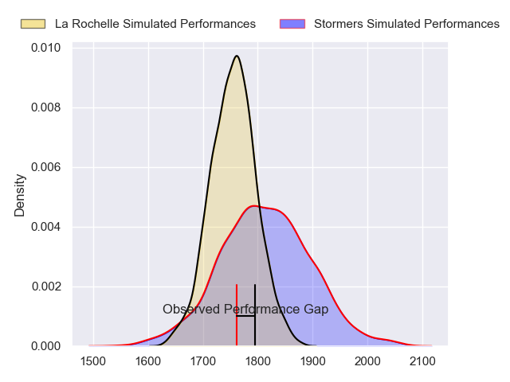
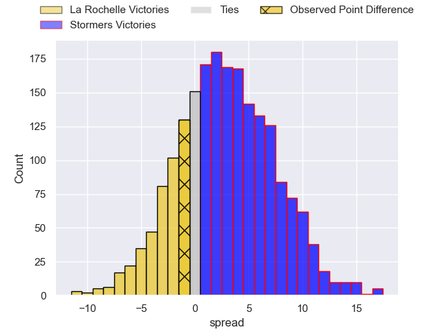
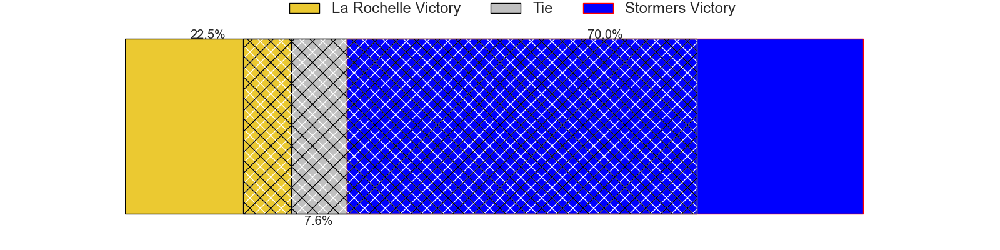
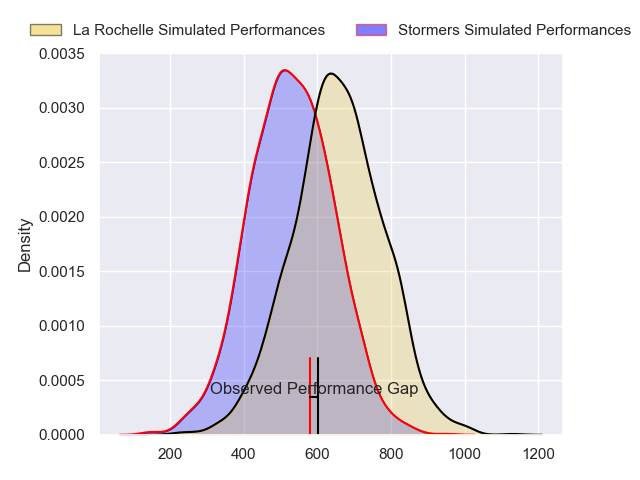
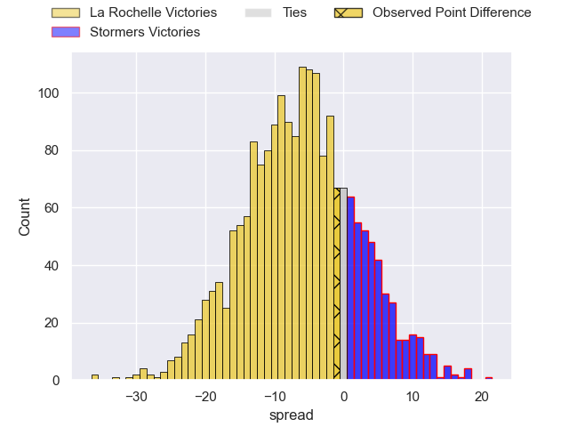
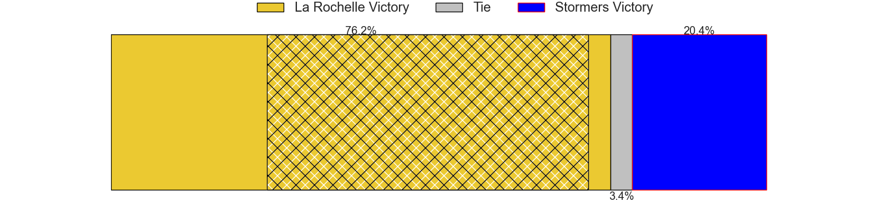

---  
layout: page  
title: La Rochelle at Stormers; 22-21  
date: 2024-04-06 18:00:00 -0500  
categories: "European Rugby Champions Cup 2023" match review  
---
# La Rochelle at Stormers; 22-21

# Club Level Predictions

The first set of predictions treats a club as the smallest object, as the club develops its members, organizes a gameplan, and deploys its players as needed for each match. This club model has a prediction of 0.583, which translates to predicting Stormers to win by 2.9.

Our Over/Under is 40.5 - and combined with the spread above, we have a predicted scoreline of 19 to 22

Each club has a rating and a rating deviation (similar to a Glicko rating), and expected performances can be generated. This allows for simulated matches and spreads like the ones below.
## Projected Performances - Club Model

## Projected Spreads - Club Model

## Projected Results - Club Model

# Player Level Predictions - Version 2

Treating teams instead as an entity made up of the currently active players, I have ratings for each player in an altogether different system. These can be combined to form team ratings once teamsheets are announced, weighting starters a bit higher than the reserves. After the match is played, players can be weighted by their minutes on the field, allowing for an accurate measure of the team's composition. With these compiled team ratings, we can make predictions, measure inaccuracy, and update the individual player ratings.
## Prediction without Player Minutes: La Rochelle by 3.4

La Rochelle by 8.0 on a neutral pitch

## Projected Performances - Player Model

## Projected Spreads - Player Model

## Projected Results - Player Model

|   Away Minutes | Away Player        |   Away Percentile |   Number |   Home Percentile | Home Player          |   Home Minutes |
|---------------:|:-------------------|------------------:|---------:|------------------:|:---------------------|---------------:|
|             59 | Louis Penverne     |             42.92 |        1 |             99.91 | Brok Harris          |             70 |
|             50 | Tolu Latu          |             88.82 |        2 |             59.41 | Joseph Dweba         |             68 |
|             59 | Uini Atonio        |             99.53 |        3 |             77.68 | Neethling Fouche     |             48 |
|             66 | Ultan Dillane      |             77.09 |        4 |             58.59 | Salmaan Moerat       |             60 |
|             80 | Will Skelton       |             98.33 |        5 |             74.46 | Ruben van Heerden    |             80 |
|             50 | Judicael Cancoriet |             34.41 |        6 |             96.18 | Deon Fourie          |             40 |
|             66 | Levani Botia       |             96.99 |        7 |             42.76 | Ben-Jason Dixon      |             30 |
|             80 | Gregory Alldritt   |             99.02 |        8 |             82.93 | Evan Roos            |             80 |
|             80 | Tawera Kerr-Barlow |             97.71 |        9 |             88.75 | Herschel Jantjies    |             66 |
|             80 | Antoine Hastoy     |             57    |       10 |             78.5  | Manie Libbok         |             80 |
|             80 | Dillyn Leyds       |             98.25 |       11 |             88    | Leolin Zas           |             40 |
|             80 | Jonathan Danty     |             92.2  |       12 |             94.84 | Damian Willemse      |             80 |
|             80 | Ulupano Seuteni    |             66.75 |       13 |             89.56 | Daniel du Plessis    |             80 |
|             80 | Jack Nowell        |             96.38 |       14 |             71.01 | Suleiman Hartzenberg |             80 |
|             75 | Brice Dulin        |             99.5  |       15 |             98    | Warrick Gelant       |             80 |
|             30 | Quentin Lespiaucq  |             72.94 |       16 |             65.49 | Andre-Hugo Venter    |             32 |
|             21 | Alexandre Kaddouri |             54.13 |       17 |            nan    | Leon Lyons           |             10 |
|             21 | Joel Sclavi        |             87.94 |       18 |             88.7  | Frans Malherbe       |             32 |
|             14 | Thomas Lavault     |             90.93 |       19 |             86.75 | Adre Smith           |             25 |
|             30 | Paul Boudehent     |             16.8  |       20 |             93.63 | Hacjivah Dayimani    |             25 |
|             14 | Yoan Tanga         |             68.19 |       21 |             39.63 | Marcel Theunissen    |             40 |
|              0 | Teddy Iribaren     |             85.83 |       22 |             82.71 | Paul de Wet          |             14 |
|              5 | Ihaia West         |             51.74 |       23 |             91.28 | Ben Loader           |             40 |

