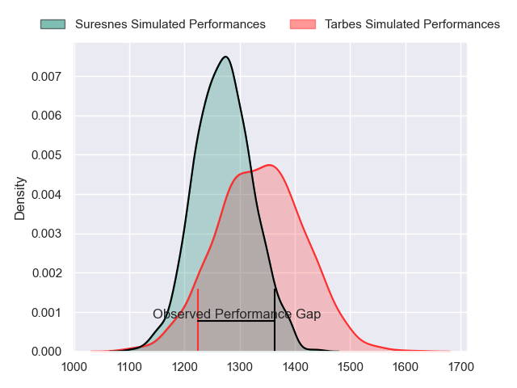
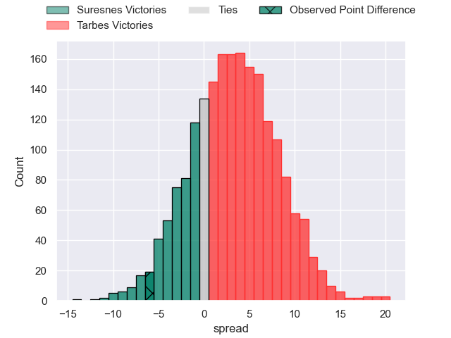
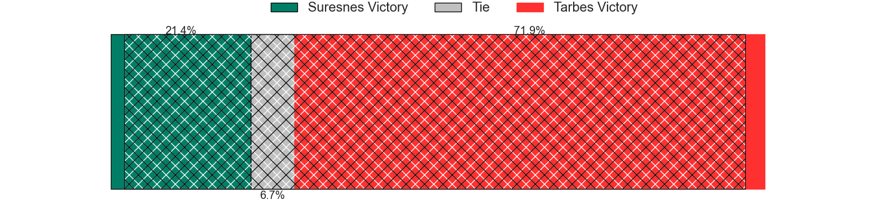
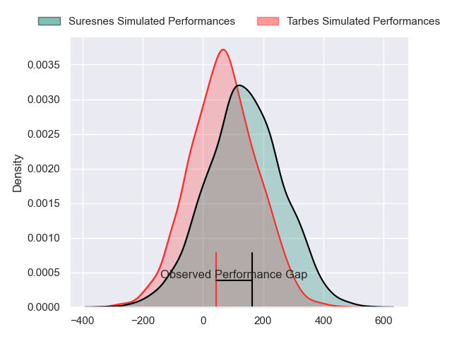
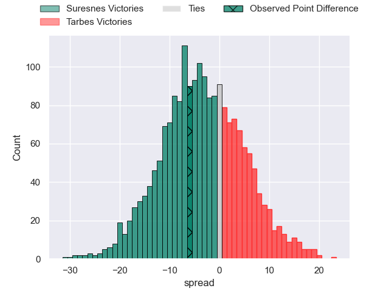
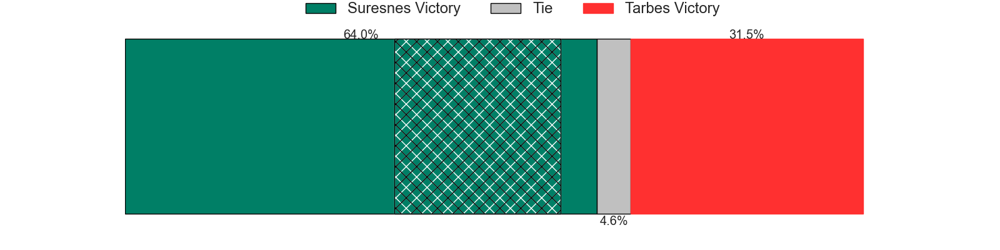

---  
layout: page  
title: Suresnes at Tarbes; 36-30  
date: 2024-04-06 18:00:00 -0500  
categories: "Nationale 2023" match review  
---
# Suresnes at Tarbes; 36-30

# Club Level Predictions

The first set of predictions treats a club as the smallest object, as the club develops its members, organizes a gameplan, and deploys its players as needed for each match. This club model has a prediction of 0.594, which translates to predicting Tarbes to win by 3.3.

Our Over/Under is 35.5 - and combined with the spread above, we have a predicted scoreline of 16 to 20

Each club has a rating and a rating deviation (similar to a Glicko rating), and expected performances can be generated. This allows for simulated matches and spreads like the ones below.
## Projected Performances - Club Model

## Projected Spreads - Club Model

## Projected Results - Club Model

# Player Level Predictions - Version 2

Treating teams instead as an entity made up of the currently active players, I have ratings for each player in an altogether different system. These can be combined to form team ratings once teamsheets are announced, weighting starters a bit higher than the reserves. After the match is played, players can be weighted by their minutes on the field, allowing for an accurate measure of the team's composition. With these compiled team ratings, we can make predictions, measure inaccuracy, and update the individual player ratings.
## Prediction without Player Minutes: Suresnes by 4.4

Suresnes by 10.8 on a neutral pitch

## Projected Performances - Player Model

## Projected Spreads - Player Model

## Projected Results - Player Model

|   Away Minutes | Away Player             |   Away Percentile |   Number |   Home Percentile | Home Player        |   Home Minutes |
|---------------:|:------------------------|------------------:|---------:|------------------:|:-------------------|---------------:|
|             60 | Elias Coulibaly         |             90.22 |        1 |              7.88 | Alexandre Combier  |             61 |
|             60 | Hayam El Bibouji        |             71.18 |        2 |             29.22 | Enzo Mondon        |             49 |
|             60 | Leandro Mario Assi      |             50.05 |        3 |             45.49 | Johan Mees Erasmus |             56 |
|             80 | Christopher van Leeuwen |              9.79 |        4 |             30.91 | Léo Estaque        |             80 |
|             68 | Yakine Djebarri         |             47.14 |        5 |             15.16 | Baptiste Peytavi   |             58 |
|             80 | Jean-Baptiste Lachaise  |             65.7  |        6 |             34.07 | Léo Saint-Guilhem  |             46 |
|             60 | Damien Bozic            |             65.24 |        7 |             58.52 | Jon Abadie         |             80 |
|             80 | Lakisipone Lee          |             80.98 |        8 |              0.73 | Filipe Manu        |             80 |
|             60 | Théo Bachiri            |             10    |        9 |             39.17 | Thibaut Dulucq     |             49 |
|             60 | Tanguy Lacoste          |             74    |       10 |             52.25 | Anthony Fuertes    |             80 |
|             80 | Faraj Fartass           |             80.97 |       11 |             28.65 | Jonathan Duffau    |             40 |
|             80 | Petero Tuwai            |             70.95 |       12 |             73.11 | Johan Paulet       |             80 |
|             69 | Victor Barnier          |             78.99 |       13 |              2.16 | Savenaca Rawaca    |             80 |
|             80 | Thomas Baudy            |              9.63 |       14 |              4.98 | Jone Tuva          |             80 |
|             80 | Goulwen Gueho           |             12.97 |       15 |              2.24 | Mathieu Berbizier  |             49 |
|             20 | Sébastien Lafrancesca   |             64.67 |       16 |            nan    | Léo Baratgin       |             19 |
|             20 | Jean-Étienne Lesueur    |             15.88 |       17 |             63.33 | Vincent Dolier     |             31 |
|             20 | Victor Damian Arias     |             53.28 |       18 |             42.74 | Alec Lambert       |             24 |
|             12 | Wian Vosloo             |             43.92 |       19 |             11.93 | Jone Trevor Seuvou |             22 |
|             20 | Florian Desbordes       |             34.76 |       20 |             14.88 | Julien Cantan      |             34 |
|             20 | Jean Chezeau            |             59.25 |       21 |             31.25 | Mickael Thébault   |             31 |
|             20 | Thomas Lacroix          |             57.29 |       22 |             42.64 | Yon Camou          |             40 |
|             11 | Jean Delbecq            |             47.06 |       23 |             13.36 | Thibaut Trotta     |             31 |

