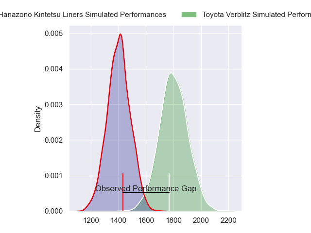
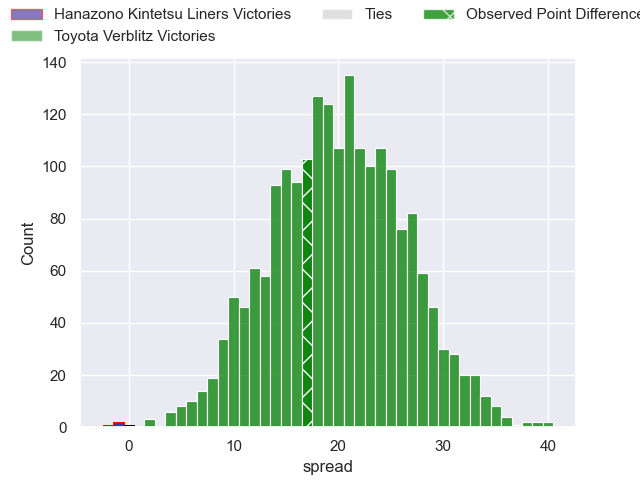
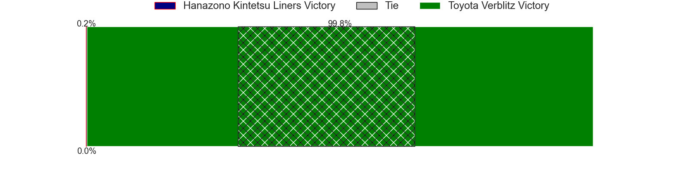
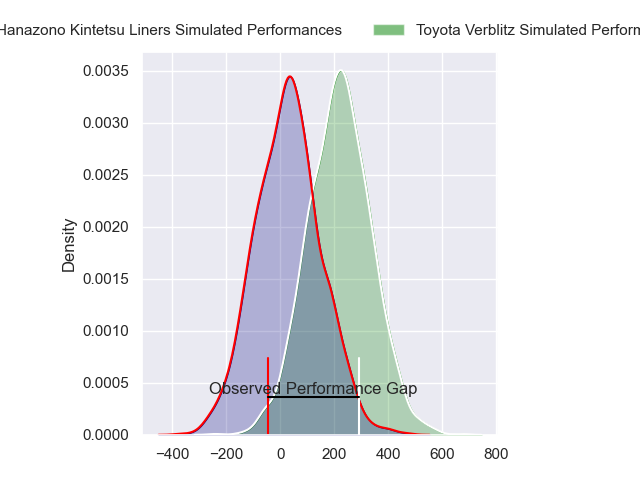
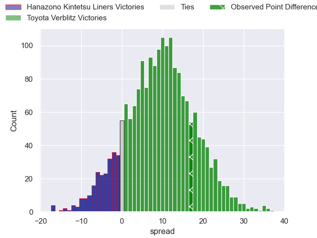
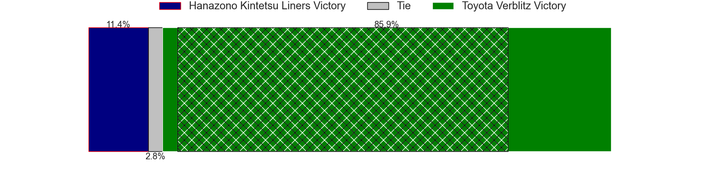

---  
layout: page  
title: Hanazono Kintetsu Liners at Toyota Verblitz; 30-47  
date: 2024-04-06 18:00:00 -0500  
categories: "Japan Rugby League One 2023" match review  
---
# Hanazono Kintetsu Liners at Toyota Verblitz; 30-47

# Club Level Predictions

The first set of predictions treats a club as the smallest object, as the club develops its members, organizes a gameplan, and deploys its players as needed for each match. This club model has a prediction of 0.903, which translates to predicting Toyota Verblitz to win by 20.0.

Our Over/Under is 71.5 - and combined with the spread above, we have a predicted scoreline of 26 to 46

Each club has a rating and a rating deviation (similar to a Glicko rating), and expected performances can be generated. This allows for simulated matches and spreads like the ones below.
## Projected Performances - Club Model

## Projected Spreads - Club Model

## Projected Results - Club Model

# Player Level Predictions - Version 2

Treating teams instead as an entity made up of the currently active players, I have ratings for each player in an altogether different system. These can be combined to form team ratings once teamsheets are announced, weighting starters a bit higher than the reserves. After the match is played, players can be weighted by their minutes on the field, allowing for an accurate measure of the team's composition. With these compiled team ratings, we can make predictions, measure inaccuracy, and update the individual player ratings.
## Prediction without Player Minutes: Toyota Verblitz by 12.7

Toyota Verblitz by 9.3 on a neutral pitch

## Projected Performances - Player Model

## Projected Spreads - Player Model

## Projected Results - Player Model

|   Away Minutes | Away Player       |   Away Percentile |   Number |   Home Percentile | Home Player                  |   Home Minutes |
|---------------:|:------------------|------------------:|---------:|------------------:|:-----------------------------|---------------:|
|             49 | Kenta Tanaka      |              5.41 |        1 |             91.64 | Shogo Miura                  |             47 |
|             49 | Keiichi Kaneko    |              6.67 |        2 |             93.92 | Yoshikatsu Hikosaka          |             22 |
|             49 | Kota Mitake       |             13.01 |        3 |             88.13 | Runya Choi                   |             47 |
|             80 | Patrick Tafa      |              4.42 |        4 |             46.06 | Josh Dickson                 |             80 |
|             49 | Ben Toolis        |             90.45 |        5 |             73.03 | Daichi Akiyama               |             65 |
|             41 | Takahito Sugahara |              0.7  |        6 |             16.34 | Will Tupou                   |             80 |
|             80 | Shohei Nonaka     |             14.02 |        7 |             59.56 | Ryusei Koike                 |             65 |
|             80 | Jose Seru         |             25.85 |        8 |             71.73 | Kazuki Himeno                |             80 |
|             47 | Tomoya Nakamura   |             20.83 |        9 |             96.25 | Aaron Smith                  |             56 |
|             80 | Quade Cooper      |             98.5  |       10 |             84    | Tiaan Falcon                 |             80 |
|             80 | Takahiro Hayashi  |             78.71 |       11 |             45.64 | Vatiliai Tuidraki            |             68 |
|             49 | Patrick Stehlin   |             76.47 |       12 |             88.84 | Charlie Lawrence             |             80 |
|             80 | Tom Hendrickson   |             51.14 |       13 |              1.08 | Siosaia Fifita               |             80 |
|             80 | Joshua Nohra      |              2.04 |       14 |             57.3  | Jone Turaganivalu Nabetelevu |             56 |
|             69 | Semisi Masirewa   |             13.97 |       15 |             84.29 | Taichi Takahashi             |             80 |
|             39 | Daiki Miyashita   |              3.94 |       16 |             63.14 | Ryusei Kato                  |             58 |
|             33 | Kensyo Kawamura   |            nan    |       17 |            nan    | Shunsuke Asaoka              |             33 |
|             31 | Shun Sasaki       |              4.75 |       18 |             47.29 | Yusuke Kizu                  |             33 |
|             31 | Kazuma Matsuda    |             25.69 |       19 |             63.31 | Shuhei Yamaguchi             |             24 |
|             31 | Lata Tangimana    |              6.55 |       20 |            nan    | Kaito Shigeno                |             24 |
|             31 | James Blackwell   |             17.3  |       21 |             56.89 | Masato Furukawa              |             15 |
|             31 | Haruki Kanazawa   |             14.17 |       22 |            nan    | Issa Yamakawa                |             15 |
|             11 | Koji Okamura      |              3.84 |       23 |             23.44 | Dick Wilson                  |             12 |

