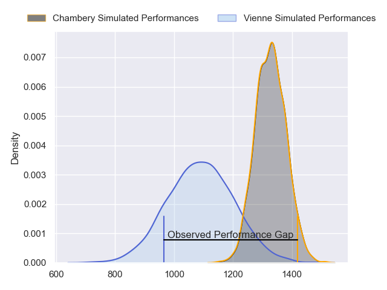
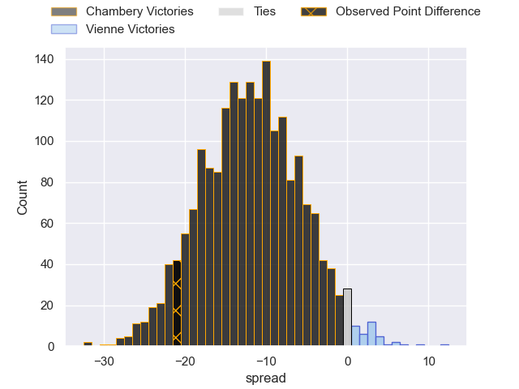
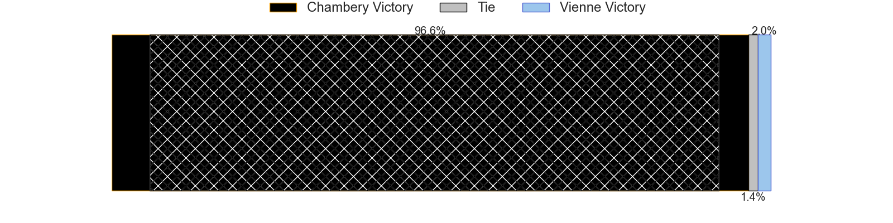
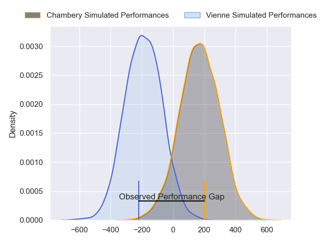
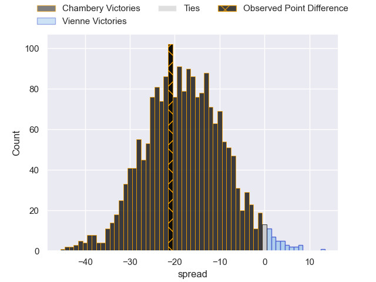
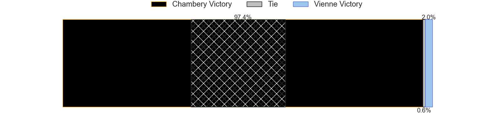

---  
layout: page  
title: Chambery at Vienne; 33-12  
date: 2024-04-06 18:00:00 -0500  
categories: "Nationale 2023" match review  
---
# Chambery at Vienne; 33-12

# Club Level Predictions

The first set of predictions treats a club as the smallest object, as the club develops its members, organizes a gameplan, and deploys its players as needed for each match. This club model has a prediction of 0.207, which translates to predicting Chambery to win by 11.8.

Our Over/Under is 45.5 - and combined with the spread above, we have a predicted scoreline of 29 to 17

Each club has a rating and a rating deviation (similar to a Glicko rating), and expected performances can be generated. This allows for simulated matches and spreads like the ones below.
## Projected Performances - Club Model

## Projected Spreads - Club Model

## Projected Results - Club Model

# Player Level Predictions - Version 2

Treating teams instead as an entity made up of the currently active players, I have ratings for each player in an altogether different system. These can be combined to form team ratings once teamsheets are announced, weighting starters a bit higher than the reserves. After the match is played, players can be weighted by their minutes on the field, allowing for an accurate measure of the team's composition. With these compiled team ratings, we can make predictions, measure inaccuracy, and update the individual player ratings.
## Prediction without Player Minutes: Chambery by 18.5

Chambery by 20.7 on a neutral pitch

## Projected Performances - Player Model

## Projected Spreads - Player Model

## Projected Results - Player Model

|   Away Minutes | Away Player             |   Away Percentile |   Number |   Home Percentile | Home Player       |   Home Minutes |
|---------------:|:------------------------|------------------:|---------:|------------------:|:------------------|---------------:|
|             53 | Enzo Segui              |             76.35 |        1 |             32.57 | Loïc Reynaud      |             60 |
|             53 | Gauthier Brute de Remur |             83.33 |        2 |              7.84 | Dimitri Gibierge  |             53 |
|             53 | Zauri Tevdorashvili     |             19.66 |        3 |             18.52 | Corentin Durand   |             53 |
|             80 | Fabien Witz             |             61.22 |        4 |              3.34 | Pierre Chapelle   |             79 |
|             60 | Steyl Barnard           |             68.14 |        5 |             10.02 | Charles Massot    |             80 |
|             60 | Pierre-Nicolas Dance    |             45.77 |        6 |              6.84 | Léon Peyrat       |             80 |
|             80 | Colin Lebian            |             62.69 |        7 |              1.97 | Guillaume Moroldo |             53 |
|             80 | Tui Uru                 |             79.02 |        8 |             20.24 | Théo Minodier     |             80 |
|             67 | Hugo Deschaux           |             20.42 |        9 |              1.46 | Malory Piet       |             60 |
|             80 | Victor Pisano           |             43    |       10 |             15.75 | Charles Hager     |             52 |
|             80 | Arthur Nennig           |             73.5  |       11 |             21.06 | Théo Brunel       |             80 |
|             80 | Emmanuel Vaitulukina    |             76.23 |       12 |              7.68 | Anzize Said Omar  |             28 |
|             80 | Maewen Sao              |             60.62 |       13 |              1.44 | Pierre Mollard    |             80 |
|             53 | Vereniki Goneva         |             13.02 |       14 |              8.38 | Hippolyte Massa   |             80 |
|             67 | Jules Dorrival          |             43.64 |       15 |              1.25 | Brandon Bellavia  |             80 |
|             27 | Nugzar Somkhishvili     |             75.5  |       16 |              3.32 | Louan Capuano     |             20 |
|             27 | Luka Begic              |             20.78 |       17 |             18.43 | Axel Benjamin     |             27 |
|             27 | Enzo Bailly             |             53.47 |       18 |              8.93 | Guram Kavtidze    |             27 |
|             20 | Ahmed Tidiane Kane      |             58.29 |       19 |             24.22 | Nathanael Grosu   |              1 |
|             20 | Matheo Triki            |             83.78 |       20 |              3.13 | Steven Giroud     |             27 |
|             13 | Mateo Guerret           |             38.39 |       21 |              1.75 | Tom Richard       |             28 |
|             27 | Thomas Hecquet          |             45.64 |       22 |             18.54 | Enzo Ravanello    |             20 |
|             13 | Clément Pérusin         |            nan    |       23 |              2.4  | Matthias Giovale  |             52 |

