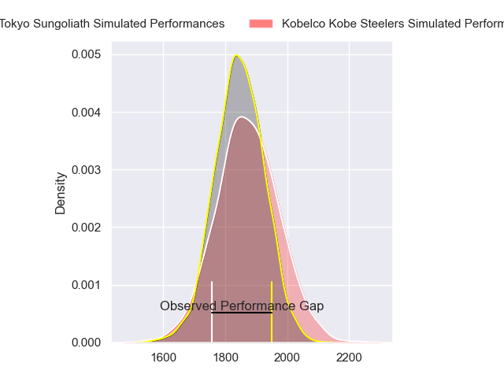
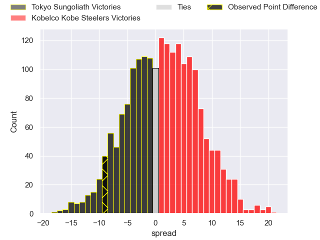
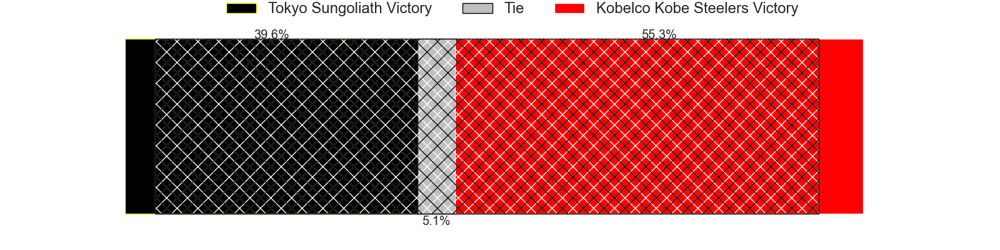
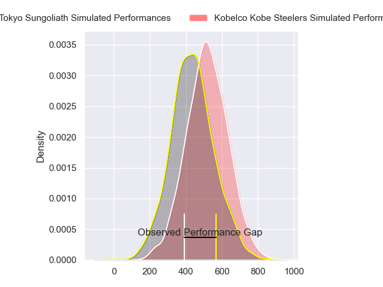
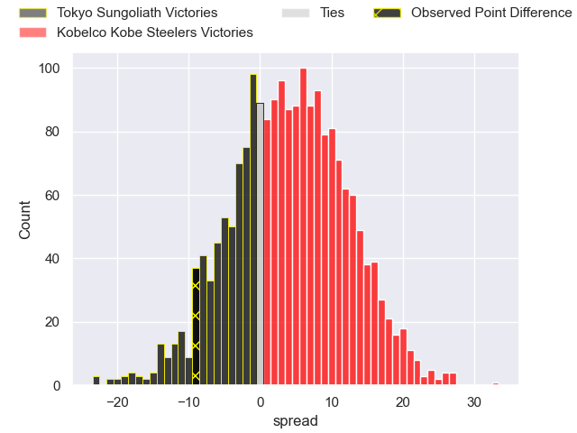
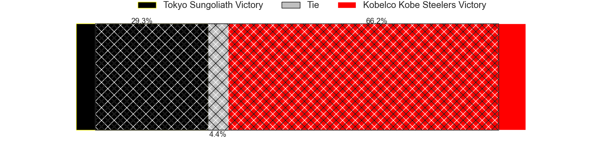

---  
layout: page  
title: Tokyo Sungoliath at Kobelco Kobe Steelers; 36-27  
date: 2024-04-07 18:00:00 -0500  
categories: "Japan Rugby League One 2023" match review  
---
# Tokyo Sungoliath at Kobelco Kobe Steelers; 36-27

# Club Level Predictions

The first set of predictions treats a club as the smallest object, as the club develops its members, organizes a gameplan, and deploys its players as needed for each match. This club model has a prediction of 0.54, which translates to predicting Kobelco Kobe Steelers to win by 1.4.

Our Over/Under is 51.5 - and combined with the spread above, we have a predicted scoreline of 25 to 27

Each club has a rating and a rating deviation (similar to a Glicko rating), and expected performances can be generated. This allows for simulated matches and spreads like the ones below.
## Projected Performances - Club Model

## Projected Spreads - Club Model

## Projected Results - Club Model

# Player Level Predictions - Version 2

Treating teams instead as an entity made up of the currently active players, I have ratings for each player in an altogether different system. These can be combined to form team ratings once teamsheets are announced, weighting starters a bit higher than the reserves. After the match is played, players can be weighted by their minutes on the field, allowing for an accurate measure of the team's composition. With these compiled team ratings, we can make predictions, measure inaccuracy, and update the individual player ratings.
## Prediction without Player Minutes: Kobelco Kobe Steelers by 5.3

Kobelco Kobe Steelers by 1.9 on a neutral pitch

## Projected Performances - Player Model

## Projected Spreads - Player Model

## Projected Results - Player Model

|   Away Minutes | Away Player         |   Away Percentile |   Number |   Home Percentile | Home Player              |   Home Minutes |
|---------------:|:--------------------|------------------:|---------:|------------------:|:-------------------------|---------------:|
|             55 | Yukio Morikawa      |             92.97 |        1 |             64.29 | Shigure Takao            |             51 |
|             65 | Kosuke Horikoshi    |             77.84 |        2 |             68.24 | Kenta Matsuoka           |             68 |
|             55 | Shinnosuke Kakinaga |             88.89 |        3 |              4.46 | Koo Ji-won               |             58 |
|             72 | Sam Jeffries        |             97.14 |        4 |             78.76 | Waisake Raratubua        |             51 |
|             80 | Harry Hockings      |             98.93 |        5 |             99.76 | Brodie Retallick         |             75 |
|             80 | Kanji Shimokawa     |             78.33 |        6 |             67.32 | Amanaki Saumaki          |             80 |
|             61 | Kai Yamamoto        |             59.68 |        7 |             99.54 | Ardie Savea              |             80 |
|             55 | Hendrik Tui         |             70.24 |        8 |             70.49 | Tiennan Costley          |             80 |
|             65 | Yutaka Nagare       |             87.29 |        9 |             88.96 | Atsushi Hiwasa           |             58 |
|             80 | Mikiya Takamoto     |             74.75 |       10 |             93.5  | Bryn Gatland             |             80 |
|             45 | Cheslin Kolbe       |             99.89 |       11 |             77.8  | Kanta Matsunaga          |             80 |
|             80 | Isaiah Punivai      |             53.9  |       12 |             83.55 | Ngani Laumape            |             51 |
|             80 | Taiga Ozaki         |             78.15 |       13 |             13.21 | Seungsin Lee             |             80 |
|             80 | Seiya Ozaki         |             93.88 |       14 |             93.77 | Rakuhei Yamashita        |             68 |
|             80 | Kotaro Matsushima   |             95.76 |       15 |             71.82 | Ryohei Yamanaka          |             80 |
|             35 | Ryoto Nakamura      |             95.32 |       16 |             86.04 | Isileli Nakajima Vakauta |             29 |
|             25 | Kan Nakano          |             56.03 |       17 |             60.5  | Michael Little           |             29 |
|             25 | Kenta Kobayashi     |             60.68 |       18 |             50.98 | Takara Imamura           |             29 |
|             25 | Ryuga Hashimoto     |             60.37 |       19 |             94.97 | Hiroshi Yamashita        |             22 |
|             19 | Sota Oketani        |             68.13 |       20 |            nan    | Kentaro Obata            |             22 |
|             15 | Kienori Go          |            nan    |       21 |             50.78 | Timothy Lafaele          |             12 |
|             15 | Naoto Saito         |             26.88 |       22 |            nan    | Hiroaki Ushihara         |             12 |
|              8 | Trevor Hosea        |             18.74 |       23 |             81.5  | Gerard Cowley-Tuioti     |              5 |

