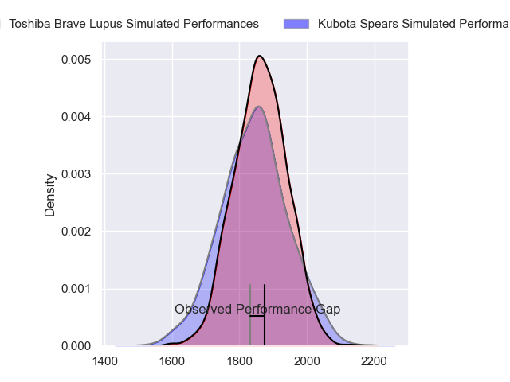
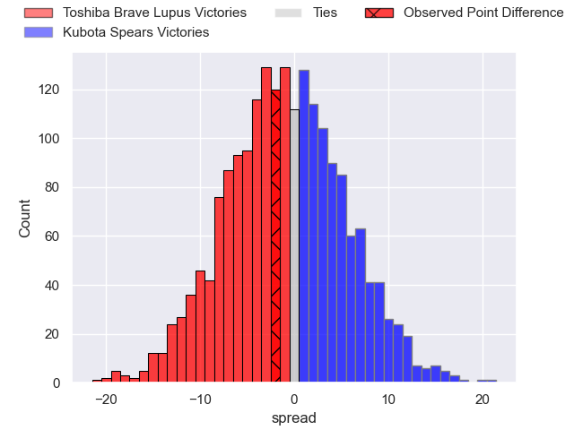
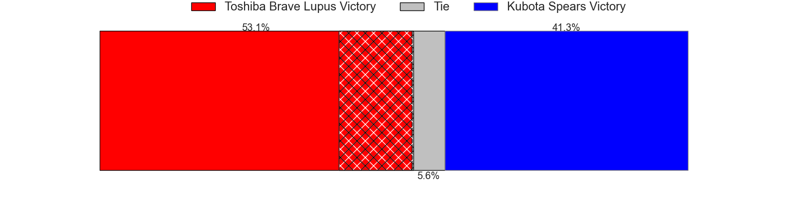
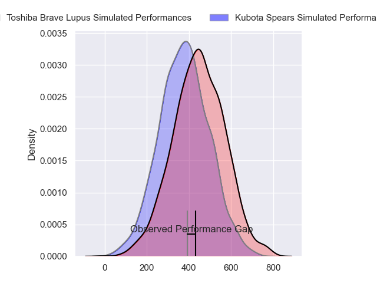
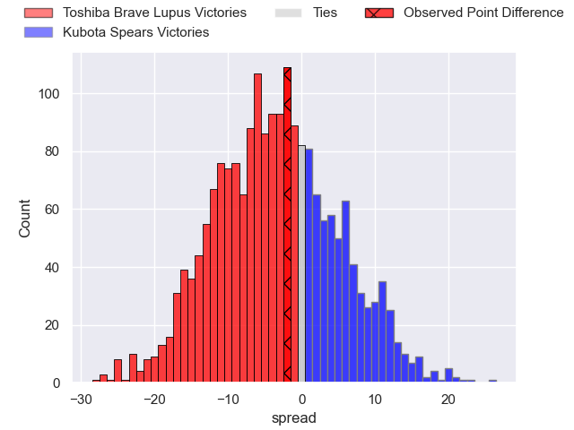
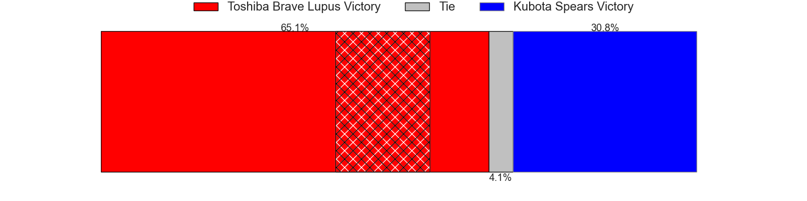

---  
layout: page  
title: Toshiba Brave Lupus at Kubota Spears; 22-20  
date: 2024-04-07 18:00:00 -0500  
categories: "Japan Rugby League One 2023" match review  
---
# Toshiba Brave Lupus at Kubota Spears; 22-20

# Club Level Predictions

The first set of predictions treats a club as the smallest object, as the club develops its members, organizes a gameplan, and deploys its players as needed for each match. This club model has a prediction of 0.472, which translates to predicting Toshiba Brave Lupus to win by 1.0.

Our Over/Under is 76.5 - and combined with the spread above, we have a predicted scoreline of 39 to 38

Each club has a rating and a rating deviation (similar to a Glicko rating), and expected performances can be generated. This allows for simulated matches and spreads like the ones below.
## Projected Performances - Club Model

## Projected Spreads - Club Model

## Projected Results - Club Model

# Player Level Predictions - Version 2

Treating teams instead as an entity made up of the currently active players, I have ratings for each player in an altogether different system. These can be combined to form team ratings once teamsheets are announced, weighting starters a bit higher than the reserves. After the match is played, players can be weighted by their minutes on the field, allowing for an accurate measure of the team's composition. With these compiled team ratings, we can make predictions, measure inaccuracy, and update the individual player ratings.
## Prediction without Player Minutes: Toshiba Brave Lupus by 1.1

Toshiba Brave Lupus by 4.2 on a neutral pitch

## Projected Performances - Player Model

## Projected Spreads - Player Model

## Projected Results - Player Model

|   Away Minutes | Away Player        |   Away Percentile |   Number |   Home Percentile | Home Player            |   Home Minutes |
|---------------:|:-------------------|------------------:|---------:|------------------:|:-----------------------|---------------:|
|             48 | Teruo Makabe       |             84.43 |        1 |             83.67 | Kota Kaishi            |             53 |
|             53 | Mamoru Harada      |             82.16 |        2 |             99.8  | Dane Coles             |             53 |
|             53 | Yuta Kokaji        |             87.84 |        3 |             70.94 | Opeti Helu             |             54 |
|             80 | Warner Dearns      |             91.05 |        4 |              2.86 | JD Schickerling        |             80 |
|             80 | Jacob Pierce       |             97.73 |        5 |             72.2  | David Bulbring         |             54 |
|             80 | Shin Ito           |             77.29 |        6 |             70.1  | Finau Tupa             |             65 |
|             47 | Yoshitaka Tokunaga |             28.27 |        7 |             85.98 | Lappies Labuschagne    |             80 |
|             40 | Shannon Frizell    |             86.34 |        8 |             78.56 | Takeo Suenaga          |             80 |
|             69 | Yuhei Sugiyama     |             74.38 |        9 |             30.21 | Shinobu Fujiwara       |             78 |
|             80 | Richie Mo'unga     |             99.5  |       10 |             98.75 | Bernard Foley          |             80 |
|             80 | Futoshi Mori       |             47.79 |       11 |             76.22 | Suryung Kim            |             80 |
|             53 | Taichi Mano        |             72.75 |       12 |             58.34 | Harumichi Tatekawa     |             80 |
|             80 | Rob Thompson       |             45.74 |       13 |             74.79 | Sione Teaupa           |             56 |
|             78 | Jone Naikabula     |             78.26 |       14 |             72.03 | Halatoa Vailea         |             65 |
|             80 | Takuro Matsunaga   |             88.75 |       15 |             93.27 | Gerhard van den Heever |             80 |
|             40 | Asaeli Lausii      |            nan    |       16 |             51.38 | Yota Kaminori          |             27 |
|             33 | Hiroki Yamamoto    |            nan    |       17 |            nan    | Hayate Era             |             27 |
|             32 | Sena Kimura        |             83.1  |       18 |            nan    | Keijiro Tamefusa       |             26 |
|             27 | Daigo Hashimoto    |             51.37 |       19 |             97.85 | Ruan Botha             |             26 |
|             27 | Seta Tamanivalu    |             95.44 |       20 |             37.58 | Rikus Pretorius        |             24 |
|             27 | Taufa Latu         |             51.57 |       21 |            nan    | Asipeli Moala          |             15 |
|             11 | Kohei Takahashi    |            nan    |       22 |            nan    | Kanji Futamura         |             15 |
|              2 | Masaki Hamada      |             83.24 |       23 |             45.5  | Tomoki Kishioka        |              2 |

