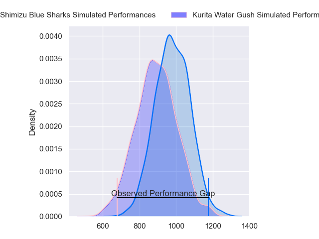
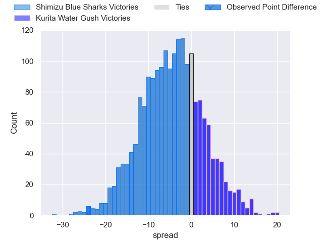
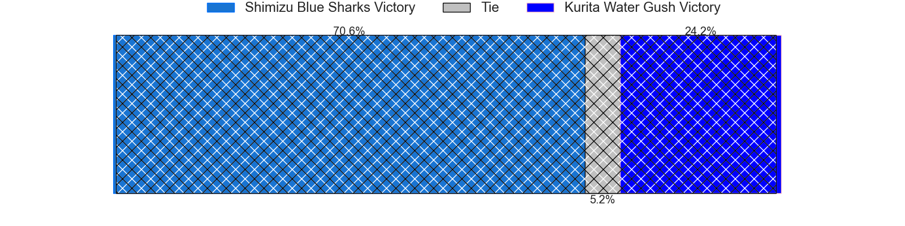
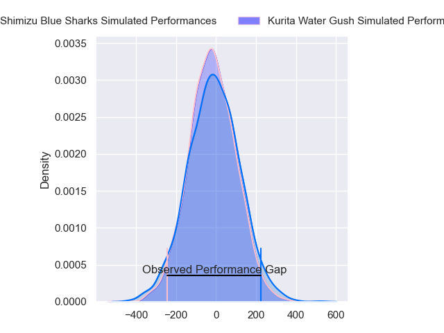
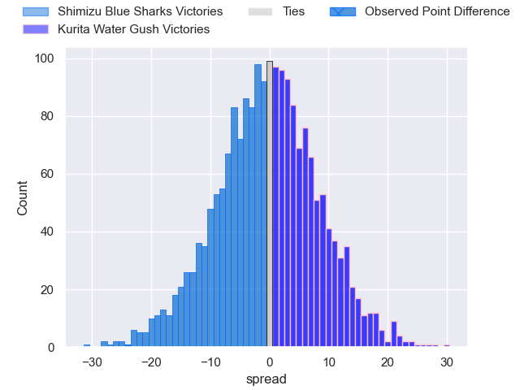
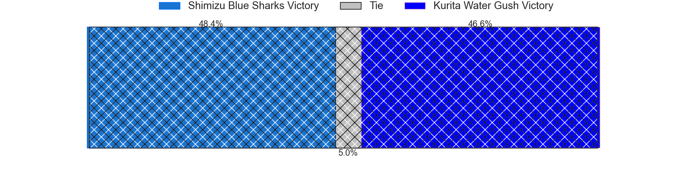

---  
layout: page  
title: Shimizu Blue Sharks at Kurita Water Gush; 46-22  
date: 2024-04-07 18:00:00 -0500  
categories: "Japan Rugby League One D3 2023" match review  
---
# Shimizu Blue Sharks at Kurita Water Gush; 46-22

# Club Level Predictions

The first set of predictions treats a club as the smallest object, as the club develops its members, organizes a gameplan, and deploys its players as needed for each match. This club model has a prediction of 0.38, which translates to predicting Shimizu Blue Sharks to win by 4.4.

Our Over/Under is 59.5 - and combined with the spread above, we have a predicted scoreline of 32 to 28

Each club has a rating and a rating deviation (similar to a Glicko rating), and expected performances can be generated. This allows for simulated matches and spreads like the ones below.
## Projected Performances - Club Model

## Projected Spreads - Club Model

## Projected Results - Club Model

# Player Level Predictions - Version 2

Treating teams instead as an entity made up of the currently active players, I have ratings for each player in an altogether different system. These can be combined to form team ratings once teamsheets are announced, weighting starters a bit higher than the reserves. After the match is played, players can be weighted by their minutes on the field, allowing for an accurate measure of the team's composition. With these compiled team ratings, we can make predictions, measure inaccuracy, and update the individual player ratings.
## Prediction without Player Minutes: Shimizu Blue Sharks by 1.4

Shimizu Blue Sharks by 3.9 on a neutral pitch

## Projected Performances - Player Model

## Projected Spreads - Player Model

## Projected Results - Player Model

|   Away Minutes | Away Player        |   Away Percentile |   Number |   Home Percentile | Home Player          |   Home Minutes |
|---------------:|:-------------------|------------------:|---------:|------------------:|:---------------------|---------------:|
|             55 | Fumiyake Mato      |             52.52 |        1 |              4.08 | Shoya Koyama         |             57 |
|             55 | Naomichi Tatekawa  |             45.88 |        2 |             28.04 | Kota Hojo            |             64 |
|             80 | Uha Lee            |             70.47 |        3 |              5.32 | Kuriyama Rui         |             64 |
|             73 | Sam Chongkit       |             81.03 |        4 |              1.79 | Kota Nakamura        |             55 |
|             80 | Suguru Hidaka      |             36.52 |        5 |              2.74 | Mike Williams        |             80 |
|             71 | Yutaro Shirako     |              4.06 |        6 |             20.05 | Tebita Oto           |             80 |
|             80 | Haruki Matsudo     |             47.74 |        7 |             40.09 | Taisei Nakao         |             55 |
|             80 | Murphy Taramai     |              5.85 |        8 |             44.88 | Teariki Ben-Nicholas |             61 |
|             71 | Kayne Hammington   |             54.37 |        9 |             10.21 | Sho Nakamura         |             80 |
|             80 | Lima Sopoaga       |             92    |       10 |             15    | Piers Francis        |             80 |
|             80 | Toru Kanazawa      |             67.16 |       11 |              5.32 | Keigo Hamazoe        |             50 |
|             80 | Orbyn Leger        |              9.72 |       12 |             14.41 | Jamie Vakalahi       |             80 |
|             71 | Naoki Moriya       |              3.72 |       13 |             25.21 | So Matsushima        |             80 |
|             74 | Ryota Noda         |             31.6  |       14 |             17.67 | Tumanawa Tawhai      |             80 |
|             80 | Coenie van Wyk     |             59.6  |       15 |              2.99 | Kentaro Sugimori     |             63 |
|             25 | Kaito Tamori       |             12.75 |       16 |              5.55 | Hosea Saumaki        |             30 |
|             25 | Takatoshi Sugawara |             15.67 |       17 |             17.71 | Ryo Omasa            |             25 |
|              9 | Tatsuya Kanetsuki  |            nan    |       18 |              3.36 | Yosuke Ishii         |             25 |
|              9 | John-Ben Kotze     |             70.33 |       19 |             15.48 | Kei Shibuya          |             23 |
|              9 | Ryo Sato           |             10.43 |       20 |              8.47 | Kengo Nakamura       |             19 |
|              7 | Ryota Sakino       |            nan    |       21 |              5.75 | Takuro Hayashida     |             17 |
|              6 | Tatsuhiro Ozaki    |              4.99 |       22 |              1.76 | Ryota Kuribara       |             16 |
|            nan | nan                |            nan    |       23 |              3.8  | Masachi Debuchi      |             16 |

