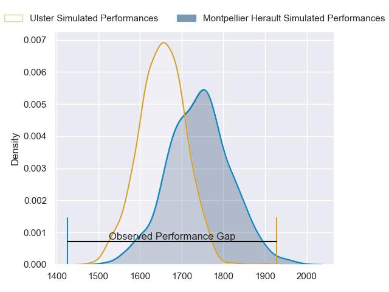
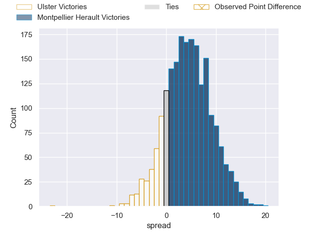
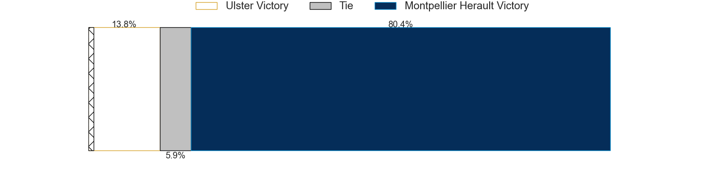
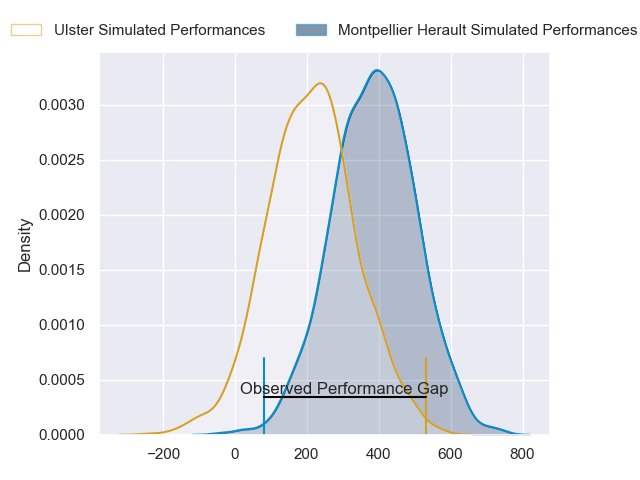
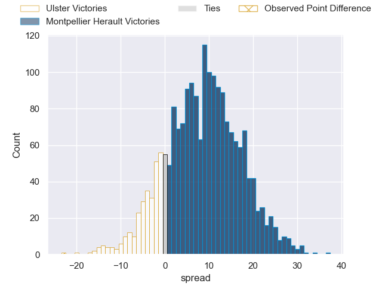
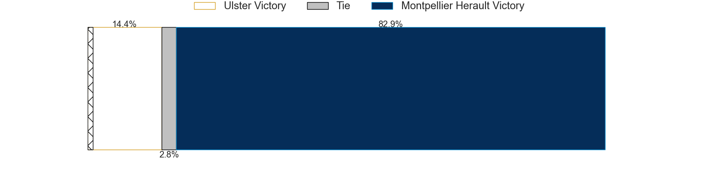

---  
layout: page  
title: Ulster at Montpellier Herault; 40-17  
date: 2024-04-07 18:00:00 -0500  
categories: "European Rugby Challenge Cup 2023" match review  
---
# Ulster at Montpellier Herault; 40-17

# Club Level Predictions

The first set of predictions treats a club as the smallest object, as the club develops its members, organizes a gameplan, and deploys its players as needed for each match. This club model has a prediction of 0.619, which translates to predicting Montpellier Herault to win by 4.3.

Our Over/Under is 50.5 - and combined with the spread above, we have a predicted scoreline of 23 to 27

Each club has a rating and a rating deviation (similar to a Glicko rating), and expected performances can be generated. This allows for simulated matches and spreads like the ones below.
## Projected Performances - Club Model

## Projected Spreads - Club Model

## Projected Results - Club Model

# Player Level Predictions - Version 2

Treating teams instead as an entity made up of the currently active players, I have ratings for each player in an altogether different system. These can be combined to form team ratings once teamsheets are announced, weighting starters a bit higher than the reserves. After the match is played, players can be weighted by their minutes on the field, allowing for an accurate measure of the team's composition. With these compiled team ratings, we can make predictions, measure inaccuracy, and update the individual player ratings.
## Prediction without Player Minutes: Montpellier Herault by 9.6

Montpellier Herault by 2.1 on a neutral pitch

## Projected Performances - Player Model

## Projected Spreads - Player Model

## Projected Results - Player Model

|   Away Minutes | Away Player       |   Away Percentile |   Number |   Home Percentile | Home Player              |   Home Minutes |
|---------------:|:------------------|------------------:|---------:|------------------:|:-------------------------|---------------:|
|             64 | Steven Kitshoff   |             97.25 |        1 |             10.83 | Gregory Fichten          |             48 |
|             66 | Rob Herring       |             92.55 |        2 |             90.39 | Christopher Tolofua      |             58 |
|             57 | Tom O'Toole       |             61.92 |        3 |             92.78 | Harry Williams           |             49 |
|             50 | Alan O'Connor     |             66.83 |        4 |             54.42 | Florian Verhaeghe        |             81 |
|             80 | Iain Henderson    |             87.23 |        5 |             42.36 | Paul Willemse            |             81 |
|             50 | Matty Rea         |             63.5  |        6 |             19.7  | Alexandre Becognee       |             49 |
|             81 | David McCann      |             64.19 |        7 |             25.14 | Clement Doumenc          |             66 |
|             81 | Nick Timoney      |             84.39 |        8 |             58.54 | Sam Simmonds             |             47 |
|             80 | John Cooney       |             87.92 |        9 |             12.92 | Aubin Eymeri             |             81 |
|             80 | Nathan Doak       |             22.75 |       10 |             11    | Louis Foursans-Bourdette |             60 |
|             81 | Stewart Moore     |             86.53 |       11 |             96.49 | Ben Lam                  |             81 |
|             81 | Stuart McCloskey  |             70.23 |       12 |             12.85 | Auguste Cadot            |             81 |
|             81 | James Hume        |             23.77 |       13 |             91.24 | George Bridge            |             81 |
|             81 | Robert Baloucoune |              6.23 |       14 |              3.85 | Gabriel Ngandebe         |             75 |
|             70 | Will Addison      |             85.29 |       15 |             37.41 | Alexandre de Nardi       |             81 |
|             15 | John Andrew       |             34.9  |       16 |             39.22 | Vano Karkadze            |             29 |
|             17 | Andrew Warwick    |             12.54 |       17 |              6.93 | Baptiste Erdocio         |             33 |
|             24 | Scott Wilson      |            nan    |       18 |             51.47 | Lasha Macharashvili      |             32 |
|             31 | Harry Sheridan    |             80.65 |       19 |             57.28 | Tyler Duguid             |             34 |
|              1 | Cormac Izuchukwu  |             51.91 |       20 |             90.61 | Yacouba Camara           |             32 |
|              1 | Dave Shanahan     |            nan    |       21 |             55.25 | Louis Carbonel           |             21 |
|             12 | Jake Flannery     |             25    |       22 |             72.48 | Masivesi Dakuwaqa        |             26 |
|             31 | Dave Ewers        |             90.73 |       23 |             58.44 | Julien Tisseron          |             15 |

