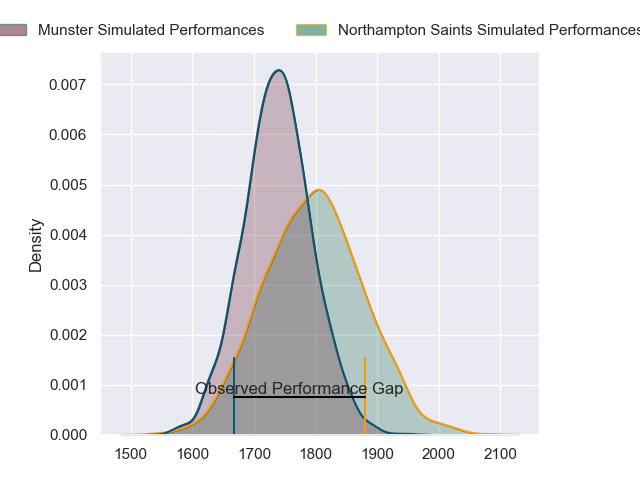
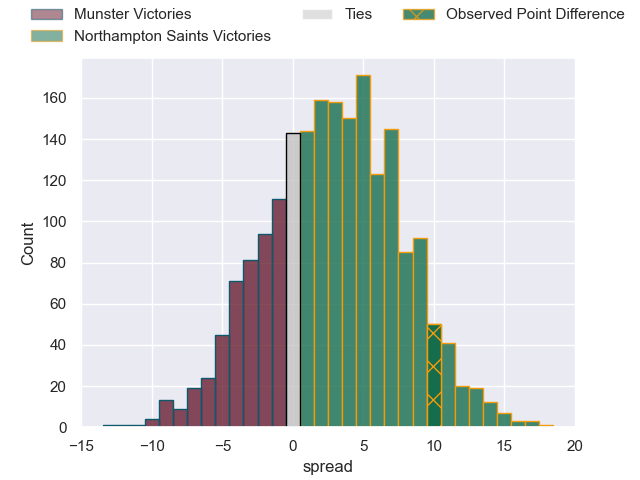
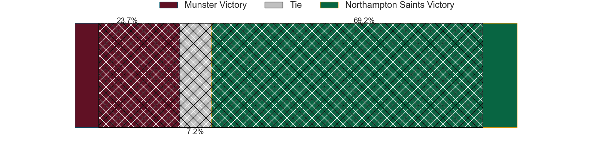
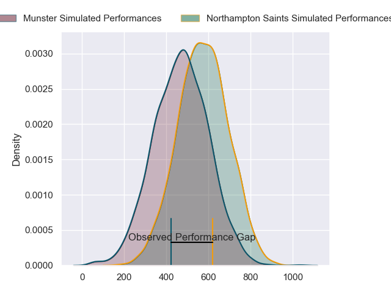
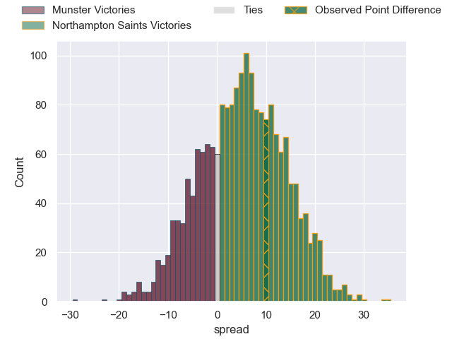
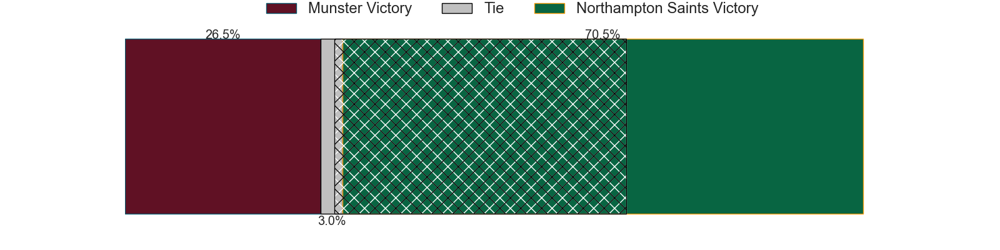

---  
layout: page  
title: Munster at Northampton Saints; 14-24  
date: 2024-04-07 18:00:00 -0500  
categories: "European Rugby Champions Cup 2023" match review  
---
# Munster at Northampton Saints; 14-24

# Club Level Predictions

The first set of predictions treats a club as the smallest object, as the club develops its members, organizes a gameplan, and deploys its players as needed for each match. This club model has a prediction of 0.584, which translates to predicting Northampton Saints to win by 3.0.

Our Over/Under is 61.5 - and combined with the spread above, we have a predicted scoreline of 29 to 32

Each club has a rating and a rating deviation (similar to a Glicko rating), and expected performances can be generated. This allows for simulated matches and spreads like the ones below.
## Projected Performances - Club Model

## Projected Spreads - Club Model

## Projected Results - Club Model

# Player Level Predictions - Version 2

Treating teams instead as an entity made up of the currently active players, I have ratings for each player in an altogether different system. These can be combined to form team ratings once teamsheets are announced, weighting starters a bit higher than the reserves. After the match is played, players can be weighted by their minutes on the field, allowing for an accurate measure of the team's composition. With these compiled team ratings, we can make predictions, measure inaccuracy, and update the individual player ratings.
## Prediction without Player Minutes: Northampton Saints by 7.3

Munster by 0.9 on a neutral pitch

## Projected Performances - Player Model

## Projected Spreads - Player Model

## Projected Results - Player Model

|   Away Minutes | Away Player     |   Away Percentile |   Number |   Home Percentile | Home Player        |   Home Minutes |
|---------------:|:----------------|------------------:|---------:|------------------:|:-------------------|---------------:|
|             70 | Jeremy Loughman |             93.45 |        1 |             50.14 | Emmanuel Iyogun    |             63 |
|             70 | Niall Scannell  |             90.98 |        2 |             90.78 | Curtis Langdon     |             57 |
|             80 | Stephen Archer  |             97.34 |        3 |              2.94 | Trevor Davison     |             63 |
|             80 | Thomas Ahern    |             53.46 |        4 |             95.58 | Alex Moon          |             65 |
|             80 | Tadhg Beirne    |             98.09 |        5 |             21.72 | Alex Coles         |             80 |
|             56 | Peter O'Mahony  |             96.64 |        6 |             98.26 | Courtney Lawes     |             80 |
|             80 | John Hodnett    |             61.76 |        7 |             63.27 | Lewis Ludlam       |             52 |
|             66 | Gavin Coombes   |             79.27 |        8 |             98.84 | Sam Graham         |             71 |
|             56 | Craig Casey     |             78.33 |        9 |             19.79 | Tom James          |             52 |
|             80 | Jack Crowley    |             35.25 |       10 |             82.75 | Fin Smith          |             80 |
|             80 | Simon Zebo      |             93.54 |       11 |             95.58 | Ollie Sleightholme |             80 |
|             66 | Alex Nankivell  |             87.88 |       12 |             85.11 | Burger Odendaal    |             60 |
|             80 | Antoine Frisch  |             86.79 |       13 |             89.8  | Fraser Dingwall    |             80 |
|             73 | Sean O'Brien    |             18.91 |       14 |             96.64 | Tommy Freeman      |             80 |
|             75 | Mike Haley      |             87.78 |       15 |             68.83 | James Ramm         |             80 |
|             10 | Eoghan Clarke   |            nan    |       16 |             82.94 | Sam Matavesi       |             23 |
|             10 | Josh Wycherley  |             41.79 |       17 |             98.1  | Alex Waller        |             17 |
|              0 | Mark Donnelly   |            nan    |       18 |             98.77 | Paul Hill          |             17 |
|             14 | Jack O'Donoghue |             74.39 |       19 |             89.74 | Temo Mayanavanua   |             15 |
|             24 | Alex Kendellen  |             73.93 |       20 |             59.79 | Angus Scott-Young  |              9 |
|             24 | Conor Murray    |             97.5  |       21 |             64.15 | Juarno Augustus    |             28 |
|             14 | Joey Carbery    |             75    |       22 |             94.79 | Alex Mitchell      |             28 |
|             12 | Shay McCarthy   |            nan    |       23 |             85.39 | George Hendy       |             20 |

