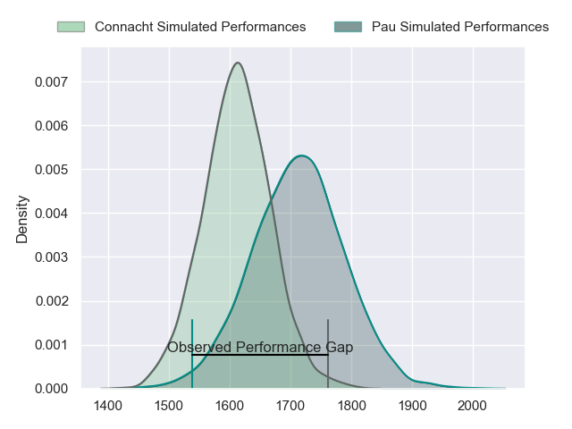
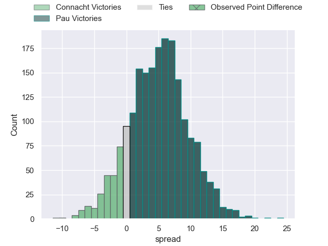
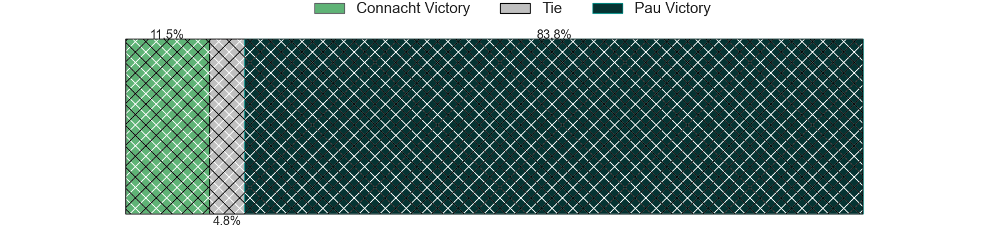
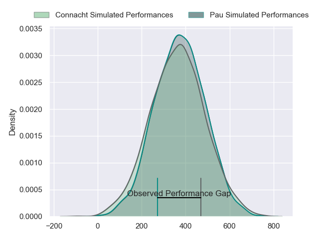
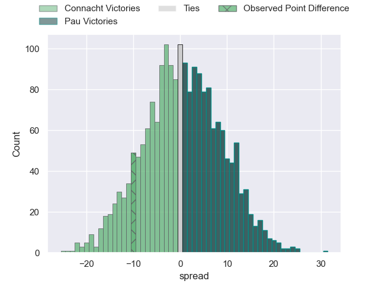
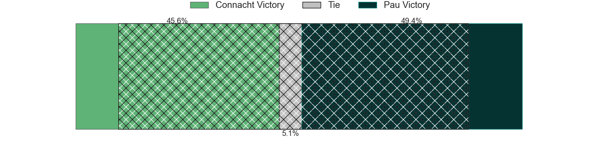

---  
layout: page  
title: Connacht at Pau; 40-30  
date: 2024-04-07 18:00:00 -0500  
categories: "European Rugby Challenge Cup 2023" match review  
---
# Connacht at Pau; 40-30

# Club Level Predictions

The first set of predictions treats a club as the smallest object, as the club develops its members, organizes a gameplan, and deploys its players as needed for each match. This club model has a prediction of 0.639, which translates to predicting Pau to win by 5.0.

Our Over/Under is 61.5 - and combined with the spread above, we have a predicted scoreline of 28 to 33

Each club has a rating and a rating deviation (similar to a Glicko rating), and expected performances can be generated. This allows for simulated matches and spreads like the ones below.
## Projected Performances - Club Model

## Projected Spreads - Club Model

## Projected Results - Club Model

# Player Level Predictions - Version 2

Treating teams instead as an entity made up of the currently active players, I have ratings for each player in an altogether different system. These can be combined to form team ratings once teamsheets are announced, weighting starters a bit higher than the reserves. After the match is played, players can be weighted by their minutes on the field, allowing for an accurate measure of the team's composition. With these compiled team ratings, we can make predictions, measure inaccuracy, and update the individual player ratings.
## Prediction without Player Minutes: Pau by 1.3

Connacht by 6.8 on a neutral pitch

## Projected Performances - Player Model

## Projected Spreads - Player Model

## Projected Results - Player Model

|   Away Minutes | Away Player           |   Away Percentile |   Number |   Home Percentile | Home Player         |   Home Minutes |
|---------------:|:----------------------|------------------:|---------:|------------------:|:--------------------|---------------:|
|             56 | Denis Buckley         |             87.56 |        1 |             36.85 | Siegfried Fisi'ihoi |             51 |
|             81 | Dave Heffernan        |             62.94 |        2 |             49.8  | Youri Delhommel     |             51 |
|             69 | Finlay Bealham        |             96.11 |        3 |             82.81 | Siate Tokolahi      |             57 |
|             81 | Joe Joyce             |             94.99 |        4 |             20.53 | Guillaume Ducat     |             61 |
|             56 | Niall Murray          |             88.66 |        5 |             69.09 | Lekima Tagitagivalu |             73 |
|             81 | Cian Prendergast      |             58.4  |        6 |             71.96 | Martin Puech        |             33 |
|             81 | Shamus Hurley-Langton |             57.71 |        7 |             27    | Thibaut Hamonou     |             81 |
|             15 | Jarrad Butler         |             85.37 |        8 |             25.37 | Sacha Zegueur       |             81 |
|             81 | Caolin Blade          |             75.62 |        9 |             97.92 | Dan Robson          |             81 |
|             50 | Jack Carty            |             93.25 |       10 |             81.75 | Joe Simmonds        |             81 |
|             81 | Shane Jennings        |             55.04 |       11 |             81.77 | Aminiasi Tuimaba    |             41 |
|             81 | Bundee Aki            |             98.56 |       12 |              0.24 | Jale Vatubua        |             81 |
|             81 | David Hawkshaw        |             70.11 |       13 |             16.81 | Elliot Roudil       |             81 |
|             46 | Shayne Bolton         |             66.93 |       14 |             73.73 | Thomas Carol        |             73 |
|             81 | Tiernan O'Halloran    |             87.03 |       15 |             78.55 | Jack Maddocks       |             81 |
|              0 | Eoin de Buitléar      |             57.25 |       16 |             19.8  | Lucas Rey           |             30 |
|             25 | Jordan Duggan         |             20.61 |       17 |            nan    | Hugo Parrou         |             30 |
|             12 | Sam Illo              |            nan    |       18 |             24.98 | Guram Papidze       |             24 |
|             25 | Darragh Murray        |             41.89 |       19 |            nan    | Steven Cummins      |             20 |
|             66 | Conor Oliver          |             78.1  |       20 |             84.13 | Fabrice Metz        |              8 |
|              0 | Matthew Devine        |            nan    |       21 |             79.26 | Reece Hewat         |             48 |
|             31 | JJ Hanrahan           |             87    |       22 |             90.42 | Thibault Daubagna   |              8 |
|             35 | Tom Farrell           |             46.46 |       23 |             73.75 | Axel Desperes       |             40 |

