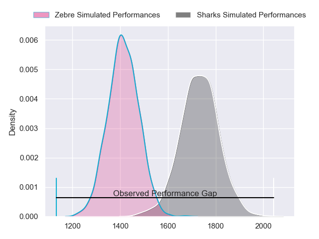
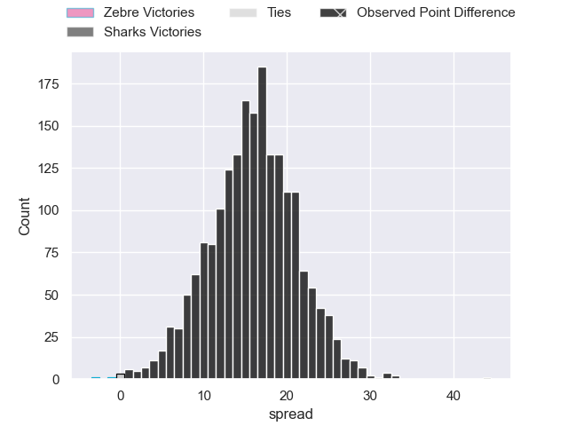
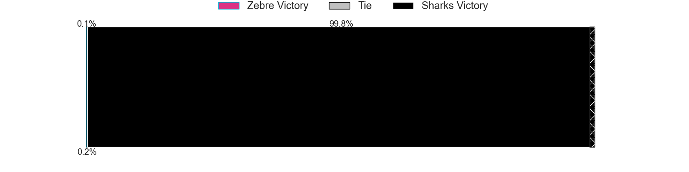
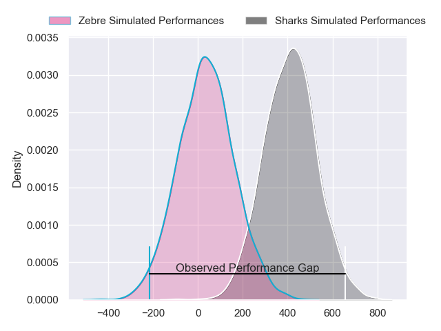
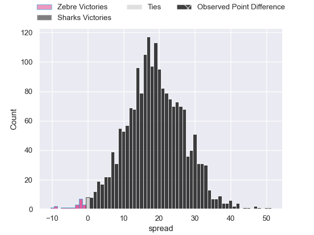
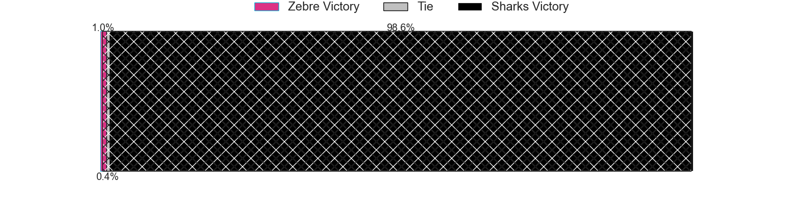

---  
layout: page  
title: Zebre at Sharks; 3-47  
date: 2024-04-07 18:00:00 -0500  
categories: "European Rugby Challenge Cup 2023" match review  
---
# Zebre at Sharks; 3-47

# Club Level Predictions

The first set of predictions treats a club as the smallest object, as the club develops its members, organizes a gameplan, and deploys its players as needed for each match. This club model has a prediction of 0.856, which translates to predicting Sharks to win by 15.8.

Our Over/Under is 48.5 - and combined with the spread above, we have a predicted scoreline of 17 to 32

Each club has a rating and a rating deviation (similar to a Glicko rating), and expected performances can be generated. This allows for simulated matches and spreads like the ones below.
## Projected Performances - Club Model

## Projected Spreads - Club Model

## Projected Results - Club Model

# Player Level Predictions - Version 2

Treating teams instead as an entity made up of the currently active players, I have ratings for each player in an altogether different system. These can be combined to form team ratings once teamsheets are announced, weighting starters a bit higher than the reserves. After the match is played, players can be weighted by their minutes on the field, allowing for an accurate measure of the team's composition. With these compiled team ratings, we can make predictions, measure inaccuracy, and update the individual player ratings.
## Prediction without Player Minutes: Sharks by 20.9

Sharks by 16.5 on a neutral pitch

## Projected Performances - Player Model

## Projected Spreads - Player Model

## Projected Results - Player Model

|   Away Minutes | Away Player        |   Away Percentile |   Number |   Home Percentile | Home Player         |   Home Minutes |
|---------------:|:-------------------|------------------:|---------:|------------------:|:--------------------|---------------:|
|             67 | Danilo Fischetti   |             71.32 |        1 |             99.81 | Ox Nche             |             58 |
|             56 | Giampietro Ribaldi |             38.04 |        2 |             96.47 | Bongi Mbonambi      |             59 |
|             71 | Juan Pitinari      |             22.98 |        3 |             56.41 | Vincent Koch        |             58 |
|             56 | Dave Sisi          |              5.85 |        4 |             54.77 | Corne Rahl          |             80 |
|             80 | Andrea Zambonin    |             40.21 |        5 |             59.07 | Emile van Heerden   |             59 |
|             56 | Guido Volpi        |             35.81 |        6 |             71.38 | James Venter        |             80 |
|             47 | Josh Kaifa         |             77.64 |        7 |             85.28 | Vincent Tshituka    |             63 |
|             80 | Davide Ruggeri     |             50.24 |        8 |             57.32 | Phepsi Buthelezi    |             80 |
|             56 | Alessandro Fusco   |              7.08 |        9 |             84.38 | Jaden Hendrikse     |             60 |
|             80 | Tiff Eden          |              8.75 |       10 |             55.75 | Siya Masuku         |             80 |
|             80 | Simone Gesi        |              7.02 |       11 |             99.55 | Makazole Mapimpi    |             80 |
|             80 | Damiano Mazza      |             67.11 |       12 |             46.94 | Ethan Hooker        |             80 |
|             80 | Franco Smith       |             27.97 |       13 |             86.55 | Lukhanyo Am         |             60 |
|             16 | Pierre Bruno       |             31.82 |       14 |             74.63 | Werner Kok          |             80 |
|             80 | Lorenzo Pani       |             35.91 |       15 |             91.52 | Aphelele Fassi      |             66 |
|             24 | Luca Bigi          |             67.84 |       16 |             31.96 | Kerron van Vuuren   |             21 |
|             13 | Luca Rizzoli       |             47.1  |       17 |             33.14 | Ntuthuko Mchunu     |             22 |
|              9 | Ion Neculai        |            nan    |       18 |             51.95 | Hanru Jacobs        |             22 |
|             24 | Leonard Krumov     |              5.49 |       19 |             15.75 | Gerbrandt Grobler   |             21 |
|             24 | Giovanni Licata    |             29.51 |       20 |             40.79 | Jeandre Labuschagne |             17 |
|             24 | Thomas Dominguez   |            nan    |       21 |             55.42 | Grant Williams      |             20 |
|             64 | Jacopo Trulla      |              7.98 |       22 |             86    | Curwin Bosch        |             14 |
|             33 | Bautista Stavile   |             34.65 |       23 |             48.98 | Francois Venter     |             20 |

