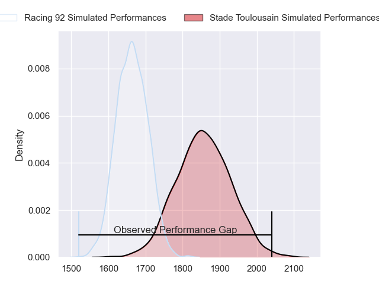
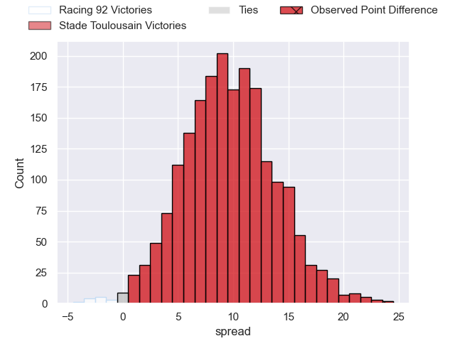
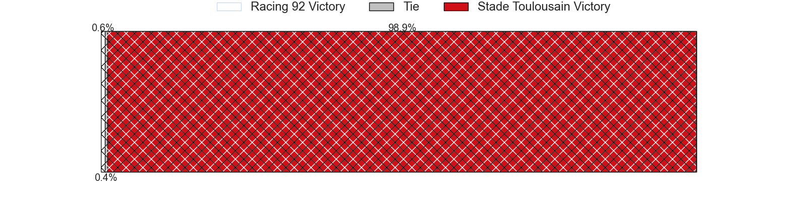
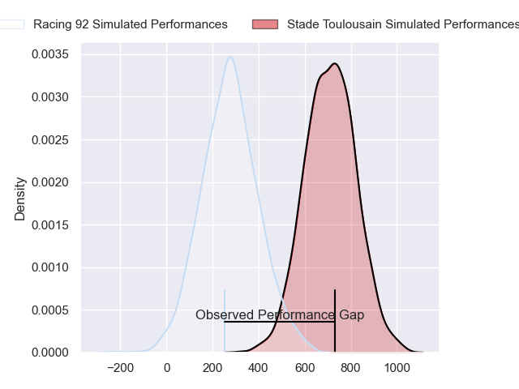
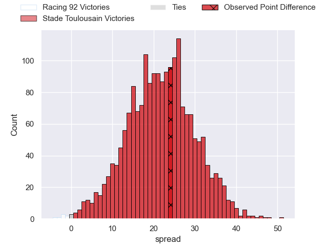
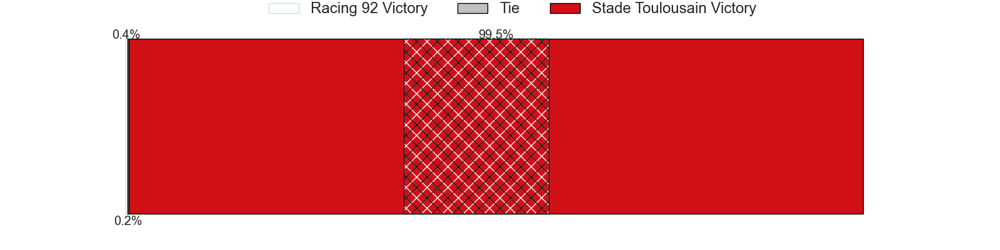

---  
layout: page  
title: Racing 92 at Stade Toulousain; 7-31  
date: 2024-04-07 18:00:00 -0500  
categories: "European Rugby Champions Cup 2023" match review  
---
# Racing 92 at Stade Toulousain; 7-31

# Club Level Predictions

The first set of predictions treats a club as the smallest object, as the club develops its members, organizes a gameplan, and deploys its players as needed for each match. This club model has a prediction of 0.751, which translates to predicting Stade Toulousain to win by 9.7.

Our Over/Under is 40.5 - and combined with the spread above, we have a predicted scoreline of 15 to 25

Each club has a rating and a rating deviation (similar to a Glicko rating), and expected performances can be generated. This allows for simulated matches and spreads like the ones below.
## Projected Performances - Club Model

## Projected Spreads - Club Model

## Projected Results - Club Model

# Player Level Predictions - Version 2

Treating teams instead as an entity made up of the currently active players, I have ratings for each player in an altogether different system. These can be combined to form team ratings once teamsheets are announced, weighting starters a bit higher than the reserves. After the match is played, players can be weighted by their minutes on the field, allowing for an accurate measure of the team's composition. With these compiled team ratings, we can make predictions, measure inaccuracy, and update the individual player ratings.
## Prediction without Player Minutes: Stade Toulousain by 25.5

Stade Toulousain by 18.0 on a neutral pitch

## Projected Performances - Player Model

## Projected Spreads - Player Model

## Projected Results - Player Model

|   Away Minutes | Away Player         |   Away Percentile |   Number |   Home Percentile | Home Player          |   Home Minutes |
|---------------:|:--------------------|------------------:|---------:|------------------:|:---------------------|---------------:|
|             48 | Hassane Kolingar    |             16.33 |        1 |             94.11 | Cyril Baille         |             62 |
|             48 | Peniami Narisia     |             71.76 |        2 |             92.35 | Peato Mauvaka        |             58 |
|             48 | Cedate Gomes Sa     |             64.2  |        3 |             94.4  | Dorian Aldegheri     |             54 |
|             83 | Baptiste Chouzenoux |             86.99 |        4 |             74.94 | Richie Arnold        |             70 |
|             83 | Will Rowlands       |             29.95 |        5 |             78.04 | Emmanuel Meafou      |             58 |
|             83 | Cameron Woki        |             84.82 |        6 |             91.19 | Jack Willis          |             62 |
|             21 | Siya Kolisi         |             85.86 |        7 |             96.87 | Francois Cros        |             83 |
|             83 | Jordan Joseph       |             63.17 |        8 |             93.41 | Alexandre Roumat     |             83 |
|             83 | Clovis Le Bail      |             18.96 |        9 |             99.79 | Antoine Dupont       |             83 |
|             83 | Tristan Tedder      |             47.25 |       10 |             94.25 | Romain Ntamack       |             70 |
|             36 | Wame Naituvi        |             84.82 |       11 |             96.94 | Matthis Lebel        |             83 |
|             83 | Henry Chavancy      |             98.2  |       12 |             55.7  | Pita Ahki            |             83 |
|             83 | Gael Fickou         |             96.16 |       13 |             86.07 | Pierre-Louis Barassi |             25 |
|             83 | Henry Arundell      |             11.1  |       14 |             98.07 | Juan Cruz Mallia     |             83 |
|             70 | Max Spring          |             30.17 |       15 |            100    | Blair Kinghorn       |             83 |
|             35 | Eddy Ben Arous      |             97.06 |       16 |             97.84 | Julien Marchand      |             25 |
|             35 | Trevor Nyakane      |             64.58 |       17 |             42.83 | Rodrigue Neti        |             21 |
|             35 | Thomas Laclayat     |             60.87 |       18 |             77.97 | Joel Merkler         |             29 |
|             41 | Fabien Sanconnie    |             22.79 |       19 |             86.52 | Thibaud Flament      |             25 |
|             21 | Ibrahim Diallo      |             17.5  |       20 |             71.49 | Joshua Brennan       |             21 |
|              3 | Martin Meliande     |              7    |       21 |             58.05 | Mathis Castro        |             13 |
|             10 | Francis Saili       |             20.53 |       22 |             32.08 | Paul Graou           |             13 |
|             47 | Christian Wade      |             94.9  |       23 |             55.22 | Paul Costes          |             58 |

