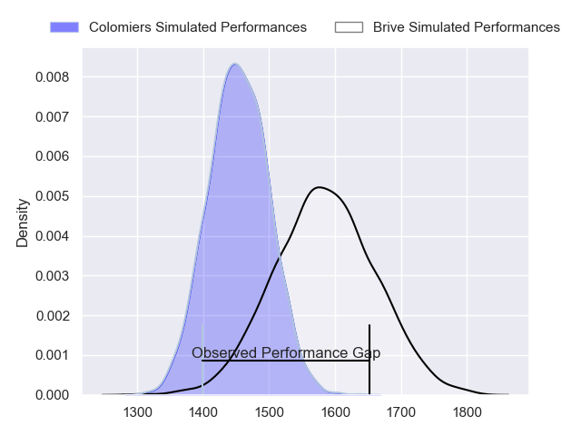
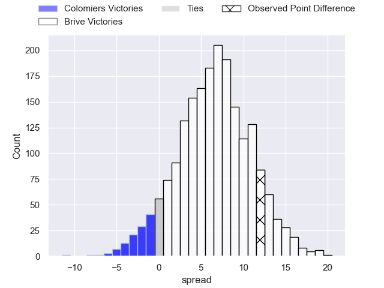
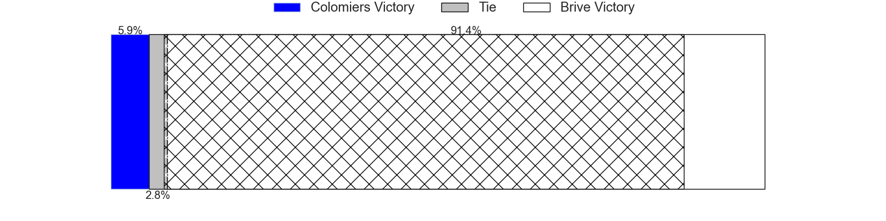
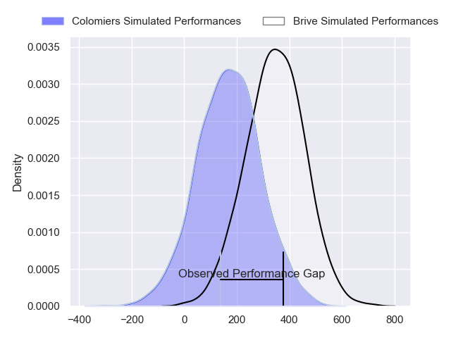
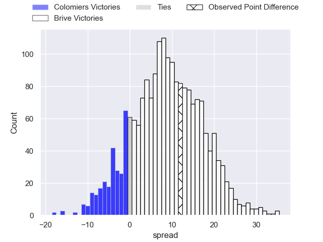
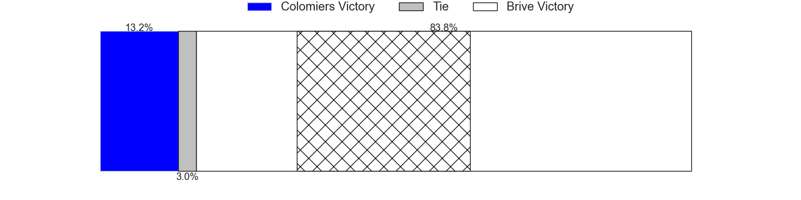

---  
layout: page  
title: Colomiers at Brive; 23-35  
date: 2024-04-11 18:00:00 -0500  
categories: "Pro D2 2023" match review  
---
# Colomiers at Brive; 23-35

# Club Level Predictions

The first set of predictions treats a club as the smallest object, as the club develops its members, organizes a gameplan, and deploys its players as needed for each match. This club model has a prediction of 0.681, which translates to predicting Brive to win by 6.7.

Our Over/Under is 48.5 - and combined with the spread above, we have a predicted scoreline of 21 to 27

Each club has a rating and a rating deviation (similar to a Glicko rating), and expected performances can be generated. This allows for simulated matches and spreads like the ones below.
## Projected Performances - Club Model

## Projected Spreads - Club Model

## Projected Results - Club Model

# Player Level Predictions - Version 2

Treating teams instead as an entity made up of the currently active players, I have ratings for each player in an altogether different system. These can be combined to form team ratings once teamsheets are announced, weighting starters a bit higher than the reserves. After the match is played, players can be weighted by their minutes on the field, allowing for an accurate measure of the team's composition. With these compiled team ratings, we can make predictions, measure inaccuracy, and update the individual player ratings.
## Prediction without Player Minutes: Brive by 10.2

Brive by 2.4 on a neutral pitch

## Projected Performances - Player Model

## Projected Spreads - Player Model

## Projected Results - Player Model

|   Away Minutes | Away Player           |   Away Percentile |   Number |   Home Percentile | Home Player               |   Home Minutes |
|---------------:|:----------------------|------------------:|---------:|------------------:|:--------------------------|---------------:|
|             52 | Guillaume Tartas      |             77.3  |        1 |             12.25 | Daniel Brennan            |             52 |
|             55 | Andrew Ready          |             30.78 |        2 |             79.22 | Issam Hamel               |             41 |
|             52 | Marco Fepulea'i       |             15.19 |        3 |             14.06 | Marcel van der Merwe      |             52 |
|             55 | Maxime Granouillet    |             78.88 |        4 |             75.3  | Asier Usarraga            |             80 |
|             55 | Janse Roux            |             43.32 |        5 |             42    | Oskar Rixen               |             52 |
|             80 | Anthony Coletta       |             51.91 |        6 |             77.75 | Retief Marais             |             80 |
|             55 | Jeremy Bechu          |             45.65 |        7 |             41.48 | Matthieu Voisin           |             52 |
|             80 | Joseva Tamani         |             69.27 |        8 |             89.27 | Ross Moriarty             |             52 |
|             65 | Ugo Seguela           |             63.75 |        9 |             50.42 | Leo Carbonneau            |             80 |
|             62 | Brett Herron          |              0.5  |       10 |             40.25 | Tom Raffy                 |             80 |
|             80 | Rodrigo Marta         |             96.04 |       11 |             70.22 | Mathis Ferté              |             80 |
|             80 | Ray Nu'u              |             61.22 |       12 |             87.64 | Sam Johnson               |             55 |
|             80 | Martin Dulon          |             20.41 |       13 |             42.38 | Sammy Arnold              |             76 |
|             80 | Vincent Pinto         |             87.2  |       14 |             77.58 | Arthur Bonneval           |             80 |
|             80 | Valentin Saurs        |              6.23 |       15 |             44.64 | Nic Krone                 |             80 |
|             28 | Pierre-Samuel Pacheco |             52.03 |       16 |             36.08 | Lucas da Silva            |             39 |
|             28 | Hugo Pirlet           |             68    |       17 |             59.9  | Renger Van Eerten         |             28 |
|             25 | Toma Kolokilagi       |            nan    |       18 |            nan    | Nathan Fraissenon         |             28 |
|             25 | Alexandre Manukula    |             47.37 |       19 |             50    | Taniela Sadrugu           |             28 |
|             25 | Jean Thomas           |             58.71 |       20 |             93.51 | Said Hireche              |             28 |
|             25 | Alexis Caumel         |             49.13 |       21 |             16.52 | Francisco Coria Marchetti |             28 |
|             18 | Thomas Girard         |             53.12 |       22 |             50.3  | Guillaume Galletier       |             25 |
|             15 | Arthur Diaz           |             44.17 |       23 |             61.04 | Julien Blanc              |              4 |

