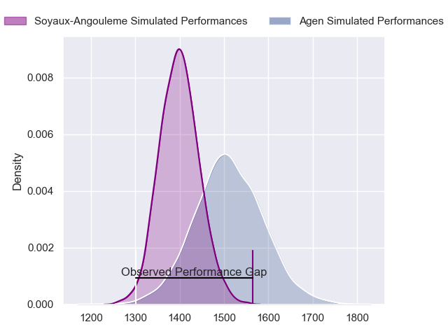
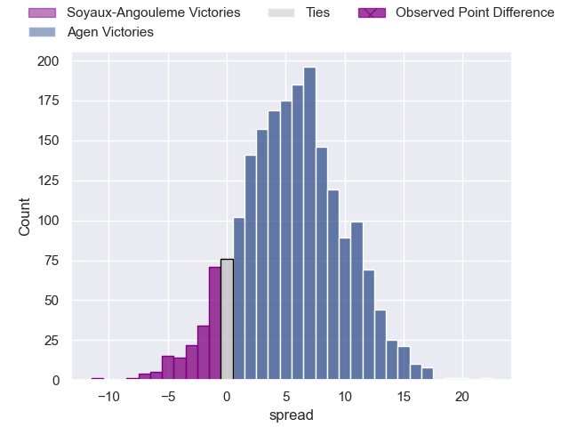
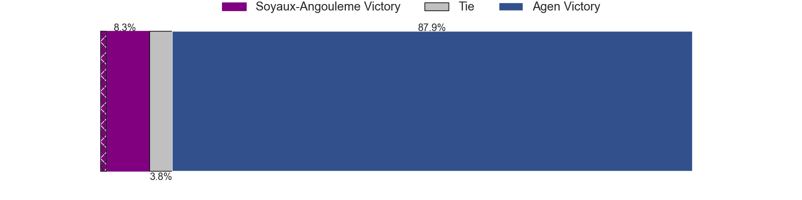
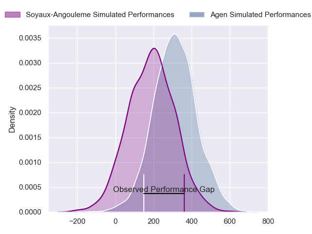
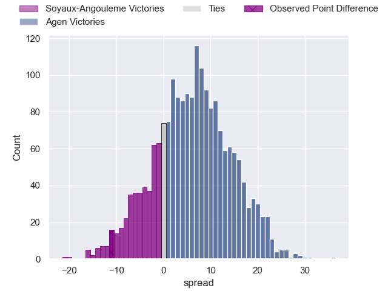
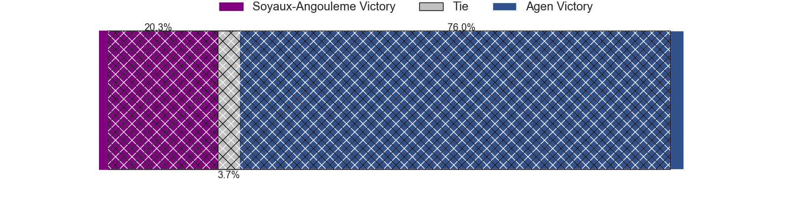

---  
layout: page  
title: Soyaux-Angouleme at Agen; 23-12  
date: 2024-04-12 18:00:00 -0500  
categories: "Pro D2 2023" match review  
---
# Soyaux-Angouleme at Agen; 23-12

# Club Level Predictions

The first set of predictions treats a club as the smallest object, as the club develops its members, organizes a gameplan, and deploys its players as needed for each match. This club model has a prediction of 0.65, which translates to predicting Agen to win by 5.4.

Our Over/Under is 46.5 - and combined with the spread above, we have a predicted scoreline of 21 to 26

Each club has a rating and a rating deviation (similar to a Glicko rating), and expected performances can be generated. This allows for simulated matches and spreads like the ones below.
## Projected Performances - Club Model

## Projected Spreads - Club Model

## Projected Results - Club Model

# Player Level Predictions - Version 2

Treating teams instead as an entity made up of the currently active players, I have ratings for each player in an altogether different system. These can be combined to form team ratings once teamsheets are announced, weighting starters a bit higher than the reserves. After the match is played, players can be weighted by their minutes on the field, allowing for an accurate measure of the team's composition. With these compiled team ratings, we can make predictions, measure inaccuracy, and update the individual player ratings.
## Prediction without Player Minutes: Agen by 8.7

Agen by 0.6 on a neutral pitch

## Projected Performances - Player Model

## Projected Spreads - Player Model

## Projected Results - Player Model

|   Away Minutes | Away Player            |   Away Percentile |   Number |   Home Percentile | Home Player                   |   Home Minutes |
|---------------:|:-----------------------|------------------:|---------:|------------------:|:------------------------------|---------------:|
|             23 | Khatchik Vartanov      |             18.14 |        1 |             14.43 | Florent Guion                 |             45 |
|             50 | Rayne Barka            |             77.45 |        2 |             16.86 | Pierre Jouvin                 |             45 |
|             53 | Yassine Boutemane      |             18.9  |        3 |             46.82 | Beau Farrance                 |             45 |
|             80 | Maxence Lemardelet     |             55.73 |        4 |             93.32 | Antoine Erbani                |             45 |
|             64 | Enzo Morand-Bruyat     |             58    |        5 |              3.46 | Evan Olmstead                 |             80 |
|             80 | Germain Burgaud        |             83.43 |        6 |             42.87 | Matthieu Bonnet               |             80 |
|             80 | Nicolas Martins        |             84.7  |        7 |             31.29 | Valentin Gayraud              |             45 |
|             70 | Alexander Masibaka     |             56.34 |        8 |             14.15 | Martin Devergie               |             80 |
|             68 | Adrien Bau             |              5.42 |        9 |             15.62 | Theo Idjellidaine             |             45 |
|             80 | Ben Botica             |             83.75 |       10 |             67.5  | Thomas Vincent                |             41 |
|             80 | Marvin Lestremau       |             49.38 |       11 |             41.45 | Iban Etcheverry               |             80 |
|             50 | Nasoni Naqiri Kunavore |             89.2  |       12 |             63.03 | Clement Garrigues             |             80 |
|             64 | George Tilsley         |             85.95 |       13 |             71.91 | Peyo Muscarditz               |             80 |
|             80 | Eoghan Barrett         |             64.78 |       14 |             88.22 | Henry Purdy                   |             80 |
|             80 | Pierre Lafitte         |             65.84 |       15 |             85.79 | Mathieu Lamoulie              |             64 |
|             57 | Sami Zouhair           |             95.06 |       16 |             18.5  | Emile Dayral                  |             39 |
|             30 | Patxi Bidart           |             58.43 |       17 |             56.47 | Clement Martinez              |             35 |
|             30 | Ledua Mau              |             83.91 |       18 |            nan    | Mamuka Mstoiani               |             35 |
|             27 | Omar Dahir             |             34.19 |       19 |             88.9  | William Demotte               |             35 |
|             16 | Matt Va'ai             |              9.76 |       20 |             27.32 | Fotu Lokotui                  |             35 |
|             16 | Rémi Brosset           |             30.67 |       21 |             65.24 | Alex Burin                    |             35 |
|             12 | Alexis Levron          |             38.12 |       22 |             43.96 | Dorian Bellot                 |             35 |
|             10 | Hubert Texier          |             38.78 |       23 |             16.31 | Inoke Nalaga Kurukuruvakatini |             16 |

