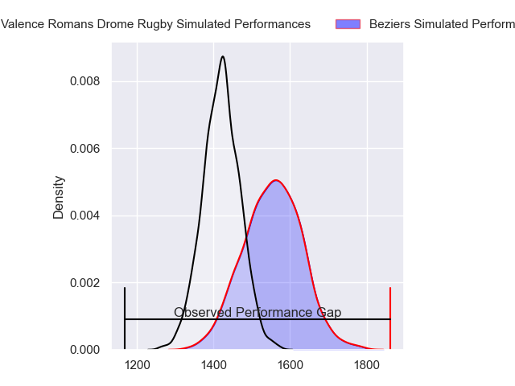
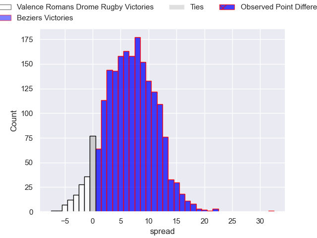
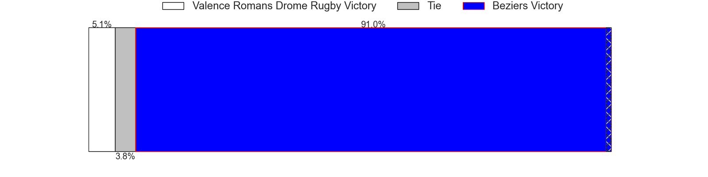
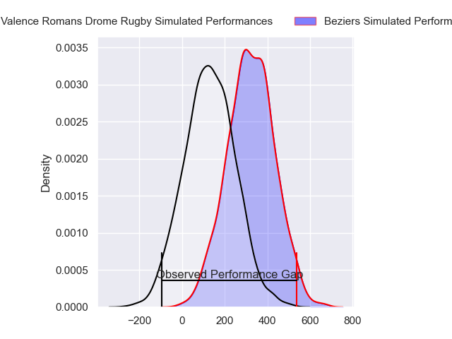
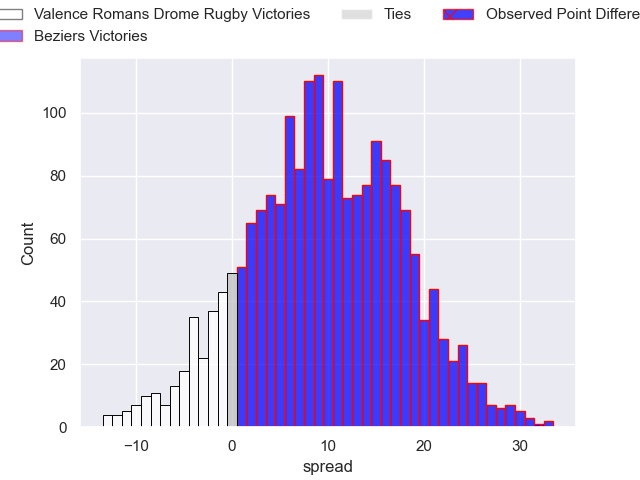
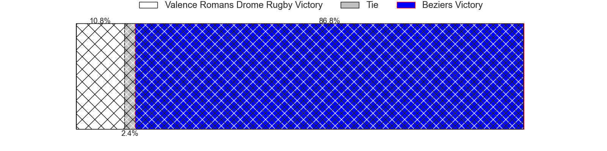

---  
layout: page  
title: Valence Romans Drome Rugby at Beziers; 24-56  
date: 2024-04-12 18:00:00 -0500  
categories: "Pro D2 2023" match review  
---
# Valence Romans Drome Rugby at Beziers; 24-56

# Club Level Predictions

The first set of predictions treats a club as the smallest object, as the club develops its members, organizes a gameplan, and deploys its players as needed for each match. This club model has a prediction of 0.683, which translates to predicting Beziers to win by 6.8.

Our Over/Under is 50.5 - and combined with the spread above, we have a predicted scoreline of 22 to 29

Each club has a rating and a rating deviation (similar to a Glicko rating), and expected performances can be generated. This allows for simulated matches and spreads like the ones below.
## Projected Performances - Club Model

## Projected Spreads - Club Model

## Projected Results - Club Model

# Player Level Predictions - Version 2

Treating teams instead as an entity made up of the currently active players, I have ratings for each player in an altogether different system. These can be combined to form team ratings once teamsheets are announced, weighting starters a bit higher than the reserves. After the match is played, players can be weighted by their minutes on the field, allowing for an accurate measure of the team's composition. With these compiled team ratings, we can make predictions, measure inaccuracy, and update the individual player ratings.
## Prediction without Player Minutes: Beziers by 10.2

Beziers by 1.9 on a neutral pitch

## Projected Performances - Player Model

## Projected Spreads - Player Model

## Projected Results - Player Model

|   Away Minutes | Away Player           |   Away Percentile |   Number |   Home Percentile | Home Player         |   Home Minutes |
|---------------:|:----------------------|------------------:|---------:|------------------:|:--------------------|---------------:|
|             52 | Andrea Pontanier      |             69.52 |        1 |             19.56 | Francisco Fernandes |             44 |
|             52 | Cyril Deligny         |              2.75 |        2 |             74.71 | Wilmar Arnoldi      |             56 |
|             41 | Chris Talakai         |             35.52 |        3 |             76.45 | Jon Zabala Arrieta  |             56 |
|             52 | Charles Brayer        |             50    |        4 |             17.06 | Pierre Gayraud      |             80 |
|             52 | Yassine Maamry        |             59.31 |        5 |             30.43 | John Madigan        |             52 |
|             80 | Axel Bruchet          |             46.23 |        6 |              4.87 | Hans N'kinsi        |             44 |
|             52 | Adrien Roux           |             26.77 |        7 |             79.95 | Clement Ancely      |             80 |
|             80 | Sven Bernat Girlando  |             71.22 |        8 |             17.8  | Thomas Hoarau       |             80 |
|             52 | Tim Menzel            |             82.5  |        9 |             91.04 | Samuel Marques      |             56 |
|             80 | Joris Moura           |             80.25 |       10 |             66.75 | Charly Malie        |             80 |
|             80 | Noe Perret-Tourlonias |             27.97 |       11 |             55.95 | Paul Reau           |             80 |
|             80 | Mathieu Guillomot     |              9    |       12 |             63.15 | Paul Recor          |             80 |
|             80 | Ben Neiceru           |             85.23 |       13 |             89.44 | Tim Nanai-Williams  |             60 |
|             41 | Jonathan Quinnez      |             55.38 |       14 |             89.92 | Raffaele Storti     |             80 |
|             80 | Gauthier Minguillon   |             39.65 |       15 |             89.28 | Gabin Lorre         |             64 |
|             39 | Mathis Roume          |             34.47 |       16 |             24.31 | Giorgi Akhaladze    |             36 |
|             39 | Lucas Meret           |             31.25 |       17 |              0.81 | Pierrick Gunther    |             36 |
|             28 | Julien Royer          |              7.03 |       18 |             63.84 | Clément Bitz        |             28 |
|             28 | Dorian Marco Pena     |             73.73 |       19 |             35.83 | Mitch Short         |             24 |
|             28 | Darrell Dyer          |             85.08 |       20 |             80.78 | Jose Luis Gonzalez  |             24 |
|             28 | Léopold Dupas         |             56.46 |       21 |             62.3  | Luka Tchelidze      |             24 |
|             28 | Philippe Laville      |            nan    |       22 |             59.06 | Taleta Tupuola      |             20 |
|             28 | Éloi Massot           |              4.4  |       23 |             22.94 | Victor Dreuille     |             16 |

