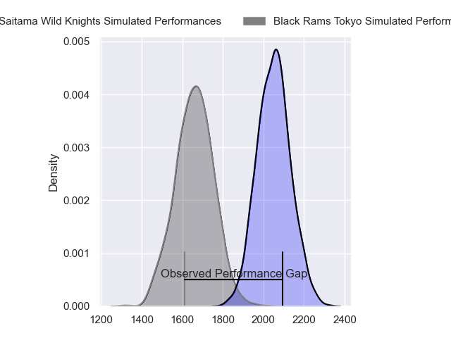
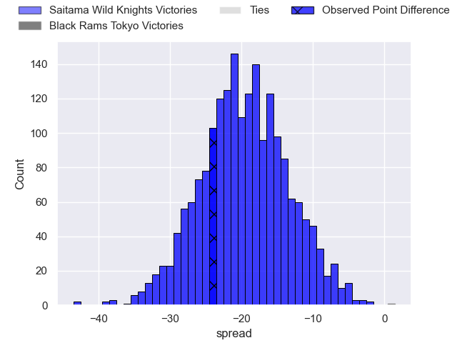
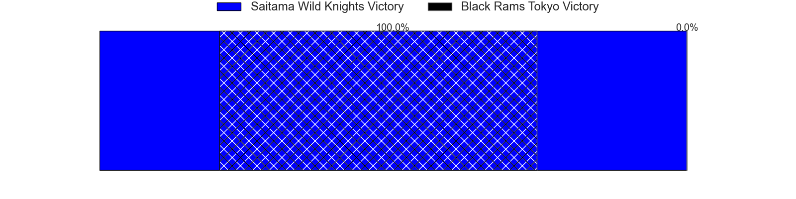
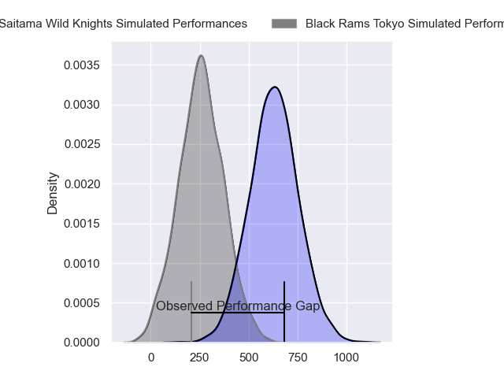
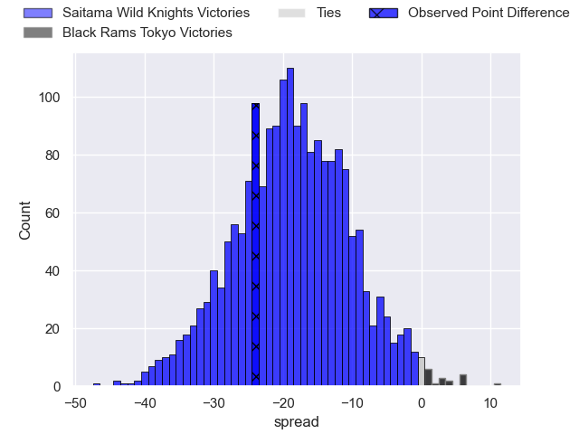
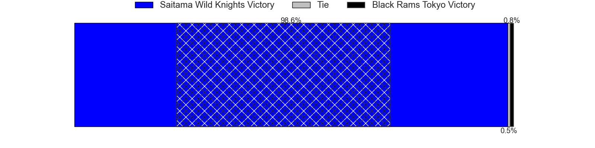

---  
layout: page  
title: Saitama Wild Knights at Black Rams Tokyo; 50-26  
date: 2024-04-12 18:00:00 -0500  
categories: "Japan Rugby League One 2023" match review  
---
# Saitama Wild Knights at Black Rams Tokyo; 50-26

# Club Level Predictions

The first set of predictions treats a club as the smallest object, as the club develops its members, organizes a gameplan, and deploys its players as needed for each match. This club model has a prediction of 0.102, which translates to predicting Saitama Wild Knights to win by 19.5.

Our Over/Under is 57.5 - and combined with the spread above, we have a predicted scoreline of 39 to 19

Each club has a rating and a rating deviation (similar to a Glicko rating), and expected performances can be generated. This allows for simulated matches and spreads like the ones below.
## Projected Performances - Club Model

## Projected Spreads - Club Model

## Projected Results - Club Model

# Player Level Predictions - Version 2

Treating teams instead as an entity made up of the currently active players, I have ratings for each player in an altogether different system. These can be combined to form team ratings once teamsheets are announced, weighting starters a bit higher than the reserves. After the match is played, players can be weighted by their minutes on the field, allowing for an accurate measure of the team's composition. With these compiled team ratings, we can make predictions, measure inaccuracy, and update the individual player ratings.
## Prediction without Player Minutes: Saitama Wild Knights by 18.4

Saitama Wild Knights by 21.7 on a neutral pitch

## Projected Performances - Player Model

## Projected Spreads - Player Model

## Projected Results - Player Model

|   Away Minutes | Away Player      |   Away Percentile |   Number |   Home Percentile | Home Player       |   Home Minutes |
|---------------:|:-----------------|------------------:|---------:|------------------:|:------------------|---------------:|
|             50 | Daniel Perez     |             58.78 |        1 |             55.08 | Kazuma Nishi      |             68 |
|             40 | Atsushi Sakate   |             88.43 |        2 |             34.71 | Hinata Takei      |             49 |
|             50 | Taiki Fujii      |             85.94 |        3 |             27.45 | Shohei Oyama      |             49 |
|             50 | Esei Ha'angana   |             84.01 |        4 |             42.48 | Reijiro Yamamoto  |             80 |
|             80 | Lood de Jager    |             96.42 |        5 |             32.34 | Josh Goodhue      |             46 |
|             59 | Ben Gunter       |             95.71 |        6 |             67.09 | Brodi McCurran    |             80 |
|             80 | Itsuki Onishi    |             92.93 |        7 |             70.22 | Shuhei Matsuhashi |             68 |
|             80 | Jack Cornelsen   |             96.59 |        8 |             35.12 | Samuel Waqabaca   |             80 |
|             59 | Taiki Koyama     |             93.96 |        9 |             65    | Toshiya Takahashi |             40 |
|             65 | Rikiya Matsuda   |             99    |       10 |             53    | Ichigo Nakakusu   |             80 |
|             80 | Marika Koroibete |             95.02 |       11 |             54.93 | Semisi Tupou      |             49 |
|             68 | Vince Aso        |             57.74 |       12 |             81.99 | Matt McGahan      |             80 |
|             80 | Tomoki Osada     |             69.15 |       13 |             58.22 | Yuki Ikeda        |             68 |
|             80 | Koki Takeyama    |             97.62 |       14 |             35.79 | Daisuke Nishikawa |             80 |
|             80 | Ryuji Noguchi    |             96.76 |       15 |             65.59 | Isaac Lucas       |             80 |
|             40 | Kazuma Shimane   |             74.12 |       16 |            nan    | Takanobu Minami   |             40 |
|             30 | Craig Millar     |             73.69 |       17 |             87.07 | Nathan Hughes     |             34 |
|             30 | Asaeli Ai Valu   |             97.63 |       18 |            nan    | Masaaki Onishi    |             31 |
|             30 | Liam Mitchell    |             64.44 |       19 |             73.6  | Paddy Ryan        |             31 |
|             21 | Keisuke Uchida   |             98.12 |       20 |             11.16 | Viliami Lolohea   |             31 |
|             21 | Shota Fukui      |             75.78 |       21 |             62.91 | Ryohei Isoda      |             12 |
|             15 | Kyohei Yamasawa  |             82.29 |       22 |             33.17 | Otoya Kihara      |             12 |
|             12 | Dylan Riley      |             98.44 |       23 |            nan    | Kosei Nakamura    |             12 |

