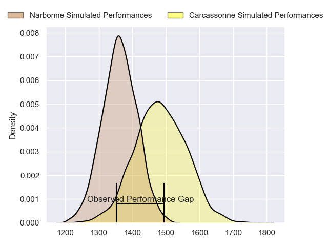
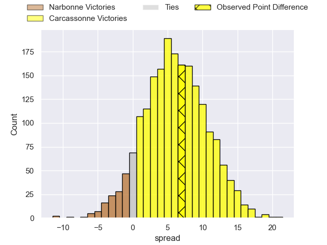
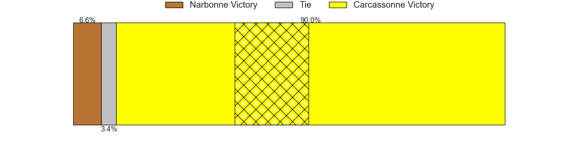
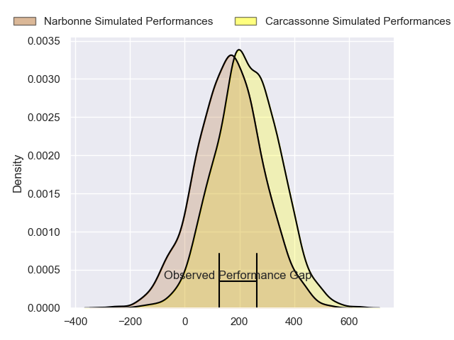
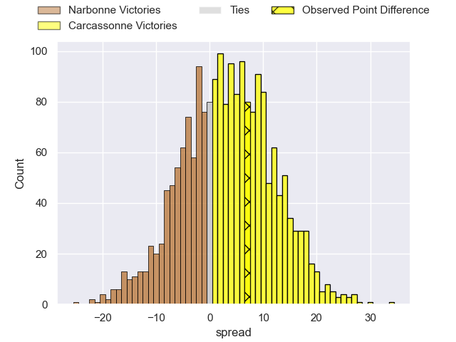
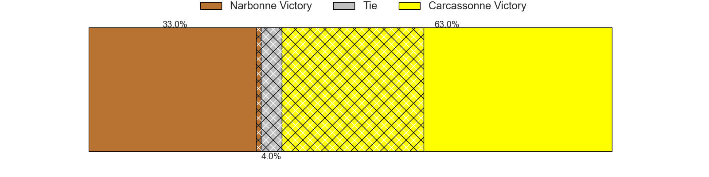

---  
layout: page  
title: Narbonne at Carcassonne; 20-27  
date: 2024-04-12 18:00:00 -0500  
categories: "Nationale 2023" match review  
---
# Narbonne at Carcassonne; 20-27

# Club Level Predictions

The first set of predictions treats a club as the smallest object, as the club develops its members, organizes a gameplan, and deploys its players as needed for each match. This club model has a prediction of 0.666, which translates to predicting Carcassonne to win by 6.1.

Our Over/Under is 37.5 - and combined with the spread above, we have a predicted scoreline of 16 to 22

Each club has a rating and a rating deviation (similar to a Glicko rating), and expected performances can be generated. This allows for simulated matches and spreads like the ones below.
## Projected Performances - Club Model

## Projected Spreads - Club Model

## Projected Results - Club Model

# Player Level Predictions - Version 2

Treating teams instead as an entity made up of the currently active players, I have ratings for each player in an altogether different system. These can be combined to form team ratings once teamsheets are announced, weighting starters a bit higher than the reserves. After the match is played, players can be weighted by their minutes on the field, allowing for an accurate measure of the team's composition. With these compiled team ratings, we can make predictions, measure inaccuracy, and update the individual player ratings.
## Prediction without Player Minutes: Carcassonne by 4.3

Narbonne by 1.7 on a neutral pitch

## Projected Performances - Player Model

## Projected Spreads - Player Model

## Projected Results - Player Model

|   Away Minutes | Away Player            |   Away Percentile |   Number |   Home Percentile | Home Player           |   Home Minutes |
|---------------:|:-----------------------|------------------:|---------:|------------------:|:----------------------|---------------:|
|             60 | Théo Castinel          |             80.27 |        1 |             95.71 | Andrei Ursache        |             75 |
|             72 | Clément Esteriola      |              8.84 |        2 |             75.05 | Raphael Carbou        |             75 |
|             33 | Jamie Hagan            |             45.47 |        3 |             88.37 | Fabien Lorenzon       |             67 |
|             80 | Marius Antonescu       |              7.89 |        4 |             55.26 | Romain Manchia        |             59 |
|             40 | Leva Fifita            |              9.45 |        5 |             54.9  | Romain Guyot          |             50 |
|             80 | Arthur Christienne     |              8.12 |        6 |              5.45 | Valentin Sese         |             80 |
|             47 | Thibault Clauzade      |             79.7  |        7 |             83.87 | Etienne Herjean       |             80 |
|             80 | Baptiste Abescat-Leroy |             68.06 |        8 |             59.95 | Shaun Adendorff       |             80 |
|             54 | Pierrick Nova          |             54.74 |        9 |              1.26 | Martin Landajo        |             80 |
|             80 | Gilles Bosch           |              2.82 |       10 |             55.13 | Gabin Michet          |             80 |
|             80 | Étienne Ducom          |             82.55 |       11 |             94.48 | Clement Egiziano      |             80 |
|             80 | Peter Betham           |             99.39 |       12 |             42.35 | Jeremy To'a           |             54 |
|             54 | Pierre Nueno           |             25.73 |       13 |              7.65 | Mathys Barka          |             62 |
|             80 | Clément Clavières      |             38.4  |       14 |              9.91 | Sakiusa Bureitakiyaca |             80 |
|             80 | Paul Auradou           |             78.95 |       15 |             72.43 | Damien Añon           |             80 |
|             20 | Sylvain Abadie         |              8.48 |       16 |             34.89 | Florent Lorenzon      |              5 |
|              8 | Christophe David       |             87.62 |       17 |            nan    | Baptiste Moreno       |              5 |
|             47 | Mohammed Loukia        |             12.68 |       18 |             17.06 | Vakhtangi Akhobadze   |             13 |
|             40 | Dennis Visser          |             50.36 |       19 |             40.95 | Ferdinand Dreno       |             21 |
|             33 | Luke Nakobukobua       |             91.42 |       20 |             34.57 | Clément Fontaine      |             30 |
|             26 | Josh Valentine         |             93.68 |       21 |             14.68 | Tutuila Vaea          |             26 |
|              3 | Sébastien Giorgis      |             56.08 |       22 |             91.48 | Maxime Gianet         |             18 |
|             23 | James Kane             |             45.36 |       23 |            nan    | nan                   |            nan |

