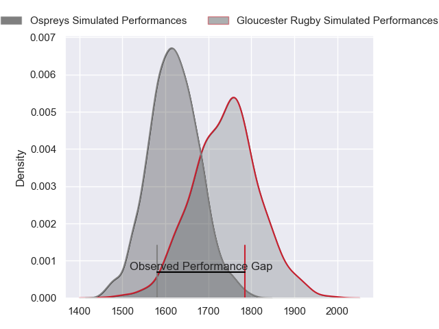
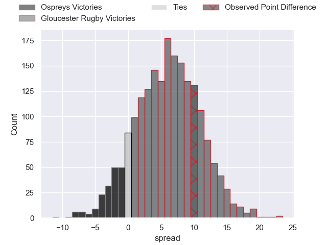
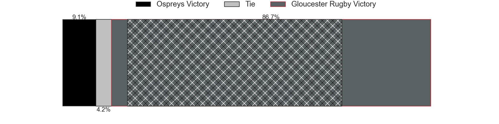
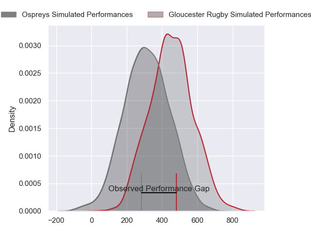
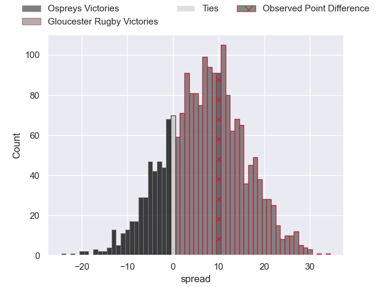
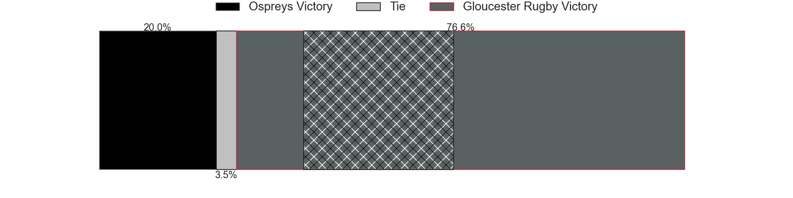

---  
layout: page  
title: Ospreys at Gloucester Rugby; 13-23  
date: 2024-04-12 18:00:00 -0500  
categories: "European Rugby Challenge Cup 2023" match review  
---
# Ospreys at Gloucester Rugby; 13-23

# Club Level Predictions

The first set of predictions treats a club as the smallest object, as the club develops its members, organizes a gameplan, and deploys its players as needed for each match. This club model has a prediction of 0.664, which translates to predicting Gloucester Rugby to win by 6.0.

Our Over/Under is 50.5 - and combined with the spread above, we have a predicted scoreline of 22 to 28

Each club has a rating and a rating deviation (similar to a Glicko rating), and expected performances can be generated. This allows for simulated matches and spreads like the ones below.
## Projected Performances - Club Model

## Projected Spreads - Club Model

## Projected Results - Club Model

# Player Level Predictions - Version 2

Treating teams instead as an entity made up of the currently active players, I have ratings for each player in an altogether different system. These can be combined to form team ratings once teamsheets are announced, weighting starters a bit higher than the reserves. After the match is played, players can be weighted by their minutes on the field, allowing for an accurate measure of the team's composition. With these compiled team ratings, we can make predictions, measure inaccuracy, and update the individual player ratings.
## Prediction without Player Minutes: Gloucester Rugby by 8.8

Gloucester Rugby by 0.7 on a neutral pitch

## Projected Performances - Player Model

## Projected Spreads - Player Model

## Projected Results - Player Model

|   Away Minutes | Away Player            |   Away Percentile |   Number |   Home Percentile | Home Player         |   Home Minutes |
|---------------:|:-----------------------|------------------:|---------:|------------------:|:--------------------|---------------:|
|             58 | Gareth Thomas          |             65.81 |        1 |             17.38 | Jamal Ford-Robinson |             61 |
|             67 | Sam Parry              |             61.76 |        2 |             64.51 | Sebastian Blake     |             61 |
|             67 | Tom Botha              |             78.44 |        3 |             90.12 | Kirill Gotovtsev    |             61 |
|             75 | James Ratti            |             65.99 |        4 |             80.19 | Freddie Clarke      |             80 |
|             80 | Adam Beard             |             94.51 |        5 |             45.47 | Freddie Thomas      |             67 |
|             58 | Harri Deaves           |             81.69 |        6 |             89.69 | Ruan Ackermann      |             80 |
|             80 | Justin Tipuric         |             98.38 |        7 |             43.8  | Lewis Ludlow        |             80 |
|             80 | Morgan Morris          |              9.27 |        8 |             68.78 | Zach Mercer         |             67 |
|             77 | Reuben Morgan-Williams |             68.75 |        9 |             25.62 | Stephen Varney      |             80 |
|             75 | Owen Williams          |             92.5  |       10 |             98    | Adam Hastings       |             80 |
|             80 | Keelan Giles           |             10.53 |       11 |             47.11 | Jake Morris         |             80 |
|             80 | Owen Watkin            |             97.6  |       12 |             33.97 | Sebastien Atkinson  |             80 |
|             80 | Keiran Williams        |             80.43 |       13 |             84.99 | Max Llewellyn       |             48 |
|             80 | Luke Morgan            |             13.59 |       14 |             68.06 | Jonny May           |             80 |
|             67 | Jack Walsh             |             64.34 |       15 |             90.77 | Santiago Carreras   |             80 |
|             13 | Lewis Lloyd            |             58.24 |       16 |             55.1  | Santiago Socino     |             19 |
|             22 | Nicky Smith            |             50.52 |       17 |             10.16 | Mayco Vivas         |             19 |
|             13 | Rhys Henry             |             84.33 |       18 |             47.77 | Fraser Balmain      |             19 |
|              5 | Huw Owen-Sutton        |            nan    |       19 |             90.85 | Albert Tuisue       |             13 |
|             22 | Morgan Morse           |            nan    |       20 |             35.34 | Jack Clement        |             13 |
|              3 | Luke Davies            |             56.88 |       21 |             78.96 | Caolan Englefield   |              0 |
|              5 | Dan Edwards            |             58    |       22 |             62.75 | Charlie Atkinson    |              0 |
|             13 | Max Nagy               |             72.82 |       23 |             79.83 | Chris Harris        |             32 |

