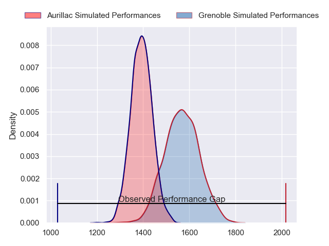
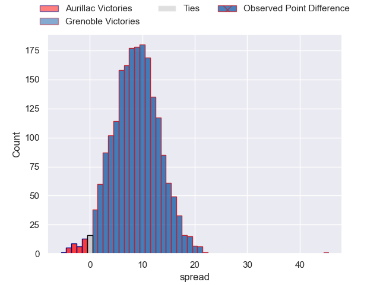
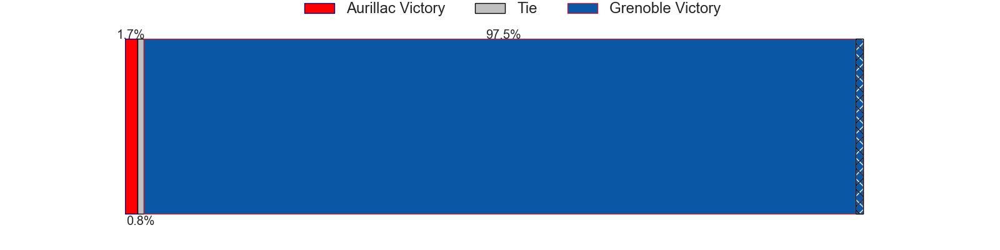
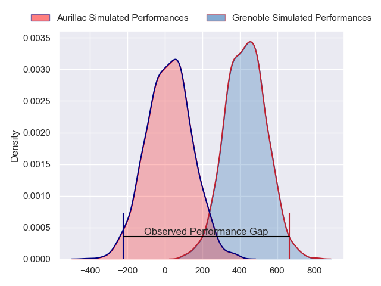
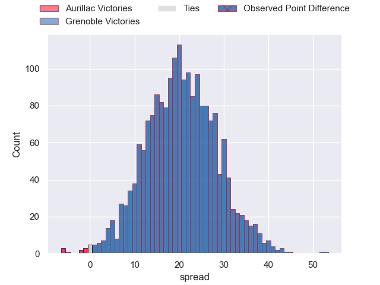
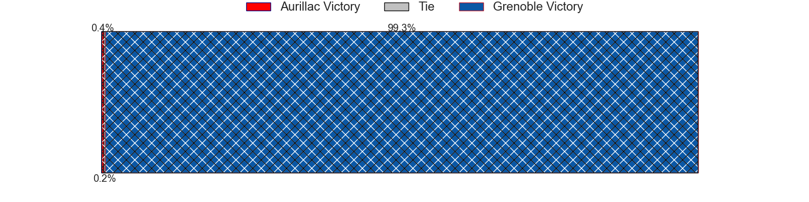

---  
layout: page  
title: Aurillac at Grenoble; 10-55  
date: 2024-04-12 18:00:00 -0500  
categories: "Pro D2 2023" match review  
---
# Aurillac at Grenoble; 10-55

# Club Level Predictions

The first set of predictions treats a club as the smallest object, as the club develops its members, organizes a gameplan, and deploys its players as needed for each match. This club model has a prediction of 0.73, which translates to predicting Grenoble to win by 8.7.

Our Over/Under is 49.5 - and combined with the spread above, we have a predicted scoreline of 20 to 29

Each club has a rating and a rating deviation (similar to a Glicko rating), and expected performances can be generated. This allows for simulated matches and spreads like the ones below.
## Projected Performances - Club Model

## Projected Spreads - Club Model

## Projected Results - Club Model

# Player Level Predictions - Version 2

Treating teams instead as an entity made up of the currently active players, I have ratings for each player in an altogether different system. These can be combined to form team ratings once teamsheets are announced, weighting starters a bit higher than the reserves. After the match is played, players can be weighted by their minutes on the field, allowing for an accurate measure of the team's composition. With these compiled team ratings, we can make predictions, measure inaccuracy, and update the individual player ratings.
## Prediction without Player Minutes: Grenoble by 22.6

Grenoble by 14.7 on a neutral pitch

## Projected Performances - Player Model

## Projected Spreads - Player Model

## Projected Results - Player Model

|   Away Minutes | Away Player         |   Away Percentile |   Number |   Home Percentile | Home Player         |   Home Minutes |
|---------------:|:--------------------|------------------:|---------:|------------------:|:--------------------|---------------:|
|             67 | Alexandre Plantier  |             64.77 |        1 |             22.7  | Eli Eglaine         |             46 |
|             63 | Luka Nioradze       |             12.55 |        2 |             74.51 | Barnabé Massa       |             46 |
|             41 | Thomas Cretu        |             33.9  |        3 |             81.48 | Irakli Aptsiauri    |             52 |
|             80 | Eoghan Masterson    |             73.15 |        4 |             55.85 | Thomas Lainault     |             55 |
|             41 | Martial Rolland     |             37.11 |        5 |             49.52 | Brandon Nansen      |             46 |
|             41 | Latuka Maituku      |              6.37 |        6 |             91.31 | Jose Madeira        |             80 |
|             46 | Théo Cambon         |             11.82 |        7 |             73.23 | Steeve Blanc-Mappaz |             55 |
|             80 | Beka Shvangiradze   |             49.27 |        8 |             62.93 | Pio Muarua          |             80 |
|             63 | Mikheil Alania      |             25.42 |        9 |             90.21 | Eric Escande        |             80 |
|             80 | Marc Palmier        |             13.25 |       10 |             83.25 | Sam Davies          |             80 |
|             80 | Axel Bevia          |             18.35 |       11 |             50.28 | Karim Qadiri        |             41 |
|             80 | Christa Powell      |              9.24 |       12 |             96.28 | Bautista Ezcurra    |             80 |
|             80 | Juun Pieters        |             54.5  |       13 |             59.66 | Romain Trouilloud   |             80 |
|             55 | Simeli Yabaki       |              7.47 |       14 |             86.86 | Wilfried Hulleu     |             27 |
|             80 | Jules Margarit      |             18.95 |       15 |             95.51 | Julien Farnoux      |             80 |
|             39 | Tim Daniel-Meissen  |             23.65 |       16 |             29.17 | Romain Fusier       |             53 |
|             39 | Hugo Huurman        |             65.47 |       17 |             53.25 | Max Clement         |             39 |
|             39 | Heath Backhouse     |             81.26 |       18 |             57.08 | Luka Goginava       |             34 |
|             34 | Aleksandre Burduli  |            nan    |       19 |             46.08 | Lilian Rossi        |             34 |
|             25 | Anderson Neisen     |             32    |       20 |             69.57 | Georgi Javakhia     |             34 |
|             17 | Leo Salvan          |            nan    |       21 |             74.17 | Regis Montagne      |             28 |
|             17 | Lilian Djomboue     |             42.35 |       22 |             34.15 | Thibaut Martel      |             25 |
|             13 | Jean-Jacques Gymael |             12.63 |       23 |             51.46 | Antonin Berruyer    |             25 |

