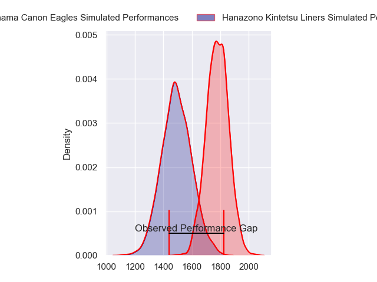
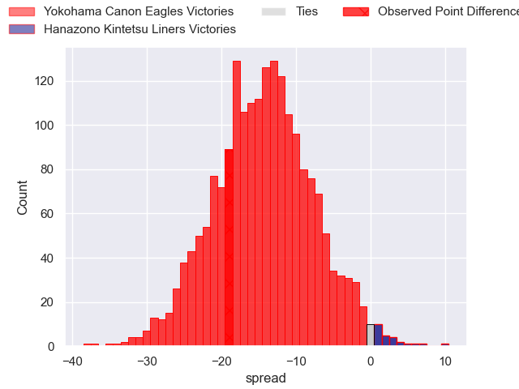
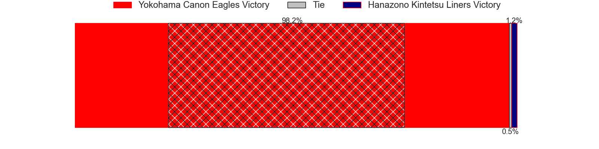
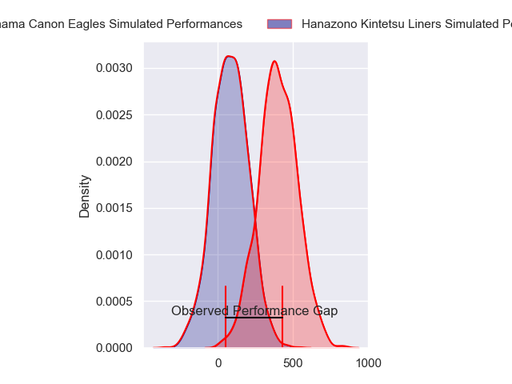
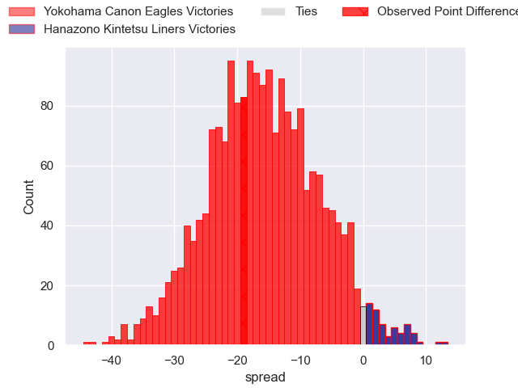
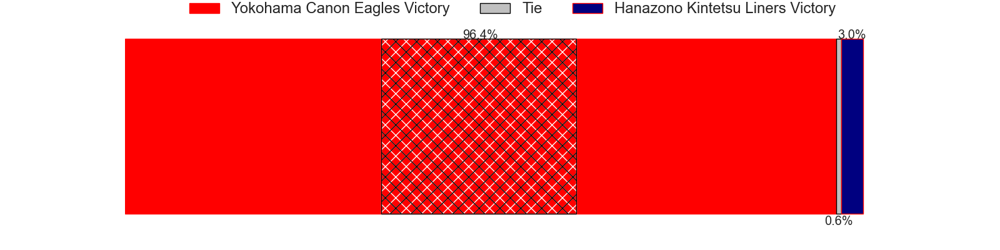

---  
layout: page  
title: Yokohama Canon Eagles at Hanazono Kintetsu Liners; 52-33  
date: 2024-04-12 18:00:00 -0500  
categories: "Japan Rugby League One 2023" match review  
---
# Yokohama Canon Eagles at Hanazono Kintetsu Liners; 52-33

# Club Level Predictions

The first set of predictions treats a club as the smallest object, as the club develops its members, organizes a gameplan, and deploys its players as needed for each match. This club model has a prediction of 0.165, which translates to predicting Yokohama Canon Eagles to win by 14.5.

Our Over/Under is 76.5 - and combined with the spread above, we have a predicted scoreline of 45 to 31

Each club has a rating and a rating deviation (similar to a Glicko rating), and expected performances can be generated. This allows for simulated matches and spreads like the ones below.
## Projected Performances - Club Model

## Projected Spreads - Club Model

## Projected Results - Club Model

# Player Level Predictions - Version 2

Treating teams instead as an entity made up of the currently active players, I have ratings for each player in an altogether different system. These can be combined to form team ratings once teamsheets are announced, weighting starters a bit higher than the reserves. After the match is played, players can be weighted by their minutes on the field, allowing for an accurate measure of the team's composition. With these compiled team ratings, we can make predictions, measure inaccuracy, and update the individual player ratings.
## Prediction without Player Minutes: Yokohama Canon Eagles by 15.7

Yokohama Canon Eagles by 19.2 on a neutral pitch

## Projected Performances - Player Model

## Projected Spreads - Player Model

## Projected Results - Player Model

|   Away Minutes | Away Player              |   Away Percentile |   Number |   Home Percentile | Home Player      |   Home Minutes |
|---------------:|:-------------------------|------------------:|---------:|------------------:|:-----------------|---------------:|
|             53 | Takato Okabe             |             96.96 |        1 |             35.71 | Yushi Inoue      |             59 |
|             65 | Shunta Nakamura          |             89.8  |        2 |             25.29 | Andrew Makalio   |             40 |
|             79 | Ryosuke Iwaihara         |             78.54 |        3 |              6.55 | Lata Tangimana   |             40 |
|             59 | Liaki Moli               |              6.92 |        4 |             17.3  | James Blackwell  |             80 |
|             80 | Matt Philip              |             70.17 |        5 |             62.77 | Sanaila Waqa     |             40 |
|             80 | Kobus Van Dyk            |             91.08 |        6 |              3.94 | Daiki Miyashita  |             80 |
|             59 | Sione Halasili           |             76.13 |        7 |             14.02 | Shohei Nonaka    |             80 |
|             80 | Amanaki Mafi             |             94.63 |        8 |             25.85 | Jose Seru        |             80 |
|             65 | Kouki Arai               |             72.71 |        9 |             84.79 | Will Genia       |             63 |
|             72 | Yu Tamura                |             81.5  |       10 |              2.5  | Daisuke Noguchi  |             79 |
|             80 | Masayoshi Takezawa       |             51.76 |       11 |             78.71 | Takahiro Hayashi |             80 |
|             80 | Yusuke Kajimura          |             94    |       12 |             76.47 | Patrick Stehlin  |             63 |
|             79 | Rohan Janse van Rensburg |             84.63 |       13 |             51.14 | Tom Hendrickson  |             80 |
|             80 | Viliame Takayawa         |             95.13 |       14 |              2.04 | Joshua Nohra     |             80 |
|             80 | Jumpei Ogura             |             98.75 |       15 |             32.17 | Yoshizumi Takeda |             80 |
|             27 | Chang Ho Ahn             |             52.71 |       16 |             25.69 | Kazuma Matsuda   |             40 |
|             21 | Naoto Shimada            |             81    |       17 |             13.01 | Kota Mitake      |             40 |
|             21 | Mitch Brown              |            nan    |       18 |              4.42 | Patrick Tafa     |             40 |
|             15 | Toshiki Amano            |             69.38 |       19 |              5.41 | Kenta Tanaka     |             21 |
|             15 | Shin Kawamura            |            nan    |       20 |             20.83 | Tomoya Nakamura  |             17 |
|              8 | Yuragi Muto              |            nan    |       21 |             14.17 | Haruki Kanazawa  |             17 |
|              1 | Shouta Matsuoka          |            nan    |       22 |              3.84 | Koji Okamura     |              1 |
|              1 | SP Marais                |             94.48 |       23 |            nan    | nan              |            nan |

