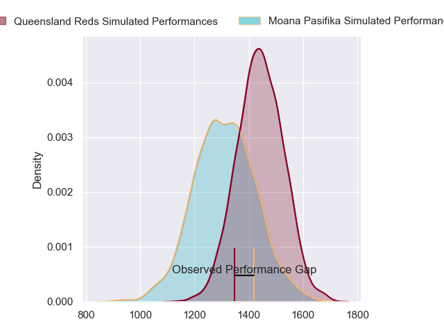
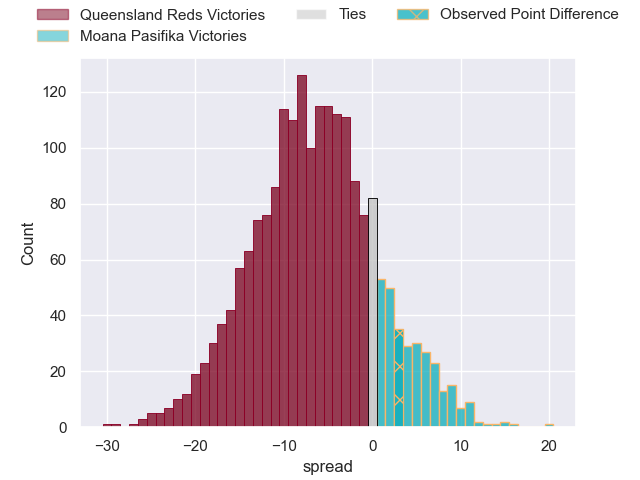
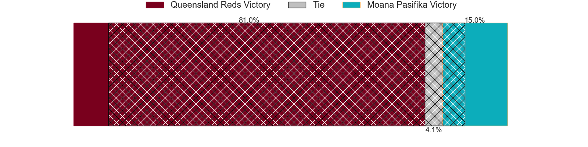
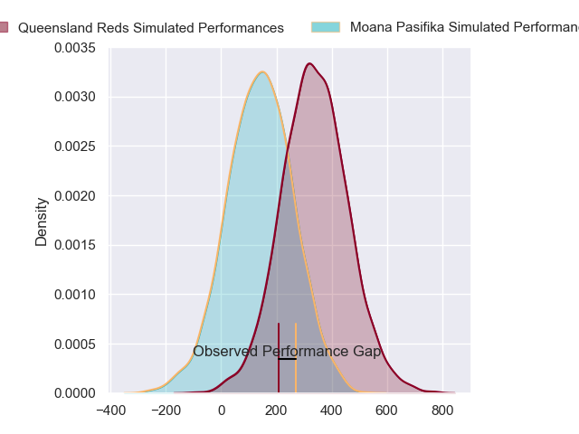
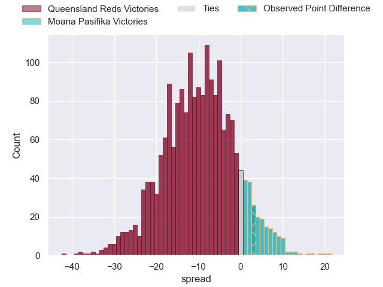
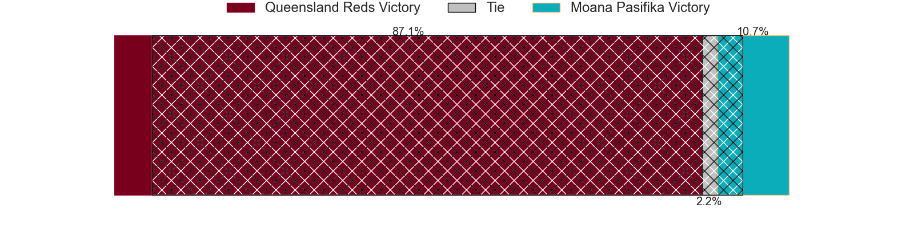

---  
layout: page  
title: Queensland Reds at Moana Pasifika; 14-17  
date: 2024-04-12 18:00:00 -0500  
categories: "Super Rugby Pacific 2024" match review  
---
# Queensland Reds at Moana Pasifika; 14-17

# Club Level Predictions

The first set of predictions treats a club as the smallest object, as the club develops its members, organizes a gameplan, and deploys its players as needed for each match. This club model has a prediction of 0.318, which translates to predicting Queensland Reds to win by 6.8.

Our Over/Under is 53.5 - and combined with the spread above, we have a predicted scoreline of 30 to 23

Each club has a rating and a rating deviation (similar to a Glicko rating), and expected performances can be generated. This allows for simulated matches and spreads like the ones below.
## Projected Performances - Club Model

## Projected Spreads - Club Model

## Projected Results - Club Model

# Player Level Predictions - Version 2

Treating teams instead as an entity made up of the currently active players, I have ratings for each player in an altogether different system. These can be combined to form team ratings once teamsheets are announced, weighting starters a bit higher than the reserves. After the match is played, players can be weighted by their minutes on the field, allowing for an accurate measure of the team's composition. With these compiled team ratings, we can make predictions, measure inaccuracy, and update the individual player ratings.
## Prediction without Player Minutes: Queensland Reds by 10.6

Queensland Reds by 12.9 on a neutral pitch

## Projected Performances - Player Model

## Projected Spreads - Player Model

## Projected Results - Player Model

|   Away Minutes | Away Player               |   Away Percentile |   Number |   Home Percentile | Home Player           |   Home Minutes |
|---------------:|:--------------------------|------------------:|---------:|------------------:|:----------------------|---------------:|
|             48 | Peni Ravai Kovekalou      |             58.69 |        1 |             20.99 | Abraham Pole          |             55 |
|             66 | Matt Faessler             |             67.65 |        2 |              5.69 | Samiuela Moli         |             55 |
|             51 | Jeff Toomaga-Allen        |             92.4  |        3 |             58.5  | Sione Mafileo         |             55 |
|             81 | Seru Uru                  |             59.19 |        4 |             92    | Tom Savage            |             62 |
|             75 | Ryan Smith                |             30.67 |        5 |             20.17 | Allan Craig           |             81 |
|             81 | Liam Wright               |             95.37 |        6 |             41.37 | Irie Papuni           |             55 |
|             81 | Fraser McReight           |             92.24 |        7 |             84.36 | Jacob Norris          |             81 |
|             81 | Harry Wilson              |             60    |        8 |             85.61 | Sione Havili Talitui  |             81 |
|             66 | Tate McDermott            |             78.75 |        9 |              3.12 | Ere Enari             |             74 |
|             56 | Harry McLaughlin-Phillips |             54    |       10 |             30.5  | William Havili        |             81 |
|             81 | Jordan Petaia             |             87.77 |       11 |              6.57 | Fine Inisi            |             66 |
|             81 | Hunter Paisami            |             65.43 |       12 |             97.24 | Julian Savea          |             81 |
|             81 | Josh Flook                |             32.41 |       13 |             30.97 | Henry Taefu           |             47 |
|             50 | Suliasi Vunivalu          |             41.79 |       14 |              4.53 | Viliami Fine          |             81 |
|             81 | Jock Campbell             |             61.85 |       15 |              8.23 | Danny Toala           |             81 |
|             15 | Josh Nasser               |            nan    |       16 |             57.45 | Sama Malolo           |             26 |
|             33 | Alex Hodgman              |             60.78 |       17 |            nan    | Sateki Latu           |             26 |
|             30 | Zane Nonggorr             |             77.78 |       18 |             83    | Sekope Kepu           |             26 |
|              6 | Angus Blyth               |             91.89 |       19 |             35.2  | Ola Tauelangi         |             19 |
|              0 | John Bryant               |            nan    |       20 |             66.05 | Miracle Faiilagi      |             26 |
|             31 | Kalani Thomas             |             62.08 |       21 |             33.12 | Melani Matavao        |              7 |
|             25 | Lawson Creighton          |             17    |       22 |             78.25 | Christian Leali'ifano |             34 |
|             15 | Mac Grealy                |             80.18 |       23 |             73.84 | Nigel Ah Wong         |             15 |

