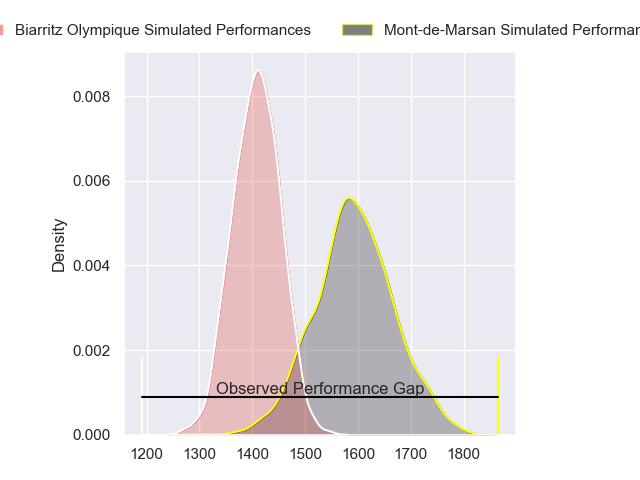
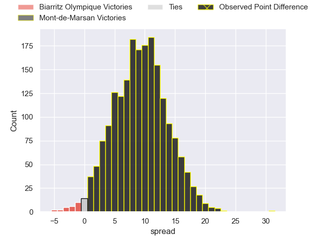
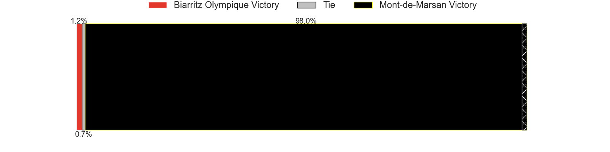
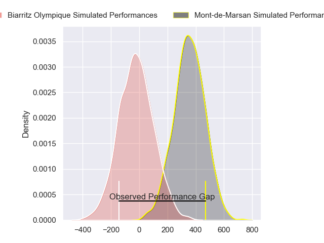
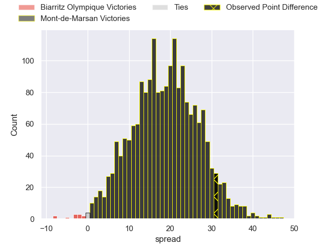
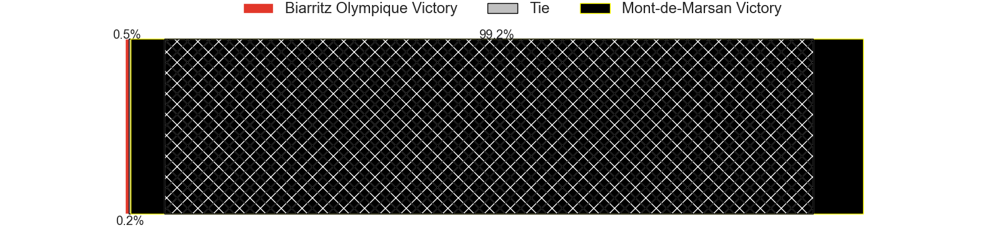

---  
layout: page  
title: Biarritz Olympique at Mont-de-Marsan; 7-38  
date: 2024-04-12 18:00:00 -0500  
categories: "Pro D2 2023" match review  
---
# Biarritz Olympique at Mont-de-Marsan; 7-38

# Club Level Predictions

The first set of predictions treats a club as the smallest object, as the club develops its members, organizes a gameplan, and deploys its players as needed for each match. This club model has a prediction of 0.742, which translates to predicting Mont-de-Marsan to win by 9.2.

Our Over/Under is 50.5 - and combined with the spread above, we have a predicted scoreline of 21 to 30

Each club has a rating and a rating deviation (similar to a Glicko rating), and expected performances can be generated. This allows for simulated matches and spreads like the ones below.
## Projected Performances - Club Model

## Projected Spreads - Club Model

## Projected Results - Club Model

# Player Level Predictions - Version 2

Treating teams instead as an entity made up of the currently active players, I have ratings for each player in an altogether different system. These can be combined to form team ratings once teamsheets are announced, weighting starters a bit higher than the reserves. After the match is played, players can be weighted by their minutes on the field, allowing for an accurate measure of the team's composition. With these compiled team ratings, we can make predictions, measure inaccuracy, and update the individual player ratings.
## Prediction without Player Minutes: Mont-de-Marsan by 18.9

Mont-de-Marsan by 11.1 on a neutral pitch

## Projected Performances - Player Model

## Projected Spreads - Player Model

## Projected Results - Player Model

|   Away Minutes | Away Player       |   Away Percentile |   Number |   Home Percentile | Home Player           |   Home Minutes |
|---------------:|:------------------|------------------:|---------:|------------------:|:----------------------|---------------:|
|             56 | Kevin Tougne      |             21.45 |        1 |              9.82 | Jean-Luc Innocente    |             54 |
|             54 | Bastien Soury     |             68.17 |        2 |             42.44 | Florian Dufour        |             22 |
|             25 | Alfie Petch       |              6.58 |        3 |              9.72 | Anthony Alves         |             54 |
|             80 | Johnny Dyer       |              2.75 |        4 |             67.46 | Nicolas Garrault      |             47 |
|             80 | Adrian Motoc      |              2.51 |        5 |             79.9  | Romain Durand         |             80 |
|             46 | Temo Matiu        |             19.61 |        6 |             55.1  | Aurélien Lisena       |             80 |
|             80 | Charlie Francoz   |              5.92 |        7 |             81.79 | Leo Banos             |             80 |
|             46 | Tornike Jalagonia |             19.9  |        8 |             29.24 | Mike Faleafa          |             48 |
|             80 | Imanol Biscay     |             47.79 |        9 |             37.26 | Nicolas Darquier      |             56 |
|             80 | Chris Hilsenbeck  |              1.54 |       10 |             84.36 | Willie du Plessis     |             52 |
|              6 | Steeve Barry      |             16.78 |       11 |             62.61 | Pierre Sayerse        |             80 |
|             80 | Yann David        |             68.69 |       12 |             75.85 | Jules Even            |             80 |
|             41 | Vincent Martin    |             13.71 |       13 |             44.54 | Gatien Masse          |             57 |
|             80 | Yohann Artru      |             13.18 |       14 |             76.01 | Eroni Sau             |             80 |
|             80 | Gervais Cordin    |             37.09 |       15 |             15.04 | Simao Broeiro Bento   |             80 |
|             35 | Billy Searle      |              4.36 |       16 |             97.64 | Torsten van Jaarsveld |             58 |
|             55 | Lasha Tabidze     |             62.44 |       17 |             14.35 | Myles Edwards         |             33 |
|             39 | Jules Vanheye     |            nan    |       18 |             58.48 | Raphaël Robic         |             32 |
|             39 | Antoine Domercq   |             35.58 |       19 |             18.33 | Simon Desaubies       |             28 |
|             34 | Nafi Ma'afu       |             65.43 |       20 |             56.24 | Mattéo Lalanne        |             26 |
|             34 | Ekain Imaz Agirre |            nan    |       21 |             39.18 | Thomas Bultel         |             26 |
|             26 | Brendan Lebrun    |             60.71 |       22 |             34.53 | Kevin Viallard        |             24 |
|             24 | Zakaria El Fakir  |             15.44 |       23 |             85.44 | Nacani Wakaya         |             23 |

