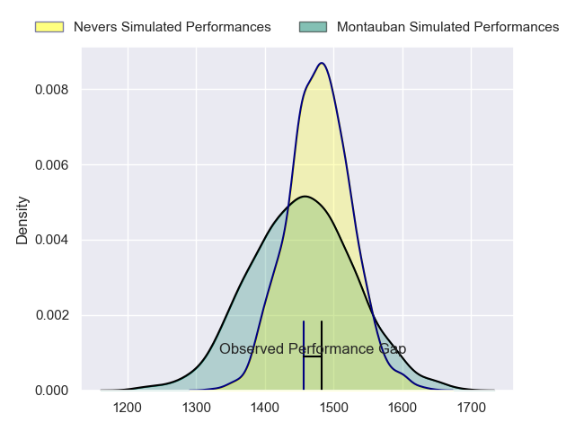
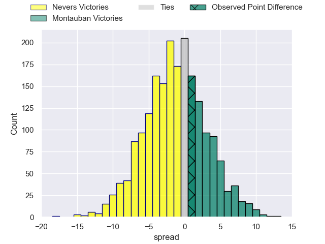
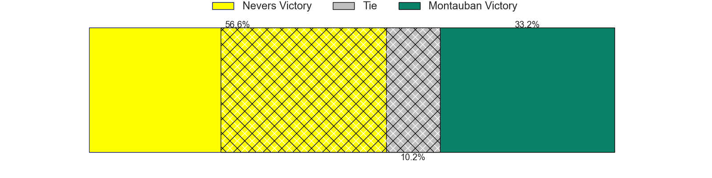
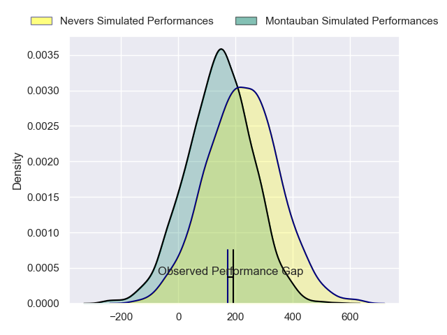
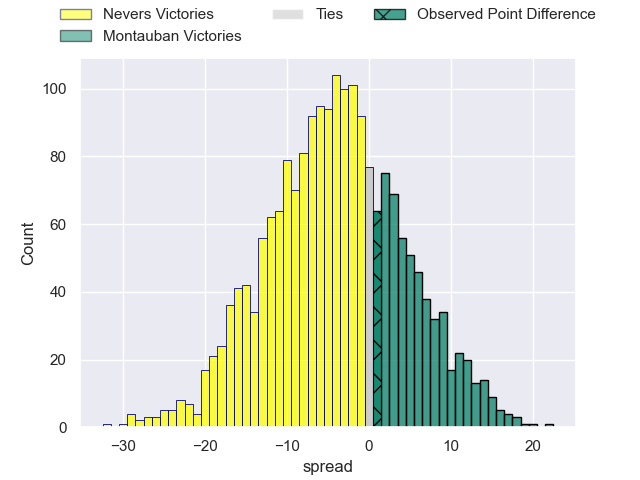

---  
layout: page  
title: Nevers at Montauban; 16-17  
date: 2024-04-12 18:00:00 -0500  
categories: "Pro D2 2023" match review  
---
# Nevers at Montauban; 16-17

# Club Level Predictions

The first set of predictions treats a club as the smallest object, as the club develops its members, organizes a gameplan, and deploys its players as needed for each match. This club model has a prediction of 0.463, which translates to predicting Nevers to win by 1.3.

Our Over/Under is 45.5 - and combined with the spread above, we have a predicted scoreline of 24 to 22

Each club has a rating and a rating deviation (similar to a Glicko rating), and expected performances can be generated. This allows for simulated matches and spreads like the ones below.
## Projected Performances - Club Model

## Projected Spreads - Club Model

## Projected Results - Club Model

# Player Level Predictions - Version 2

Treating teams instead as an entity made up of the currently active players, I have ratings for each player in an altogether different system. These can be combined to form team ratings once teamsheets are announced, weighting starters a bit higher than the reserves. After the match is played, players can be weighted by their minutes on the field, allowing for an accurate measure of the team's composition. With these compiled team ratings, we can make predictions, measure inaccuracy, and update the individual player ratings.
## Prediction without Player Minutes: Nevers by 2.7

Nevers by 9.3 on a neutral pitch

## Projected Performances - Player Model

## Projected Spreads - Player Model

## Projected Results - Player Model

|   Away Minutes | Away Player         |   Away Percentile |   Number |   Home Percentile | Home Player         |   Home Minutes |
|---------------:|:--------------------|------------------:|---------:|------------------:|:--------------------|---------------:|
|             48 | Tornike Mataradze   |             60.44 |        1 |             18.97 | Thomas Bue          |             58 |
|             64 | Jonathan Maiau      |             11    |        2 |              6.09 | Kevin Firmin        |             51 |
|             66 | Cleopas Kundiona    |             35.84 |        3 |             55    | Tietie Tuimauga     |             40 |
|             80 | Lado Chachanidze    |             45.22 |        4 |              5.62 | Tjuee Uanivi        |             80 |
|             63 | Lasha Jaiani        |             83.97 |        5 |             23.33 | Dimitri Vaotoa      |             58 |
|             80 | Luka Plataret       |             78.31 |        6 |             22.85 | Kyllian Ringuet     |             80 |
|             55 | Julien Kazubek      |             82.13 |        7 |             30.97 | Stéphane Munoz      |             53 |
|             80 | Jason-Colin Fraser  |             89.68 |        8 |             12.29 | Tyrone Viiga        |             51 |
|             53 | Guillaume Manevy    |              8.84 |        9 |             63.79 | Yoan Cottin         |             51 |
|             70 | Yohan Le Bourhis    |             74.62 |       10 |             18.21 | Thomas Fortunel     |             80 |
|             80 | Arthur Mathiron     |             53.72 |       11 |             85.81 | Stephane Ahmed      |             80 |
|             80 | Mattéo Faucher      |             51.09 |       12 |              9.34 | Maxime Mathy        |             80 |
|             80 | Rudy Derrieux       |             85.68 |       13 |             27.55 | Yvan Reilhac        |             80 |
|             53 | Thomas Zenon        |              3.94 |       14 |             79.45 | Semesa Rokoduguni   |             80 |
|             80 | Kylian Jaminet      |             78.2  |       15 |             76.69 | Jérôme Bosviel      |             55 |
|             32 | Aitor Kitutu        |             63.3  |       16 |              2.29 | Mirian Burduli      |             40 |
|             27 | Christian Ambadiang |             62.16 |       17 |              9.04 | Badri Alkhazashvili |             29 |
|             27 | Arthurs Barbier     |             71.58 |       18 |             23.59 | Corentin Coularis   |             29 |
|             25 | Robin Dione         |             51.84 |       19 |             48.42 | Alexis Bernadet     |             29 |
|             16 | Quentin Beaudaux    |             40.28 |       20 |             46.64 | Noa Kanika          |             27 |
|             17 | Will Skelton        |             98.21 |       21 |             49.64 | Simon Renda         |             25 |
|             14 | Aselo Ikahehegi     |            nan    |       22 |             25.12 | Lewis Bean          |             22 |
|             10 | Shaun Reynolds      |             27.69 |       23 |              0.38 | Malino Vanai        |             22 |

