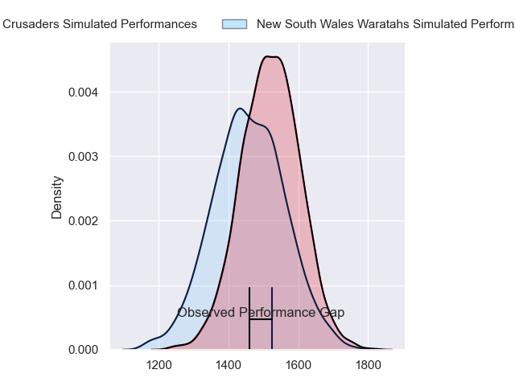
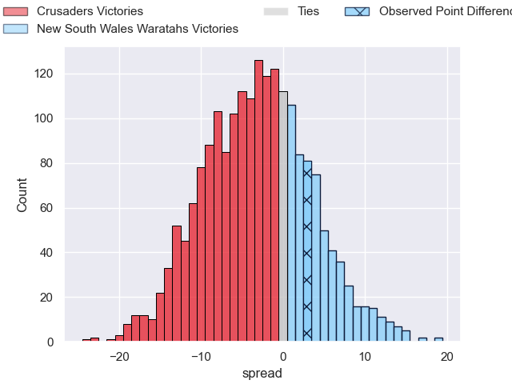
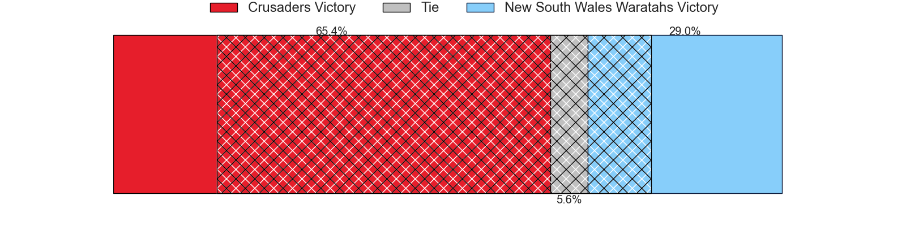
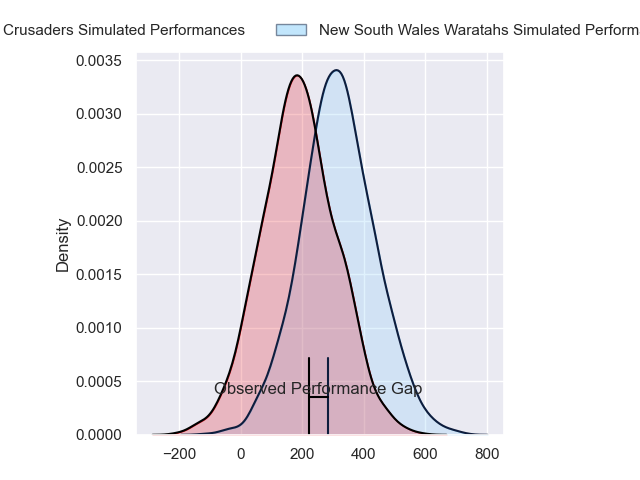
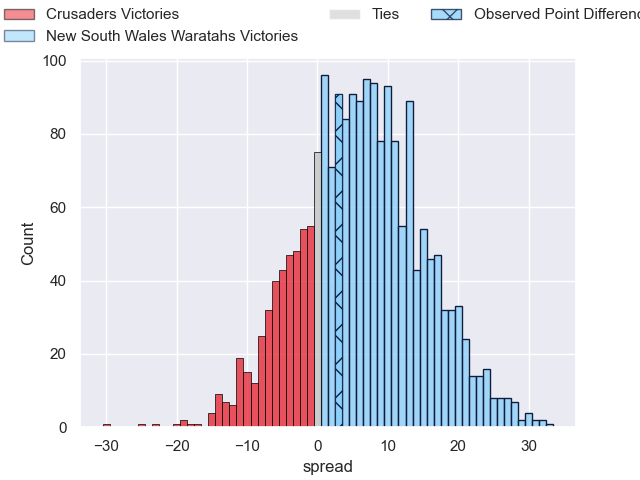
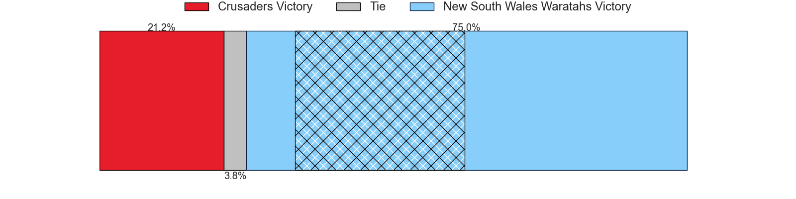

---  
layout: page  
title: Crusaders at New South Wales Waratahs; 40-43  
date: 2024-04-12 18:00:00 -0500  
categories: "Super Rugby Pacific 2024" match review  
---
# Crusaders at New South Wales Waratahs; 40-43

# Club Level Predictions

The first set of predictions treats a club as the smallest object, as the club develops its members, organizes a gameplan, and deploys its players as needed for each match. This club model has a prediction of 0.422, which translates to predicting Crusaders to win by 2.8.

Our Over/Under is 54.5 - and combined with the spread above, we have a predicted scoreline of 28 to 26

Each club has a rating and a rating deviation (similar to a Glicko rating), and expected performances can be generated. This allows for simulated matches and spreads like the ones below.
## Projected Performances - Club Model

## Projected Spreads - Club Model

## Projected Results - Club Model

# Player Level Predictions - Version 2

Treating teams instead as an entity made up of the currently active players, I have ratings for each player in an altogether different system. These can be combined to form team ratings once teamsheets are announced, weighting starters a bit higher than the reserves. After the match is played, players can be weighted by their minutes on the field, allowing for an accurate measure of the team's composition. With these compiled team ratings, we can make predictions, measure inaccuracy, and update the individual player ratings.
## Prediction without Player Minutes: New South Wales Waratahs by 7.9

New South Wales Waratahs by 3.6 on a neutral pitch

## Projected Performances - Player Model

## Projected Spreads - Player Model

## Projected Results - Player Model

|   Away Minutes | Away Player          |   Away Percentile |   Number |   Home Percentile | Home Player              |   Home Minutes |
|---------------:|:---------------------|------------------:|---------:|------------------:|:-------------------------|---------------:|
|             53 | George Bower         |             10.07 |        1 |             91.83 | Hayden Thompson-Stringer |             71 |
|             53 | George Bell          |              8.82 |        2 |             43.33 | Julian Heaven            |             83 |
|             53 | Fletcher Newell      |              1.99 |        3 |             66.86 | Harry Johnson-Holmes     |             57 |
|             83 | Quinten Strange      |             83.89 |        4 |             27.21 | Jed Holloway             |             57 |
|             71 | Jamie Hannah         |             43.08 |        5 |             59.79 | Ned Hanigan              |             83 |
|             53 | Ethan Blackadder     |             97.22 |        6 |             14.6  | Lachlan Swinton          |             83 |
|             83 | Tom Christie         |             69.06 |        7 |             73    | Charlie Gamble           |             83 |
|             83 | Cullen Grace         |             74.63 |        8 |             67.56 | Langi Gleeson            |             69 |
|             55 | Noah Hotham          |             64.58 |        9 |             86.46 | Jake Gordon              |             71 |
|             55 | Riley Hohepa         |             11.25 |       10 |             35.75 | Tane Edmed               |             57 |
|             83 | Johnny McNicholl     |             78.6  |       11 |             71.23 | Dylan Pietsch            |             83 |
|             83 | Dallas McLeod        |             62.3  |       12 |             77.31 | Lalakai Foketi           |             83 |
|             62 | Levi Aumua           |             69.27 |       13 |             53.3  | Izaia Perese             |             62 |
|             83 | Sevu Reece           |             83.47 |       14 |             65.69 | Triston Reilly           |             83 |
|             83 | Chay Fihaki          |             19.95 |       15 |             62.34 | Max Jorgensen            |             83 |
|             30 | Brodie McAlister     |             86.47 |       16 |            nan    | Theo Fourie              |              0 |
|             30 | Joe Moody            |             77.21 |       17 |            nan    | Lewis Ponini             |             12 |
|             30 | Owen Franks          |             79.01 |       18 |             27.26 | Tom Ross                 |             26 |
|             12 | Dom Gardiner         |             29.55 |       19 |              5.13 | Miles Amatosero          |             14 |
|             30 | Christian Lio-Willie |             36.59 |       20 |             17.32 | Hugh Sinclair            |             26 |
|             28 | Mitchell Drummond    |             91.25 |       21 |            nan    | Jack Grant               |             12 |
|             28 | Rivez Reihana        |             32.5  |       22 |            nan    | Will Harrison            |             26 |
|             21 | Macca Springer       |             30.01 |       23 |             82.35 | Joey Walton              |             21 |

