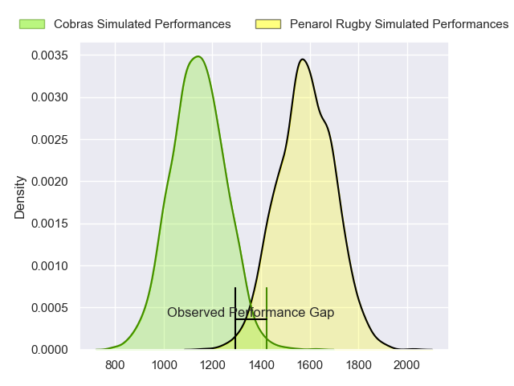
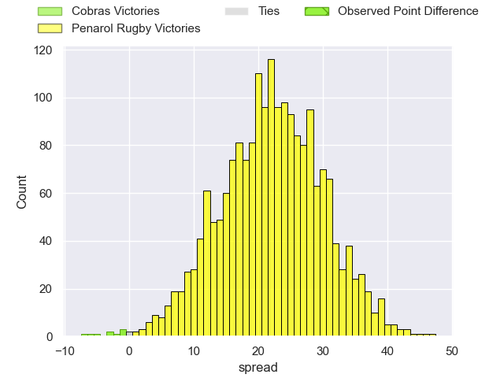
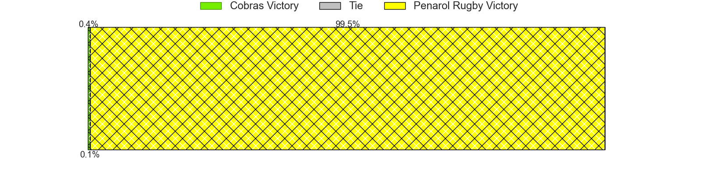
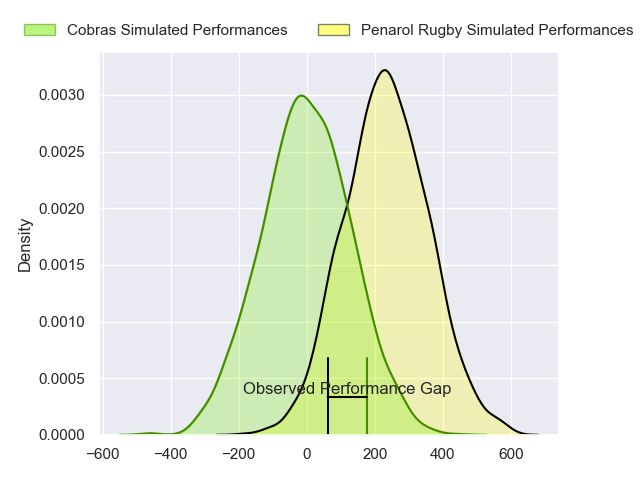
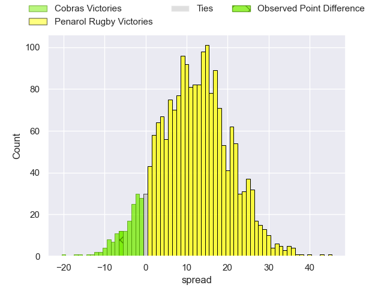
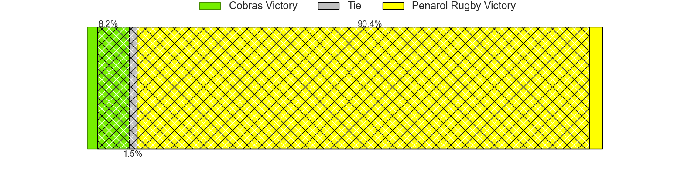

---  
layout: page  
title: Cobras at Penarol Rugby; 25-19  
date: 2024-04-12 18:00:00 -0500  
categories: "Super Rugby Americas 2024" match review  
---
# Cobras at Penarol Rugby; 25-19

# Club Level Predictions

The first set of predictions treats a club as the smallest object, as the club develops its members, organizes a gameplan, and deploys its players as needed for each match. This club model has a prediction of 0.916, which translates to predicting Penarol Rugby to win by 21.9.

Our Over/Under is 47.5 - and combined with the spread above, we have a predicted scoreline of 13 to 35

Each club has a rating and a rating deviation (similar to a Glicko rating), and expected performances can be generated. This allows for simulated matches and spreads like the ones below.
## Projected Performances - Club Model

## Projected Spreads - Club Model

## Projected Results - Club Model

# Player Level Predictions - Version 2

Treating teams instead as an entity made up of the currently active players, I have ratings for each player in an altogether different system. These can be combined to form team ratings once teamsheets are announced, weighting starters a bit higher than the reserves. After the match is played, players can be weighted by their minutes on the field, allowing for an accurate measure of the team's composition. With these compiled team ratings, we can make predictions, measure inaccuracy, and update the individual player ratings.
## Prediction without Player Minutes: Penarol Rugby by 12.4

Penarol Rugby by 10.0 on a neutral pitch

## Projected Performances - Player Model

## Projected Spreads - Player Model

## Projected Results - Player Model

|   Away Minutes | Away Player               |   Away Percentile |   Number |   Home Percentile | Home Player                     |   Home Minutes |
|---------------:|:--------------------------|------------------:|---------:|------------------:|:--------------------------------|---------------:|
|             76 | Luciano Gabellieri        |             69.69 |        1 |             11.34 | Mateo Sanguinetti               |             60 |
|             40 | Henrique Ribeiro Ferreira |             22    |        2 |             23.18 | Francisco Garcia                |             80 |
|             80 | Francisco Moreno          |             75.31 |        3 |             25.17 | Santiago Martirene              |             66 |
|             80 | Franco Carrera            |             70.93 |        4 |             34.33 | Manuel Rosmarino                |             66 |
|             57 | Gabriel Paganini          |              2.15 |        5 |             64.71 | Lucas Bianchi                   |             80 |
|             74 | Cleber Dias               |              6.5  |        6 |             46.98 | Santiago Civetta                |             80 |
|             57 | Rafael Teixeira           |             56.5  |        7 |             67.52 | Carlos Deus                     |             80 |
|             80 | Andre Arruda              |             10.32 |        8 |             75.92 | Manuel Diana Olaso              |             80 |
|             80 | Felipe Goncalves Cunha    |             59.37 |        9 |             65.26 | Santiago Álvarez Viera Da Cunha |             40 |
|             60 | Joao Amaral               |             61.03 |       10 |             78.97 | Juan Zuccarino                  |             80 |
|             80 | Ariel Rodrigues           |             40.99 |       11 |             27.25 | Dante Soto                      |             80 |
|             80 | Robert Tenorio            |             10.44 |       12 |             19.54 | Juan Manuel Alonso Dieguez      |             80 |
|             80 | Carlo Mignot              |             54.73 |       13 |             64.44 | Felipe Arcos Perez              |             80 |
|             60 | Agustin Llano             |             68.69 |       14 |              3.83 | Gaston Mieres Valente           |             80 |
|             80 | Luca Mignot               |             55.14 |       15 |             30.58 | Ignacio Alvarez                 |             40 |
|             40 | Endy Willian              |             11.39 |       16 |            nan    | Pedro Hoblog                    |             40 |
|             23 | Gabriel Oliveira          |             21.53 |       17 |            nan    | Valentin Grille Dotti           |             40 |
|             23 | Adrio Melo                |             54.79 |       18 |             59.77 | Mateo Perillo                   |             20 |
|             20 | Lucas Tranquez            |              6.77 |       19 |            nan    | Duban Silvera                   |             14 |
|             20 | Lorenzo Massari           |             19.78 |       20 |            nan    | Tomas Etcheverry                |             14 |
|              6 | Pedro Aparecido           |            nan    |       21 |            nan    | nan                             |            nan |
|              4 | Levy Marinho              |             26.69 |       22 |            nan    | nan                             |            nan |

