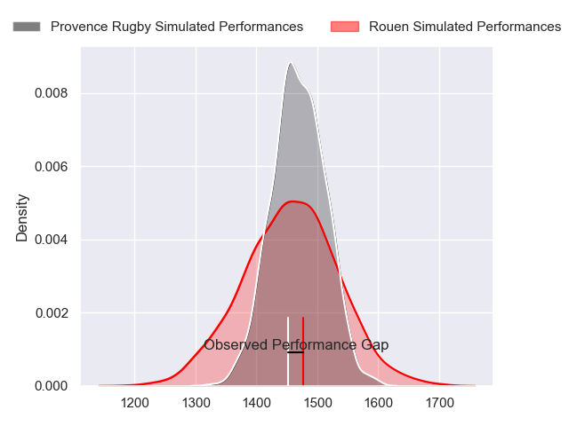
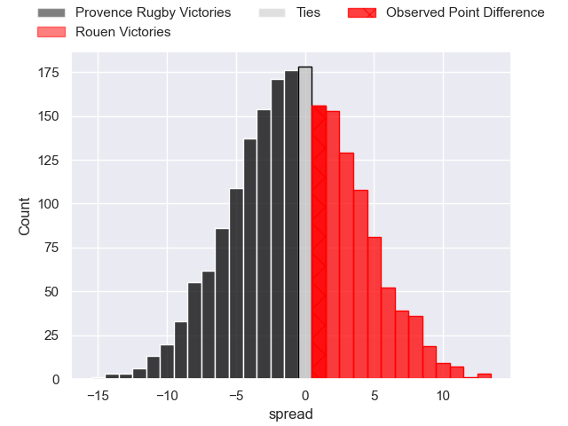
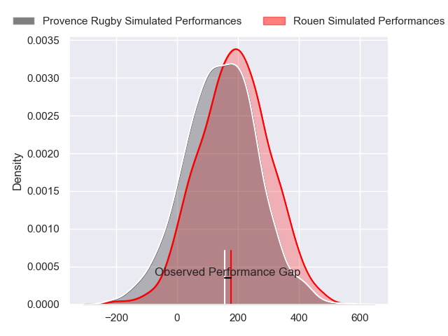
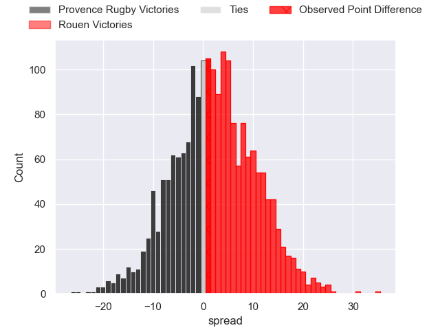

---  
layout: page  
title: Provence Rugby at Rouen; 28-29  
date: 2024-04-12 18:00:00 -0500  
categories: "Pro D2 2023" match review  
---
# Provence Rugby at Rouen; 28-29

# Club Level Predictions

The first set of predictions treats a club as the smallest object, as the club develops its members, organizes a gameplan, and deploys its players as needed for each match. This club model has a prediction of 0.484, which translates to predicting Provence Rugby to win by 0.6.

Our Over/Under is 48.5 - and combined with the spread above, we have a predicted scoreline of 25 to 24

Each club has a rating and a rating deviation (similar to a Glicko rating), and expected performances can be generated. This allows for simulated matches and spreads like the ones below.
## Projected Performances - Club Model

## Projected Spreads - Club Model

## Projected Results - Club Model

# Player Level Predictions - Version 2

Treating teams instead as an entity made up of the currently active players, I have ratings for each player in an altogether different system. These can be combined to form team ratings once teamsheets are announced, weighting starters a bit higher than the reserves. After the match is played, players can be weighted by their minutes on the field, allowing for an accurate measure of the team's composition. With these compiled team ratings, we can make predictions, measure inaccuracy, and update the individual player ratings.
## Prediction without Player Minutes: Rouen by 0.5

Provence Rugby by 2.7 on a neutral pitch

## Projected Performances - Player Model

## Projected Spreads - Player Model

## Projected Results - Player Model

|   Away Minutes | Away Player           |   Away Percentile |   Number |   Home Percentile | Home Player       |   Home Minutes |
|---------------:|:----------------------|------------------:|---------:|------------------:|:------------------|---------------:|
|             45 | Paul Mallez           |             62.82 |        1 |             21.54 | Elias El Ansari   |             40 |
|             45 | Loick Jammes          |              2.36 |        2 |             36.54 | Efi Ma'afu        |             62 |
|             45 | Thomas Vernet         |             41.94 |        3 |             76.36 | Soso Bekoshvili   |             68 |
|             45 | Jérôme Dufour         |             84.45 |        4 |             24.28 | Jean Leleu        |             80 |
|             80 | Clément Chartier      |             51.56 |        5 |             40.07 | Will Witty        |             80 |
|             80 | Guillaume Piazzoli    |             64.97 |        6 |             46.06 | Lucas Costa       |             59 |
|             23 | Bilel Taieb           |             83.53 |        7 |             44.9  | Samuel Maximin    |             80 |
|             80 | Baptiste Belhadj      |             65.85 |        8 |             22.85 | Tino Mapapalangi  |             48 |
|             63 | Joris Cazenave        |             66.74 |        9 |             73.89 | Maxime Sidobre    |             50 |
|             54 | Enzo Selponi          |             86.97 |       10 |             86.15 | Franck Pourteau   |             80 |
|             80 | Hugo Navizet          |             73.2  |       11 |             68.36 | Paul Vallee       |             80 |
|             80 | Dorian Lavernhe       |             35.68 |       12 |             34.83 | JT Jackson        |             80 |
|             54 | Louis Marrou          |             82.89 |       13 |              8.5  | Alex Luatua       |             48 |
|             80 | Sione Tui             |             78.15 |       14 |             86.04 | Benito Masilevu   |             80 |
|             80 | Adrien Lapegue-Lafaye |             17.12 |       15 |             80.7  | Baptiste Mouchous |             62 |
|             57 | Charly Gambini        |             66.01 |       16 |             37.37 | Cody Thomas       |             40 |
|             35 | Julius Nostadt        |             76.55 |       17 |             86.54 | Tienie Burger     |             32 |
|             35 | Jean Charles Orioli   |             48.92 |       18 |             56.8  | Pablo Patilla     |             32 |
|             35 | Eliott Yemsi          |            nan    |       19 |             59.58 | Florent Campeggia |             30 |
|             35 | Andres Zafra Tarazona |              0.72 |       20 |             80.97 | Julien Ruaud      |             21 |
|             26 | Johnny McPhillips     |            nan    |       21 |             47.69 | Edgar Retiere     |             18 |
|             26 | Atila Septar          |             41.02 |       22 |              4.13 | Jeremie Maurouard |             18 |
|             17 | Simon Tarel           |             32.42 |       23 |              2    | Luka Azariashvili |             12 |

