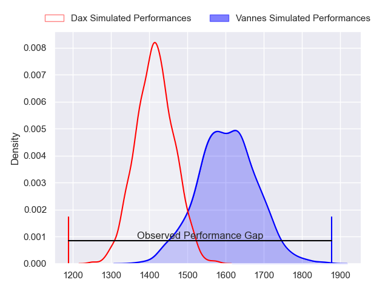
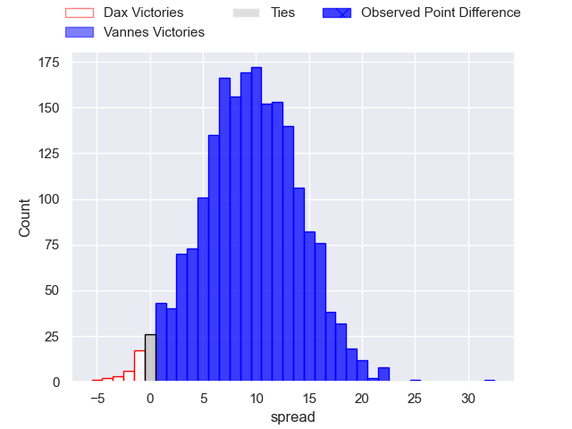
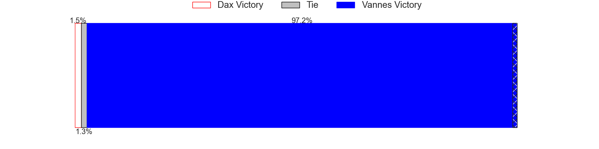
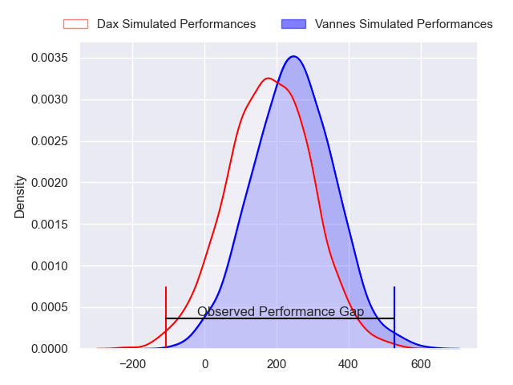
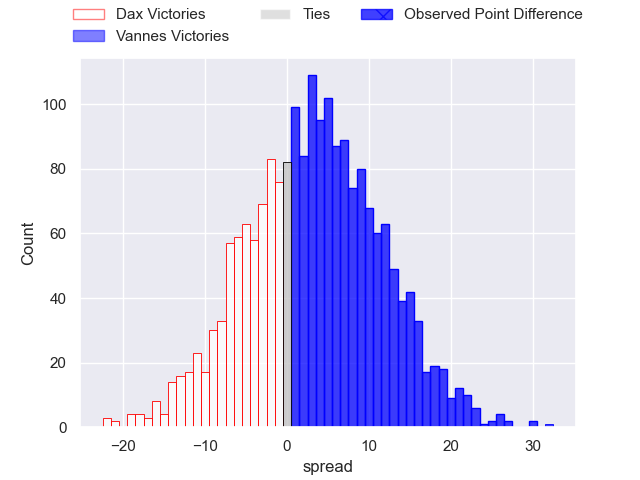
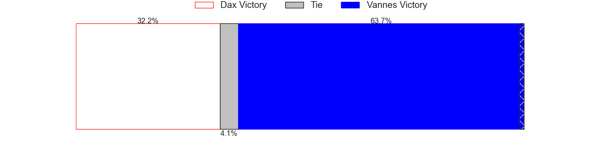

---  
layout: page  
title: Dax at Vannes; 10-42  
date: 2024-04-12 18:00:00 -0500  
categories: "Pro D2 2023" match review  
---
# Dax at Vannes; 10-42

# Club Level Predictions

The first set of predictions treats a club as the smallest object, as the club develops its members, organizes a gameplan, and deploys its players as needed for each match. This club model has a prediction of 0.747, which translates to predicting Vannes to win by 9.5.

Our Over/Under is 52.5 - and combined with the spread above, we have a predicted scoreline of 21 to 31

Each club has a rating and a rating deviation (similar to a Glicko rating), and expected performances can be generated. This allows for simulated matches and spreads like the ones below.
## Projected Performances - Club Model

## Projected Spreads - Club Model

## Projected Results - Club Model

# Player Level Predictions - Version 2

Treating teams instead as an entity made up of the currently active players, I have ratings for each player in an altogether different system. These can be combined to form team ratings once teamsheets are announced, weighting starters a bit higher than the reserves. After the match is played, players can be weighted by their minutes on the field, allowing for an accurate measure of the team's composition. With these compiled team ratings, we can make predictions, measure inaccuracy, and update the individual player ratings.
## Prediction without Player Minutes: Vannes by 4.9

Vannes by 1.0 on a neutral pitch

## Projected Performances - Player Model

## Projected Spreads - Player Model

## Projected Results - Player Model

|   Away Minutes | Away Player          |   Away Percentile |   Number |   Home Percentile | Home Player             |   Home Minutes |
|---------------:|:---------------------|------------------:|---------:|------------------:|:------------------------|---------------:|
|             45 | Thibaud Dréan        |             49.48 |        1 |             87.65 | Andy Bordelai           |             60 |
|             44 | Louis Barrere        |             21.18 |        2 |             86.27 | Pat Leafa               |             55 |
|             45 | David Lolohea        |             17.28 |        3 |             92.31 | Paga Tafili             |             55 |
|             80 | Josh Furno           |             44.39 |        4 |             14.8  | Eric Marks              |             80 |
|             55 | Mat Luamanu          |             66.11 |        5 |             17.42 | Mattéo Desjeux          |             55 |
|             80 | Paul Arnaud Ausset   |             59.44 |        6 |             23.17 | Juan Bautista Pedemonte |             55 |
|             45 | Théo Tremeau         |             50.29 |        7 |             97.8  | Francisco Gorrissen     |             80 |
|             80 | Sam Wasley           |             44.63 |        8 |             91.71 | Joe Edwards             |             60 |
|             52 | Simon Garrouteigt    |             70.42 |        9 |             91.88 | Michael Ruru            |             55 |
|             52 | Hugo Cerisier        |             69    |       10 |             94.5  | Maxime Lafage           |             55 |
|             80 | Alexandre Pilati     |              9.4  |       11 |             75.88 | Romaric Camou           |             80 |
|             55 | Ilikena Bolakoro     |             86.19 |       12 |             14.89 | Alex Arrate             |             80 |
|             80 | Bastien Daguerre     |             65.91 |       13 |             48.86 | Robin Taccola           |             80 |
|             80 | Guillaume Bouche     |             46.89 |       14 |             56.51 | Enzo Benmegal           |             80 |
|             80 | Théo Duprat          |             61.35 |       15 |             57.86 | Thibault Debaes         |             80 |
|             35 | Raphaël Laboille     |             37.7  |       16 |             18.08 | Karl Chateau            |             25 |
|             35 | Arnaud Aletti        |             76.83 |       17 |             80.63 | Phil Kite               |             25 |
|             35 | Diogo Hasse Ferreira |             20.04 |       18 |             45.37 | Sione Kalamafoni        |             25 |
|             28 | Romuald Séguy        |             57.25 |       19 |             37.5  | Jules Le Bail           |             25 |
|             28 | Sylvère Reteau       |             77.08 |       20 |             54.11 | Paul Surano             |             25 |
|             25 | Étienne Loiret       |             67.3  |       21 |             32.16 | Cyril Blanchard         |             25 |
|             25 | Hugo Fourquet        |             86.52 |       22 |              8.26 | Ximun Bessonart         |             20 |
|             36 | Maxime Delonca       |             48.04 |       23 |            nan    | Timothé Mezou           |             20 |

