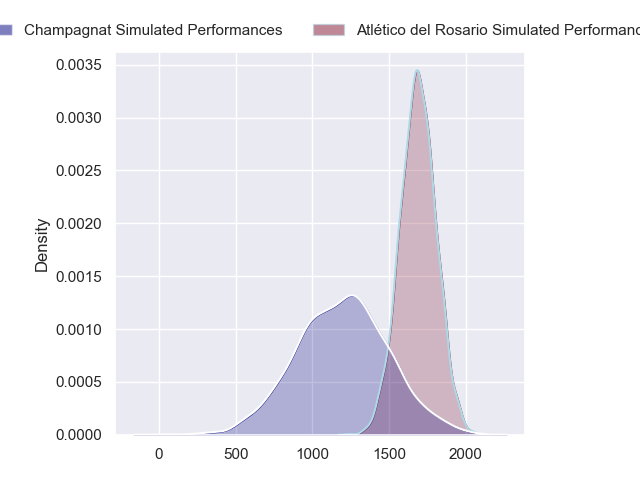
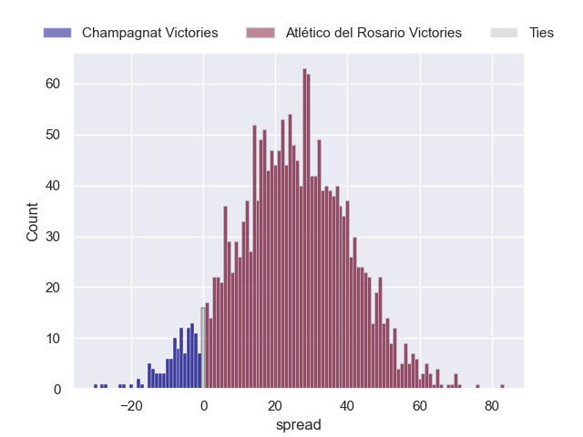
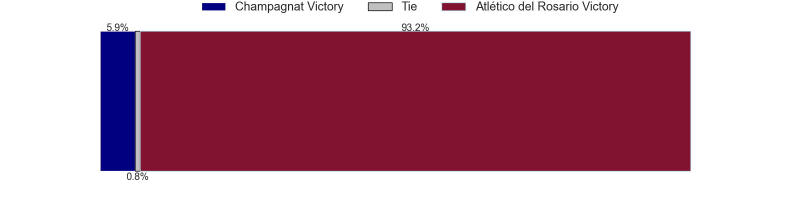
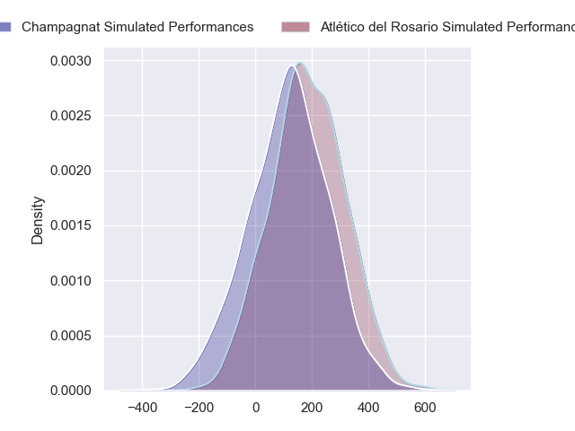
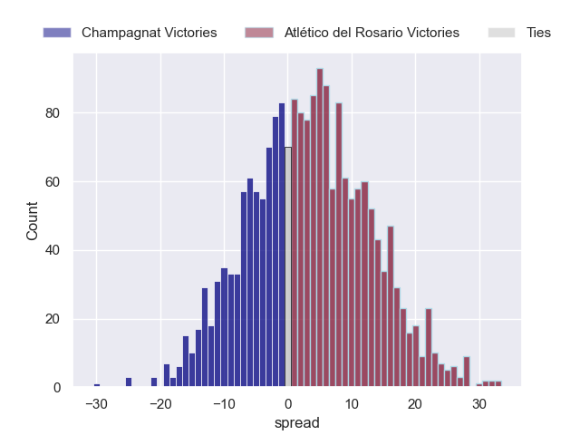
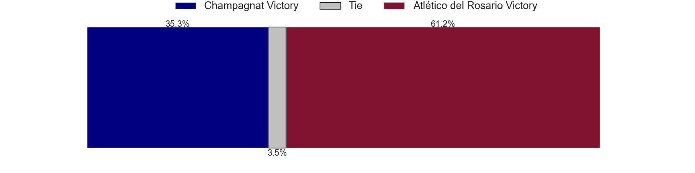

---  
layout: page  
title: Champagnat at Atletico del Rosario; 18-18  
date: 2024-04-13 18:00:00 -0500  
categories: "URBA Top 12 2024" match review  
---
# Champagnat at Atletico del Rosario; 18-18

# Club Level Predictions

The first set of predictions treats a club as the smallest object, as the club develops its members, organizes a gameplan, and deploys its players as needed for each match. This club model has a prediction of 0.88, which translates to predicting Atlético del Rosario to win by 23.7.

Our Over/Under is 57.5 - and combined with the spread above, we have a predicted scoreline of 17 to 41

Each club has a rating and a rating deviation (similar to a Glicko rating), and expected performances can be generated. This allows for simulated matches and spreads like the ones below.
## Projected Performances - Club Model

## Projected Spreads - Club Model

## Projected Results - Club Model

# Player Level Predictions - Version 2

Treating teams instead as an entity made up of the currently active players, I have ratings for each player in an altogether different system. These can be combined to form team ratings once teamsheets are announced, weighting starters a bit higher than the reserves. After the match is played, players can be weighted by their minutes on the field, allowing for an accurate measure of the team's composition. With these compiled team ratings, we can make predictions, measure inaccuracy, and update the individual player ratings.
## Prediction without Player Minutes: Atlético del Rosario by 3.7

Champagnat by 0.0 on a neutral pitch

## Projected Performances - Player Model

## Projected Spreads - Player Model

## Projected Results - Player Model

|   Away Minutes | Away Player                   |   Away Percentile |   Number |   Home Percentile | Home Player                 |   Home Minutes |
|---------------:|:------------------------------|------------------:|---------:|------------------:|:----------------------------|---------------:|
|             80 | Tomas Distel                  |             49.38 |        1 |             31.72 | Agustin Fernandez           |             80 |
|             80 | Fernando Rodriguez Pascarella |             47.45 |        2 |             22.55 | Jeremias Aime               |             80 |
|             80 | Alberto Adissi                |             48.34 |        3 |             21.27 | Lisandro Dipierri           |             80 |
|             80 | Inaki Ustariz                 |             48.69 |        4 |             27.39 | Matias Kremer               |             80 |
|             80 | Santiago Escuti               |             48.93 |        5 |             27.39 | Octavio Capella             |             80 |
|             80 | Matias Alonso Boto            |             45.13 |        6 |             22.54 | Santiago Casals             |             80 |
|             80 | Francisco Castelli            |             45.13 |        7 |             22.54 | Lucas Malanos               |             80 |
|             80 | Matias Muniagurria            |             43.9  |        8 |             24.63 | Valentin Tumosa             |             80 |
|             80 | Martin Graciarena             |             46.25 |        9 |             23.96 | Matias Savatierra           |             80 |
|             80 | Santos Panela                 |             40.5  |       10 |             19.75 | Guido Vidalle               |             80 |
|             80 | Tomas Baca Castex             |             47.34 |       11 |             39.41 | Nicolas Cripovich           |             80 |
|             80 | Tobias Imbrosciano            |             41.36 |       12 |             24.13 | Pedro de Aro                |             80 |
|             80 | Tomas Cotter                  |             41.36 |       13 |             36.37 | Valentino Aime              |             80 |
|             80 | Simon Zappella                |             46.66 |       14 |             33.98 | Maximiliano Nicoli Fiscella |             80 |
|             80 | Geronimo Tomasella            |             40.15 |       15 |             23.19 | Pedro Bisio                 |             80 |
|              0 | Away Team 16                  |            nan    |       16 |            nan    | Home Team 16                |              0 |
|              0 | Away Team 17                  |            nan    |       17 |            nan    | Home Team 17                |              0 |
|              0 | Away Team 18                  |            nan    |       18 |            nan    | Home Team 18                |              0 |
|              0 | Away Team 19                  |            nan    |       19 |            nan    | Home Team 19                |              0 |
|              0 | Away Team 20                  |            nan    |       20 |            nan    | Home Team 20                |              0 |
|              0 | Away Team 21                  |            nan    |       21 |            nan    | Home Team 21                |              0 |
|              0 | Away Team 22                  |            nan    |       22 |            nan    | Home Team 22                |              0 |
|              0 | Away Team 23                  |            nan    |       23 |            nan    | Home Team 23                |              0 |

