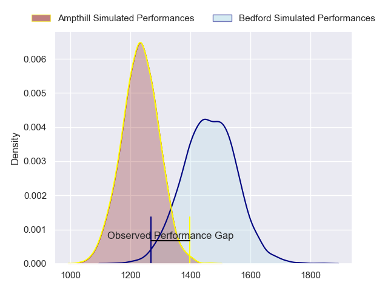
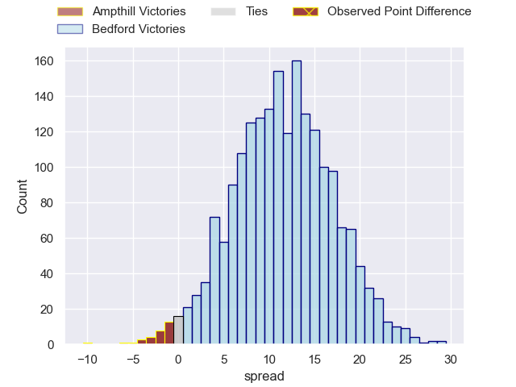
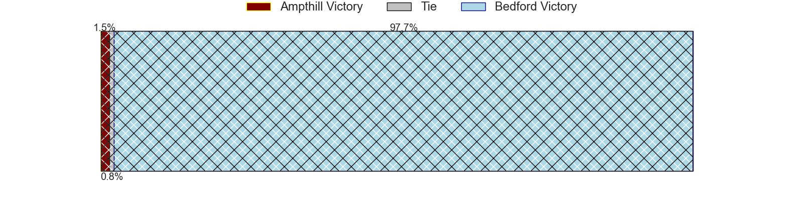
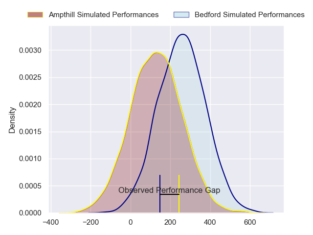
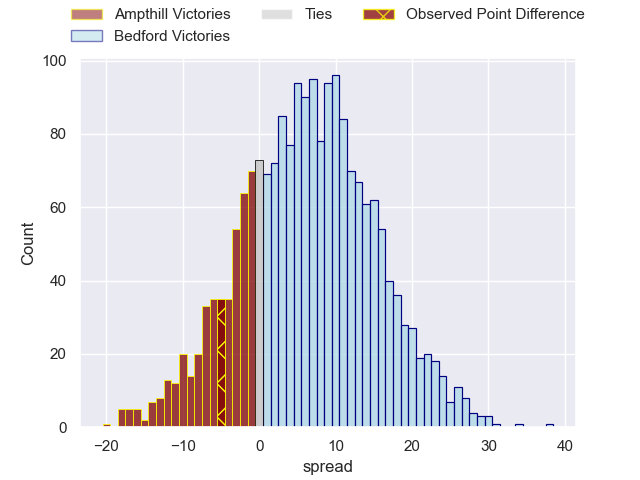
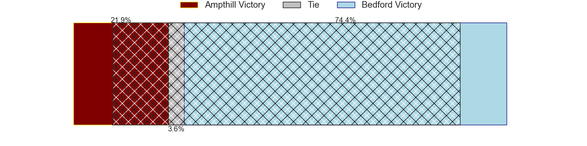

---  
layout: page  
title: Ampthill at Bedford; 29-24  
date: 2024-04-13 18:00:00 -0500  
categories: "RFU Championship 2023" match review  
---
# Ampthill at Bedford; 29-24

# Club Level Predictions

The first set of predictions treats a club as the smallest object, as the club develops its members, organizes a gameplan, and deploys its players as needed for each match. This club model has a prediction of 0.785, which translates to predicting Bedford to win by 11.5.

Our Over/Under is 53.5 - and combined with the spread above, we have a predicted scoreline of 21 to 32

Each club has a rating and a rating deviation (similar to a Glicko rating), and expected performances can be generated. This allows for simulated matches and spreads like the ones below.
## Projected Performances - Club Model

## Projected Spreads - Club Model

## Projected Results - Club Model

# Player Level Predictions - Version 2

Treating teams instead as an entity made up of the currently active players, I have ratings for each player in an altogether different system. These can be combined to form team ratings once teamsheets are announced, weighting starters a bit higher than the reserves. After the match is played, players can be weighted by their minutes on the field, allowing for an accurate measure of the team's composition. With these compiled team ratings, we can make predictions, measure inaccuracy, and update the individual player ratings.
## Prediction without Player Minutes: Bedford by 7.5

Bedford by 4.1 on a neutral pitch

## Projected Performances - Player Model

## Projected Spreads - Player Model

## Projected Results - Player Model

|   Away Minutes | Away Player                 |   Away Percentile |   Number |   Home Percentile | Home Player          |   Home Minutes |
|---------------:|:----------------------------|------------------:|---------:|------------------:|:---------------------|---------------:|
|             49 | James Flynn                 |              9.63 |        1 |             61.68 | Joey Conway          |             54 |
|             65 | Samson Adejimi              |             30.26 |        2 |             63.46 | James Fish           |             78 |
|             57 | Alec Clarey                 |             15.82 |        3 |             65.3  | Bryan O'Connor       |             50 |
|             80 | Ollie Stonham               |             68.78 |        4 |             49.76 | Emeka Atuanya        |             19 |
|             80 | Iwan Shenton                |             70.69 |        5 |             82.54 | Alex Woolford        |             80 |
|             54 | Izaiha Moore-Aiono          |             47.56 |        6 |             12.76 | Luke Frost           |             80 |
|             80 | Toby Knight                 |             61.95 |        7 |             60.67 | Henry Pollock        |             57 |
|             72 | Morgan Strong               |             70.52 |        8 |             12.04 | Cameron King         |             61 |
|             71 | Charlie Bracken             |             68.21 |        9 |             84.84 | Alex Day             |             74 |
|             70 | Josh Barton                 |             58.21 |       10 |             81.28 | William Maisey       |             80 |
|             80 | Brandon Jackson-Richards    |             63.51 |       11 |             86.37 | Dean Adamson         |             80 |
|             80 | Fraser James Kevin Strachan |             87.5  |       12 |             30.7  | Josh Matavesi        |             74 |
|             80 | Oli Morris                  |             41.87 |       13 |             65.66 | Michael Le Bourgeois |             80 |
|             80 | Francis Moore               |             40.2  |       14 |             41.44 | Sean French          |             80 |
|             80 | Tomas Bacon                 |             74.69 |       15 |             53.63 | Matthew Worley       |             80 |
|             31 | Sam Crean                   |             81.98 |       16 |             74.64 | Robin Williams       |             61 |
|             26 | Sid Blackmore               |            nan    |       17 |             85.13 | Oisin Heffernan      |             30 |
|             23 | James Johnston              |             69.78 |       18 |             23.16 | Jamie Jack           |             26 |
|             15 | Benjamin Chapman            |             23.58 |       19 |             64.39 | Jac Arthur           |             23 |
|             10 | Gwyn Parks                  |             25.64 |       20 |             14.99 | Joe Howard           |             19 |
|              9 | Joe Green                   |            nan    |       21 |             16.21 | James Lennon         |              6 |
|              8 | Griff Evans                 |            nan    |       22 |             37.44 | Louis Grimoldby      |              6 |
|            nan | nan                         |            nan    |       23 |             55.21 | Jacob Fields         |              2 |

