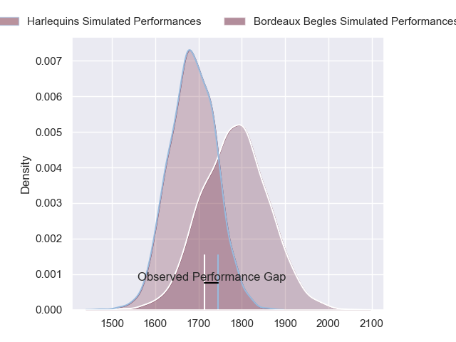
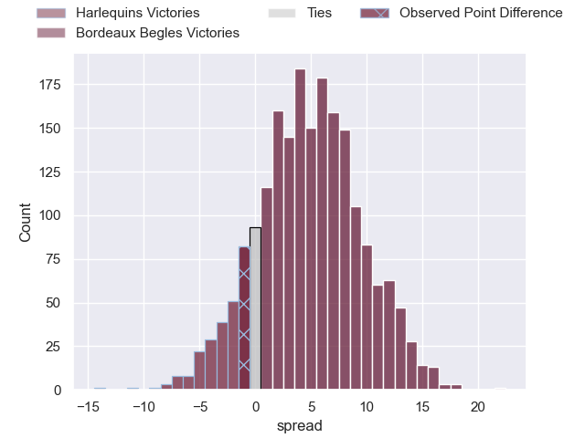
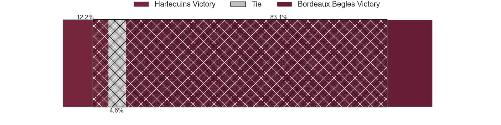
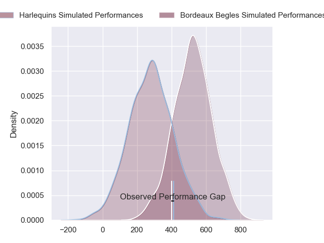
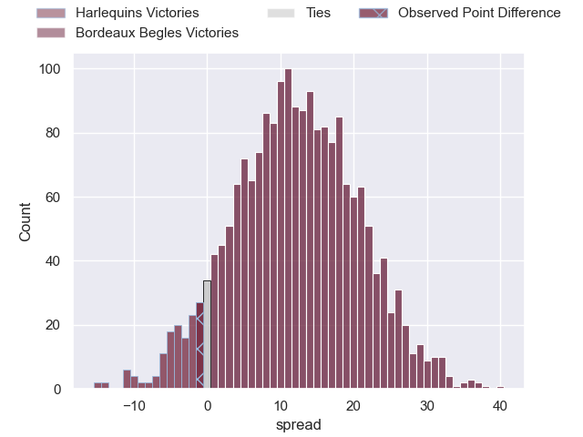
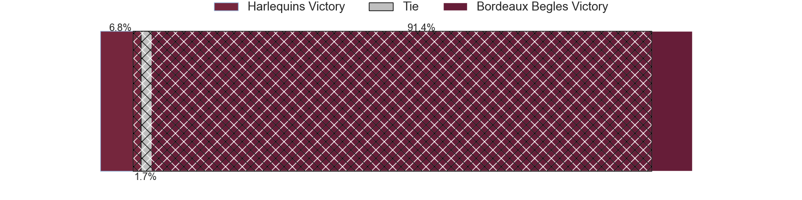

---  
layout: page  
title: Harlequins at Bordeaux Begles; 42-41  
date: 2024-04-13 18:00:00 -0500  
categories: "European Rugby Champions Cup 2023" match review  
---
# Harlequins at Bordeaux Begles; 42-41

# Club Level Predictions

The first set of predictions treats a club as the smallest object, as the club develops its members, organizes a gameplan, and deploys its players as needed for each match. This club model has a prediction of 0.638, which translates to predicting Bordeaux Begles to win by 5.0.

Our Over/Under is 64.5 - and combined with the spread above, we have a predicted scoreline of 30 to 35

Each club has a rating and a rating deviation (similar to a Glicko rating), and expected performances can be generated. This allows for simulated matches and spreads like the ones below.
## Projected Performances - Club Model

## Projected Spreads - Club Model

## Projected Results - Club Model

# Player Level Predictions - Version 2

Treating teams instead as an entity made up of the currently active players, I have ratings for each player in an altogether different system. These can be combined to form team ratings once teamsheets are announced, weighting starters a bit higher than the reserves. After the match is played, players can be weighted by their minutes on the field, allowing for an accurate measure of the team's composition. With these compiled team ratings, we can make predictions, measure inaccuracy, and update the individual player ratings.
## Prediction without Player Minutes: Bordeaux Begles by 14.8

Bordeaux Begles by 7.5 on a neutral pitch

## Projected Performances - Player Model

## Projected Spreads - Player Model

## Projected Results - Player Model

|   Away Minutes | Away Player               |   Away Percentile |   Number |   Home Percentile | Home Player               |   Home Minutes |
|---------------:|:--------------------------|------------------:|---------:|------------------:|:--------------------------|---------------:|
|             70 | Fin Baxter                |             32.48 |        1 |             87.37 | Lekso Kaulashvili         |             41 |
|             61 | Jack Walker               |             20.98 |        2 |             51.57 | Maxime Lamothe            |             61 |
|             70 | Will Collier              |             92.12 |        3 |             96.49 | Ben Tameifuna             |             48 |
|             62 | Irne Herbst               |             71.96 |        4 |             89.14 | Cyril Cazeaux             |             68 |
|             80 | Stephan Lewies            |             82.1  |        5 |             97.97 | Adam Coleman              |             50 |
|             53 | Chandler Cunningham-South |             74.97 |        6 |             69.87 | Antoine Miquel            |             80 |
|             80 | Will Evans                |             72.54 |        7 |             85.05 | Pete Samu                 |             80 |
|             80 | Alex Dombrandt            |             86.1  |        8 |             83.9  | Tevita Tatafu             |             50 |
|             74 | Will Porter               |             28.12 |        9 |             98.75 | Maxime Lucu               |             80 |
|             74 | Marcus Smith              |             85.75 |       10 |             38    | Mateo Garcia              |             41 |
|             80 | Cadan Murley              |             35.67 |       11 |             72.93 | Louis Bielle-Biarrey      |             80 |
|             80 | Andre Esterhuizen         |             97.84 |       12 |             73.59 | Yoram Moefana             |             80 |
|             54 | Oscar Beard               |             66.63 |       13 |             79.35 | Nicolas Depoortere        |             80 |
|             80 | Louis Lynagh              |             83.58 |       14 |             10.87 | Pablo Uberti              |             59 |
|             80 | Tyrone Green              |             78.3  |       15 |             96.51 | Romain Buros              |             80 |
|             19 | Sam Riley                 |             65.1  |       16 |             91.76 | Clement Maynadier         |             19 |
|             10 | Simon Kerrod              |             27.73 |       17 |             88.98 | Ugo Boniface              |             39 |
|             10 | Dillon Lewis              |             93.64 |       18 |             28.87 | Carlu Sadie               |             32 |
|             27 | Will Trenholm             |            nan    |       19 |             73.39 | Kane Douglas              |             12 |
|             18 | George Hammond            |             17.18 |       20 |             84.59 | Guido Petti               |             30 |
|              6 | Max Green                 |             54.79 |       21 |             69.64 | Bastien Vergnes Taillefer |             30 |
|              6 | Jarrod Evans              |             86.25 |       22 |              7.29 | Yann Lesgourgues          |             39 |
|             26 | Luke Northmore            |             77.79 |       23 |             92.53 | Madosh Tambwe             |             21 |

