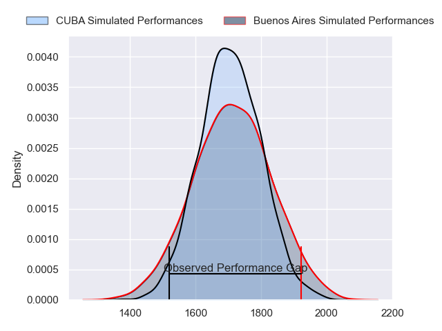
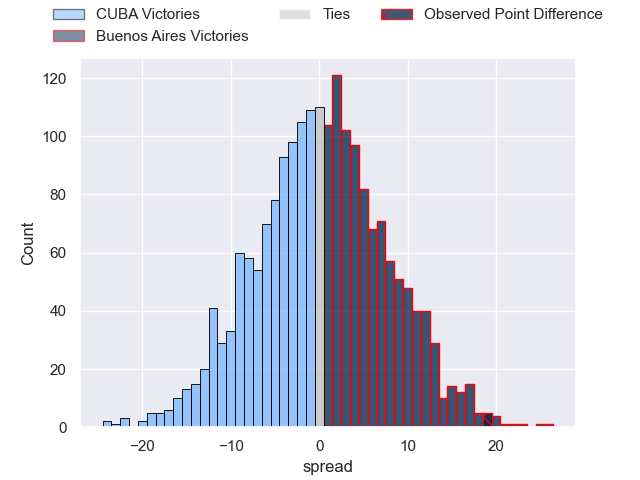
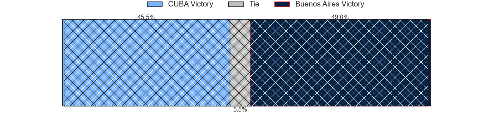
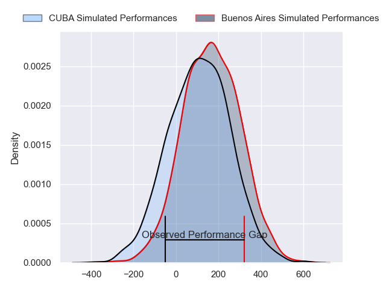
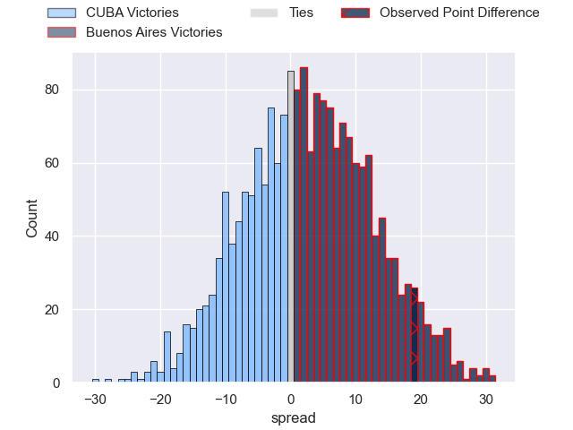
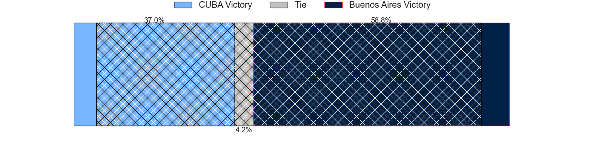

---  
layout: page  
title: CUBA at Buenos Aires; 15-34  
date: 2024-04-13 18:00:00 -0500  
categories: "URBA Top 12 2024" match review  
---
# CUBA at Buenos Aires; 15-34

# Club Level Predictions

The first set of predictions treats a club as the smallest object, as the club develops its members, organizes a gameplan, and deploys its players as needed for each match. This club model has a prediction of 0.512, which translates to predicting Buenos Aires to win by 0.4.

Our Over/Under is 44.5 - and combined with the spread above, we have a predicted scoreline of 22 to 23

Each club has a rating and a rating deviation (similar to a Glicko rating), and expected performances can be generated. This allows for simulated matches and spreads like the ones below.
## Projected Performances - Club Model

## Projected Spreads - Club Model

## Projected Results - Club Model

# Player Level Predictions - Version 2

Treating teams instead as an entity made up of the currently active players, I have ratings for each player in an altogether different system. These can be combined to form team ratings once teamsheets are announced, weighting starters a bit higher than the reserves. After the match is played, players can be weighted by their minutes on the field, allowing for an accurate measure of the team's composition. With these compiled team ratings, we can make predictions, measure inaccuracy, and update the individual player ratings.
## Prediction without Player Minutes: Buenos Aires by 2.8

CUBA by 0.0 on a neutral pitch

## Projected Performances - Player Model

## Projected Spreads - Player Model

## Projected Results - Player Model

|   Away Minutes | Away Player           |   Away Percentile |   Number |   Home Percentile | Home Player            |   Home Minutes |
|---------------:|:----------------------|------------------:|---------:|------------------:|:-----------------------|---------------:|
|             80 | Joaquin Yaquiche      |             24.69 |        1 |             61.58 | Pablo Gaston Vaca      |             80 |
|             80 | Tomas Anderlic        |             25.74 |        2 |             62.08 | Tomas Rosasco          |             80 |
|             80 | Facundo Aguirre       |             21.26 |        3 |             60.92 | Tomas Gallo            |             80 |
|             80 | Santiago Landau       |             28.23 |        4 |             59.57 | Francisco Jose Sluga   |             80 |
|             80 | Santiago Uriarte      |             27.63 |        5 |             60.29 | Franco Baldoni         |             80 |
|             80 | Francisco Sied        |             21.35 |        6 |             55.68 | Pedro Maria Del Carril |             80 |
|             80 | Segundo Pisani        |             24.4  |        7 |             53.02 | Matias Espina          |             80 |
|             80 | Lucas Campion         |             26.78 |        8 |             56.02 | Jordi Dieguez          |             80 |
|             80 | Manuel Madero         |             29.47 |        9 |             58.32 | Mateo Freire           |             80 |
|             80 | Felipe de la Vega     |             22.33 |       10 |             51.54 | Mateo Capalbo          |             80 |
|             80 | Marcos Moroni         |             27.48 |       11 |             58.22 | Tomas Acosta Pimentel  |             80 |
|             80 | Felipe Perdomo        |             22.57 |       12 |             51.64 | Agustin Lamensa Sanudo |             80 |
|             80 | Francisco Patrono     |             24.66 |       13 |             51.64 | Tobias Diaz Borda      |             80 |
|             80 | Santiago Cardini      |             24.44 |       14 |             55.29 | Alfonso Latorre        |             80 |
|             80 | Segundo Perdomo       |             22.56 |       15 |             51.38 | Julian Quetglas Bojar  |             80 |
|              0 | Francisco Garoby      |             39.94 |       16 |             41.65 | Tomas Ruiz             |              0 |
|              0 | Enrique Devoto        |             36.15 |       17 |             42.71 | Tomas Herrador         |              0 |
|              0 | Esteban Tribarne      |            nan    |       18 |            nan    | Juan Ignacio Giovenali |              0 |
|              0 | Francisco Nabia       |            nan    |       19 |            nan    | Lucas Etcheverry       |              0 |
|              0 | Benito Ortiz de Rozas |             36.61 |       20 |             42.26 | Tomas Etcheverry       |              0 |
|              0 | Valentin Mastroizi    |             34.62 |       21 |            nan    | Francisco Lamensa      |              0 |
|              0 | Jeronimo Conte Grand  |            nan    |       22 |            nan    | Juan Monasterio        |              0 |
|              0 | Simon Benitez Cruz    |            nan    |       23 |            nan    | Tomas Bunge            |              0 |

