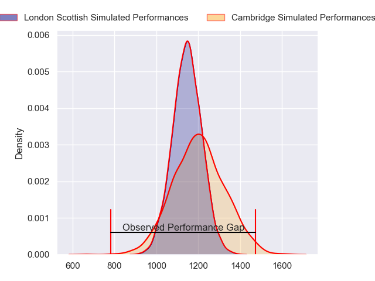
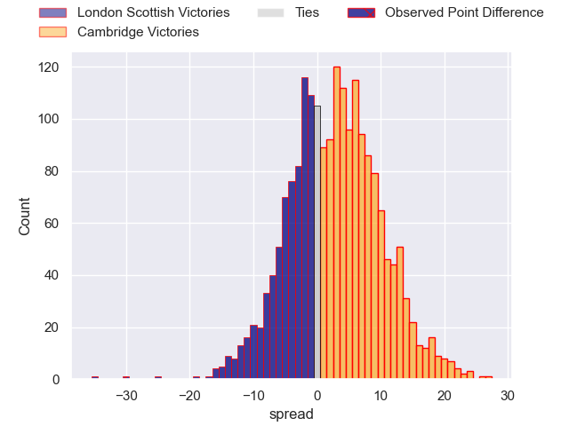
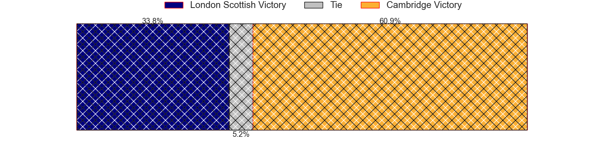
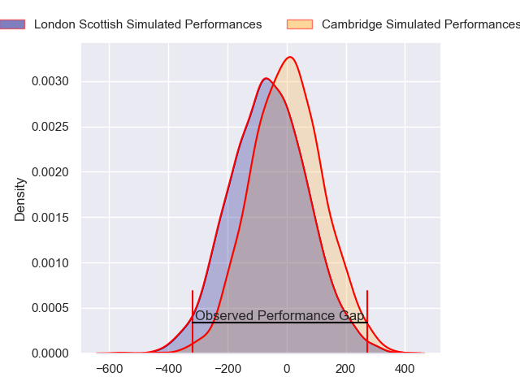
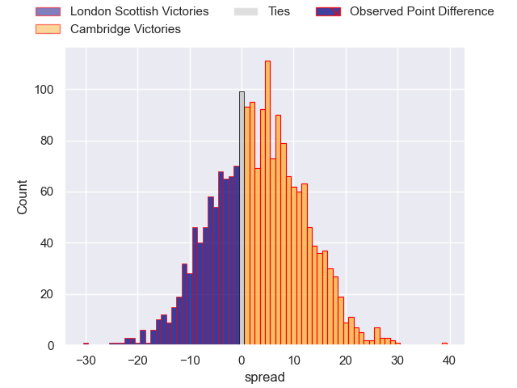
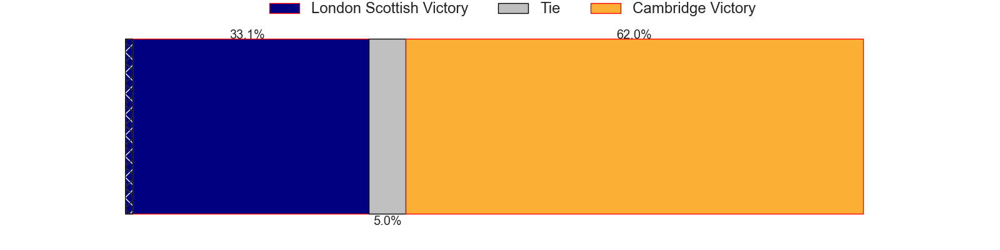

---  
layout: page  
title: London Scottish at Cambridge; 43-13  
date: 2024-04-13 18:00:00 -0500  
categories: "RFU Championship 2023" match review  
---
# London Scottish at Cambridge; 43-13

# Club Level Predictions

The first set of predictions treats a club as the smallest object, as the club develops its members, organizes a gameplan, and deploys its players as needed for each match. This club model has a prediction of 0.576, which translates to predicting Cambridge to win by 2.7.

Our Over/Under is 51.5 - and combined with the spread above, we have a predicted scoreline of 25 to 27

Each club has a rating and a rating deviation (similar to a Glicko rating), and expected performances can be generated. This allows for simulated matches and spreads like the ones below.
## Projected Performances - Club Model

## Projected Spreads - Club Model

## Projected Results - Club Model

# Player Level Predictions - Version 2

Treating teams instead as an entity made up of the currently active players, I have ratings for each player in an altogether different system. These can be combined to form team ratings once teamsheets are announced, weighting starters a bit higher than the reserves. After the match is played, players can be weighted by their minutes on the field, allowing for an accurate measure of the team's composition. With these compiled team ratings, we can make predictions, measure inaccuracy, and update the individual player ratings.
## Prediction without Player Minutes: Cambridge by 2.1

London Scottish by 0.2 on a neutral pitch

## Projected Performances - Player Model

## Projected Spreads - Player Model

## Projected Results - Player Model

|   Away Minutes | Away Player           |   Away Percentile |   Number |   Home Percentile | Home Player          |   Home Minutes |
|---------------:|:----------------------|------------------:|---------:|------------------:|:---------------------|---------------:|
|             46 | Will Prior            |             79.31 |        1 |             11.44 | Jake Elwood          |             53 |
|             46 | Austin Wallis         |             23.38 |        2 |              9.82 | Archie Vanes         |             53 |
|             69 | Rhys Charalambous     |             63.97 |        3 |              7.15 | Billy Walker         |             53 |
|             46 | Matt Wilkinson        |             36.36 |        4 |             17.82 | George Bretag-Norris |             80 |
|             80 | Bailey Ransom         |             57.54 |        5 |             20.1  | Gareth Baxter        |             80 |
|             46 | Ioan Rhys Davies      |             25.75 |        6 |              5.57 | Ben Adams            |             57 |
|             80 | Jack Ingall           |             17.98 |        7 |              4.52 | Jared Cardew         |             80 |
|             80 | Tom Marshall          |             42.75 |        8 |             15.97 | Matthew Dawson       |             62 |
|             60 | Daniel Nutton         |             18.53 |        9 |             10.74 | Sam Edwards          |             30 |
|             70 | Harry Sheppard        |              4.1  |       10 |             14.1  | Steffan James        |             80 |
|             80 | Noah Ferdinand        |              2.59 |       11 |              5.97 | Elias Caven          |             80 |
|             80 | Bryn Bradley          |             69.66 |       12 |              3.03 | Sam Hanks            |             80 |
|             80 | Ben Waghorn           |             27.43 |       13 |             13.83 | Benjamin Hoppe       |             80 |
|             80 | William Talbot-Davies |             80.29 |       14 |              4.05 | Matt Williams        |             69 |
|             60 | Will Brown            |             83.71 |       15 |             16.29 | Joseph Tarrant       |             70 |
|             34 | Tom Osborne           |             31.65 |       16 |             32.84 | Kieran Duffin        |             50 |
|             34 | Jack Musk             |             50.69 |       17 |             43.09 | Matt Collins         |             27 |
|             34 | Marijn Huis           |            nan    |       18 |             10.41 | Morgan Veness        |             27 |
|             34 | Archie White          |             27.27 |       19 |             60.15 | Huw Owen             |             27 |
|             20 | Jonny Law             |             17.47 |       20 |            nan    | Noah Sloot           |             23 |
|             20 | Alexander Lloyd-Seed  |             49.49 |       21 |             33.42 | Anthony Maka         |             18 |
|             11 | Caleb Ashworth        |             41.56 |       22 |             33.99 | Benjamin Brownlie    |             11 |
|             10 | Luke Mehson           |             28.27 |       23 |            nan    | Lawrence Rayner      |             10 |

