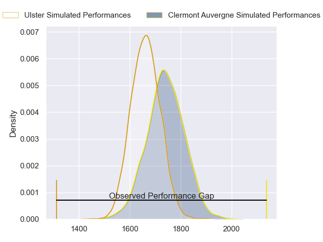
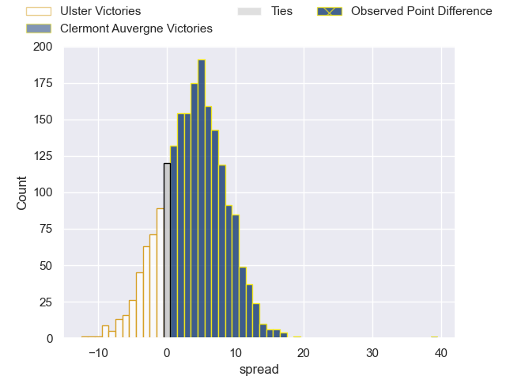
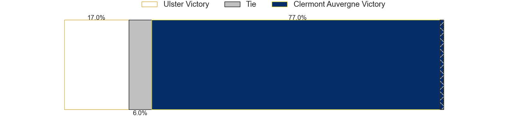
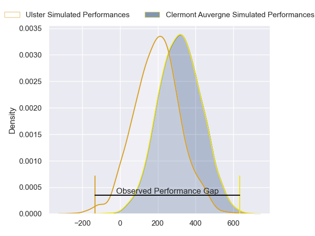
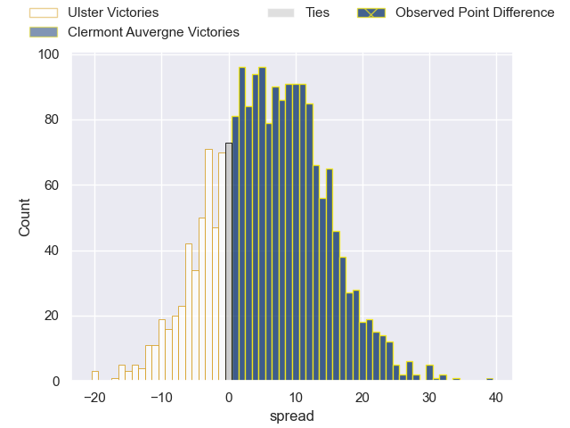
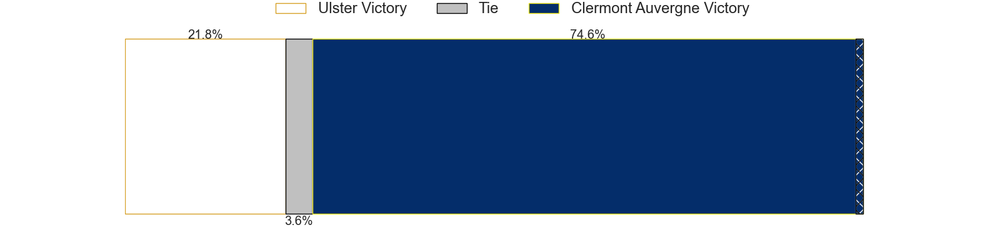

---  
layout: page  
title: Ulster at Clermont Auvergne; 14-53  
date: 2024-04-13 18:00:00 -0500  
categories: "European Rugby Challenge Cup 2023" match review  
---
# Ulster at Clermont Auvergne; 14-53

# Club Level Predictions

The first set of predictions treats a club as the smallest object, as the club develops its members, organizes a gameplan, and deploys its players as needed for each match. This club model has a prediction of 0.61, which translates to predicting Clermont Auvergne to win by 3.9.

Our Over/Under is 60.5 - and combined with the spread above, we have a predicted scoreline of 28 to 32

Each club has a rating and a rating deviation (similar to a Glicko rating), and expected performances can be generated. This allows for simulated matches and spreads like the ones below.
## Projected Performances - Club Model

## Projected Spreads - Club Model

## Projected Results - Club Model

# Player Level Predictions - Version 2

Treating teams instead as an entity made up of the currently active players, I have ratings for each player in an altogether different system. These can be combined to form team ratings once teamsheets are announced, weighting starters a bit higher than the reserves. After the match is played, players can be weighted by their minutes on the field, allowing for an accurate measure of the team's composition. With these compiled team ratings, we can make predictions, measure inaccuracy, and update the individual player ratings.
## Prediction without Player Minutes: Clermont Auvergne by 5.1

Ulster by 2.4 on a neutral pitch

## Projected Performances - Player Model

## Projected Spreads - Player Model

## Projected Results - Player Model

|   Away Minutes | Away Player       |   Away Percentile |   Number |   Home Percentile | Home Player         |   Home Minutes |
|---------------:|:------------------|------------------:|---------:|------------------:|:--------------------|---------------:|
|             56 | Steven Kitshoff   |             97.24 |        1 |             19.35 | Giorgi Beria        |             54 |
|             41 | Rob Herring       |             92.73 |        2 |             32.22 | Yohan Beheregaray   |             50 |
|             51 | Tom O'Toole       |             61.3  |        3 |             74.93 | Rabah Slimani       |             54 |
|             65 | Alan O'Connor     |             64.23 |        4 |             69.86 | Thibaud Lanen       |             54 |
|             41 | Iain Henderson    |             87.32 |        5 |             91.75 | Tomas Lavanini      |             68 |
|             80 | Harry Sheridan    |             81.7  |        6 |             62.88 | Killian Tixeront    |             80 |
|             80 | David McCann      |             60.2  |        7 |             16.36 | Peceli Yato         |             68 |
|             54 | Nick Timoney      |             84.52 |        8 |             81.82 | Pita Gus Sowakula   |             80 |
|             80 | John Cooney       |             87.58 |        9 |             24.63 | Baptiste Jauneau    |             56 |
|             65 | Nathan Doak       |             24.42 |       10 |             89.23 | Anthony Belleau     |             68 |
|             80 | Mike Lowry        |             33.67 |       11 |             14.53 | Alivereti Raka      |             68 |
|             80 | Stuart McCloskey  |             70.63 |       12 |             49.88 | Julien Heriteau     |             80 |
|             80 | James Hume        |             23.06 |       13 |             53.16 | Leon Darricarrere   |             80 |
|             80 | Robert Baloucoune |              6.64 |       14 |             77.93 | Bautista Delguy     |             80 |
|              6 | Stewart Moore     |             86.22 |       15 |             66.92 | Alex Newsome        |             80 |
|             39 | Tom Stewart       |              3.14 |       16 |             32.81 | Etienne Fourcade    |             30 |
|             24 | Andrew Warwick    |             12.87 |       17 |             10.1  | Daniel Bibi Biziwu  |             26 |
|             29 | Scott Wilson      |             58.53 |       18 |            nan    | Giorgi Dzmanashvili |             26 |
|             15 | Cormac Izuchukwu  |             51.44 |       19 |             91.99 | Rob Simmons         |             26 |
|             39 | Dave Ewers        |             88.98 |       20 |             70.65 | Alexandre Fischer   |             24 |
|             15 | Jake Flannery     |             25.13 |       21 |             83.37 | Sebastien Bezy      |             24 |
|             74 | Ethan McIlroy     |             81.08 |       22 |            nan    | Theo Giral          |             12 |
|             26 | Marcus Rea        |             90.72 |       23 |             71.51 | Joris Jurand        |             12 |

