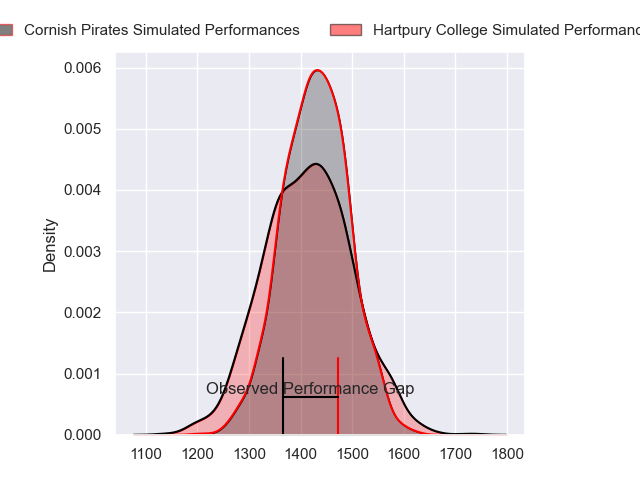
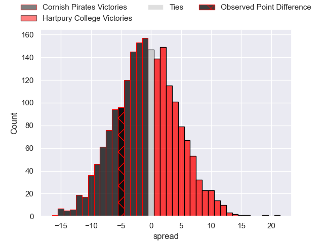
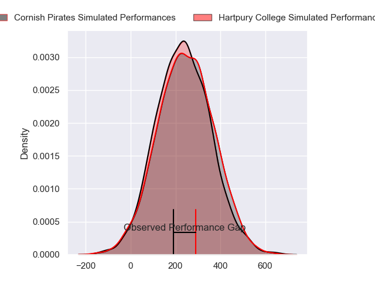
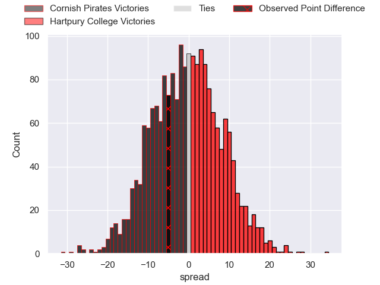

---  
layout: page  
title: Cornish Pirates at Hartpury College; 30-25  
date: 2024-04-13 18:00:00 -0500  
categories: "RFU Championship 2023" match review  
---
# Cornish Pirates at Hartpury College; 30-25

# Club Level Predictions

The first set of predictions treats a club as the smallest object, as the club develops its members, organizes a gameplan, and deploys its players as needed for each match. This club model has a prediction of 0.476, which translates to predicting Cornish Pirates to win by 0.8.

Our Over/Under is 57.5 - and combined with the spread above, we have a predicted scoreline of 29 to 28

Each club has a rating and a rating deviation (similar to a Glicko rating), and expected performances can be generated. This allows for simulated matches and spreads like the ones below.
## Projected Performances - Club Model

## Projected Spreads - Club Model

## Projected Results - Club Model

# Player Level Predictions - Version 2

Treating teams instead as an entity made up of the currently active players, I have ratings for each player in an altogether different system. These can be combined to form team ratings once teamsheets are announced, weighting starters a bit higher than the reserves. After the match is played, players can be weighted by their minutes on the field, allowing for an accurate measure of the team's composition. With these compiled team ratings, we can make predictions, measure inaccuracy, and update the individual player ratings.
## Prediction without Player Minutes: Cornish Pirates by 0.8

Cornish Pirates by 3.9 on a neutral pitch

## Projected Performances - Player Model

## Projected Spreads - Player Model

## Projected Results - Player Model

|   Away Minutes | Away Player          |   Away Percentile |   Number |   Home Percentile | Home Player           |   Home Minutes |
|---------------:|:---------------------|------------------:|---------:|------------------:|:----------------------|---------------:|
|             64 | Lefty Zigiriadis     |             85.7  |        1 |             63.11 | James Gibbons         |             45 |
|             58 | Harry Hocking        |             49.9  |        2 |             58.35 | William Crane         |             65 |
|             64 | Matt Johnson         |             79.12 |        3 |             56.91 | Jonathan Benz-Salomon |             65 |
|             64 | Will Britton         |             22.13 |        4 |             47.01 | Dale Lemon            |             80 |
|             80 | Steele Robert Barker |             82.66 |        5 |             73.56 | Jack Davies           |             80 |
|             64 | Peter Everett        |             71.23 |        6 |             76.33 | Josh Gray             |             80 |
|             80 | John Stevens         |             83.41 |        7 |             69.72 | Harry Short           |             61 |
|             80 | Hugh Bokenham        |             74.94 |        8 |             29.48 | Jarrad Hayler         |             65 |
|             60 | Ruaridh Dawson       |             67.37 |        9 |             52.63 | Michael Austin        |             80 |
|             72 | Bruce Houston        |             66.67 |       10 |             72.05 | Harry Bazalgette      |             80 |
|             80 | Matthew McNab        |             51.13 |       11 |             36.6  | Alex Morgan           |             80 |
|             80 | Joe Elderkin         |             67.35 |       12 |             39.08 | Tommy Mathews         |             66 |
|             80 | Ioan Evans           |             75    |       13 |             14.93 | Louis Hillman-Cooper  |             80 |
|             80 | Will Trewin          |             86.82 |       14 |             15.65 | Alex Forrester        |             69 |
|             80 | Kyle Moyle           |             61.4  |       15 |             54.89 | George Barton         |             80 |
|             20 | Alex Schwarz         |             63.37 |       16 |             72.16 | Aristot Benz-Salomon  |             35 |
|             22 | Iestyn Harris        |            nan    |       17 |             46.68 | Mitchell Eadie        |             19 |
|             16 | Jake Morris          |             51.48 |       18 |              0.86 | Joe Rees              |             15 |
|             16 | Finlay Richardson    |             71.59 |       19 |            nan    | Haari Beddall         |             15 |
|             16 | Will Gibson          |             81.55 |       20 |             72.69 | Ethan Hunt            |             15 |
|             16 | Josh Williams        |             57.66 |       21 |              9.71 | Robbie Smith          |             14 |
|              8 | Tom Pittman          |             71.28 |       22 |              6.92 | Jack Reeves           |             11 |

