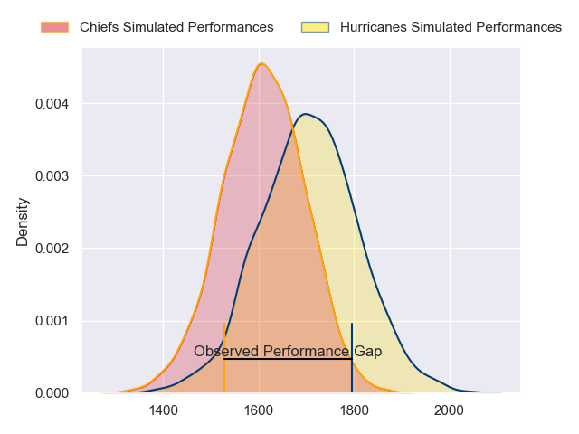
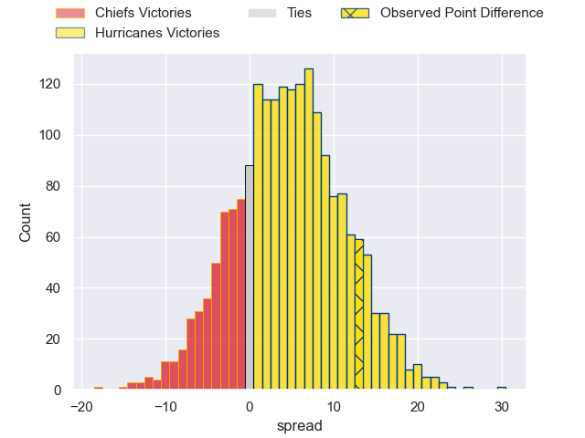
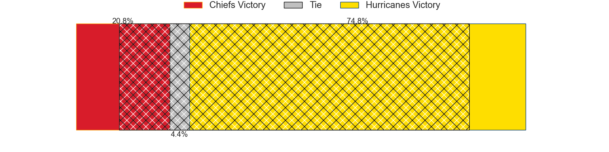
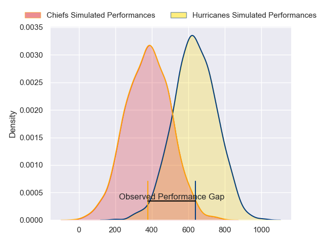
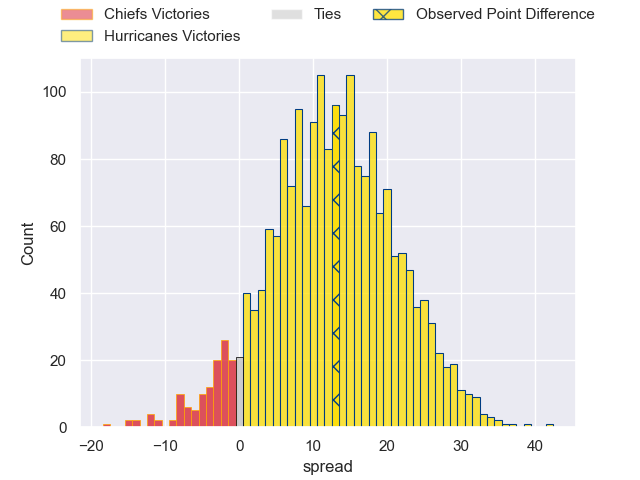
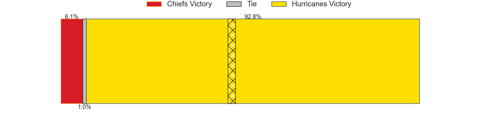

---  
layout: page  
title: Chiefs at Hurricanes; 23-36  
date: 2024-04-13 18:00:00 -0500  
categories: "Super Rugby Pacific 2024" match review  
---
# Chiefs at Hurricanes; 23-36

# Club Level Predictions

The first set of predictions treats a club as the smallest object, as the club develops its members, organizes a gameplan, and deploys its players as needed for each match. This club model has a prediction of 0.627, which translates to predicting Hurricanes to win by 4.7.

Our Over/Under is 54.5 - and combined with the spread above, we have a predicted scoreline of 25 to 30

Each club has a rating and a rating deviation (similar to a Glicko rating), and expected performances can be generated. This allows for simulated matches and spreads like the ones below.
## Projected Performances - Club Model

## Projected Spreads - Club Model

## Projected Results - Club Model

# Player Level Predictions - Version 2

Treating teams instead as an entity made up of the currently active players, I have ratings for each player in an altogether different system. These can be combined to form team ratings once teamsheets are announced, weighting starters a bit higher than the reserves. After the match is played, players can be weighted by their minutes on the field, allowing for an accurate measure of the team's composition. With these compiled team ratings, we can make predictions, measure inaccuracy, and update the individual player ratings.
## Prediction without Player Minutes: Hurricanes by 14.5

Hurricanes by 10.1 on a neutral pitch

## Projected Performances - Player Model

## Projected Spreads - Player Model

## Projected Results - Player Model

|   Away Minutes | Away Player         |   Away Percentile |   Number |   Home Percentile | Home Player          |   Home Minutes |
|---------------:|:--------------------|------------------:|---------:|------------------:|:---------------------|---------------:|
|             57 | Aidan Ross          |             97.33 |        1 |             96.09 | Xavier Numia         |             60 |
|             64 | Samisoni Taukei'aho |             92.14 |        2 |             97.25 | Asafo Aumua          |             75 |
|             41 | Reuben O'Neill      |             26.02 |        3 |             94.95 | Tyrel Lomax          |             60 |
|             57 | Naitoa Ah Kuoi      |             93.42 |        4 |             87.08 | Caleb Delany         |             80 |
|             80 | Tupou Vaa'i         |             86.6  |        5 |             97.49 | Isaia Walker-Leawere |             64 |
|             80 | Samipeni Finau      |             91.65 |        6 |             93.39 | Brad Shields         |             52 |
|             80 | Luke Jacobson       |             89.91 |        7 |             94.08 | Peter Lakai          |             80 |
|             60 | Wallace Sititi      |             28.5  |        8 |              2.21 | Brayden Iose         |             51 |
|             71 | Cortez Ratima       |             66.11 |        9 |             97.68 | TJ Perenara          |             70 |
|             80 | Damian McKenzie     |             97.18 |       10 |             20.77 | Brett Cameron        |             80 |
|             80 | Etene Nanai-Seturo  |             33.9  |       11 |             97.18 | Kini Naholo          |             80 |
|             80 | Rameka Poihipi      |             67.6  |       12 |             96.72 | Jordie Barrett       |             80 |
|             54 | Daniel Rona         |             69.3  |       13 |             93.69 | Billy Proctor        |             74 |
|             80 | Emoni Narawa        |             89.3  |       14 |             87.47 | Joshua Moorby        |             80 |
|             28 | Shaun Stevenson     |             89.47 |       15 |             94.24 | Ruben Love           |             80 |
|             16 | Bradley Slater      |             78.39 |       16 |             44.01 | James O'Reilly       |              5 |
|             23 | Ollie Norris        |             79.98 |       17 |             86.65 | Pouri Rakete-Stones  |             20 |
|             39 | George Dyer         |             77.79 |       18 |             50.91 | Pasilio Tosi         |             20 |
|             23 | Jimmy Tupou         |             30.62 |       19 |             71.17 | Justin Sangster      |             16 |
|             20 | Kaylum Boshier      |             33.76 |       20 |             92.46 | Du'Plessis Kirifi    |             28 |
|              9 | Xavier Roe          |             37.89 |       21 |             83.05 | Devan Flanders       |             29 |
|             52 | Josh Ioane          |             46.87 |       22 |             95.58 | Richard Judd         |             10 |
|             26 | Quinn Tupaea        |             83.98 |       23 |             39.44 | Peter Umaga-Jensen   |              6 |

