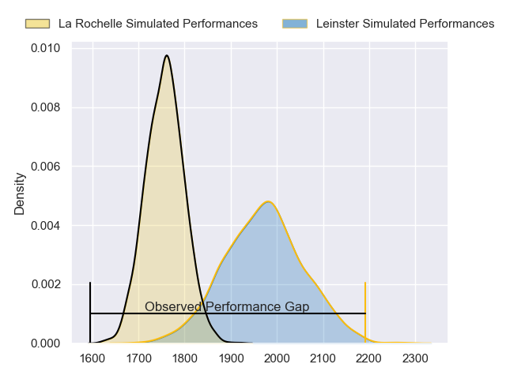
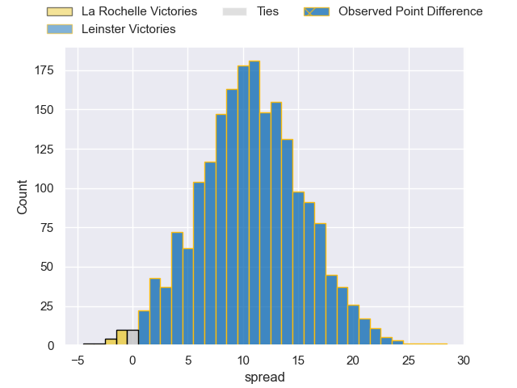
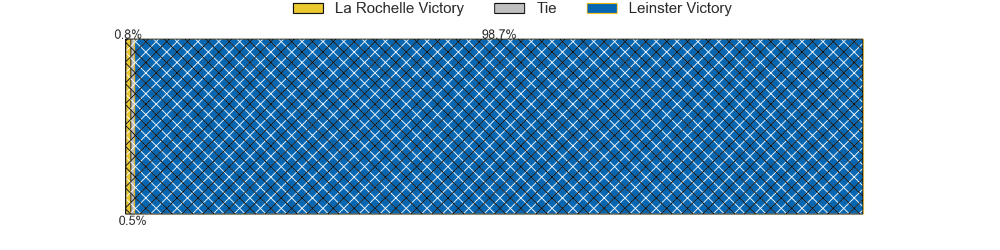
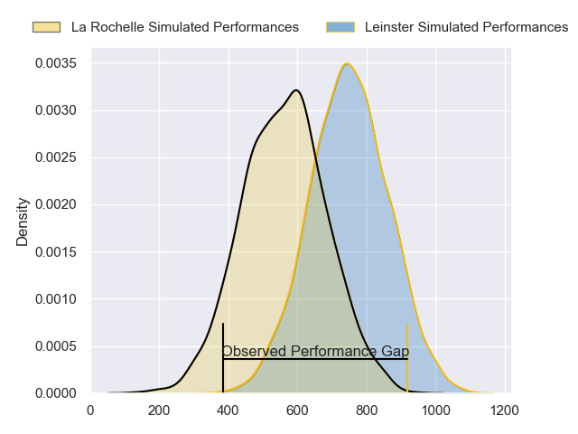
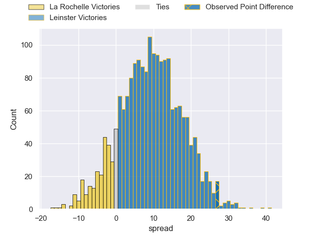
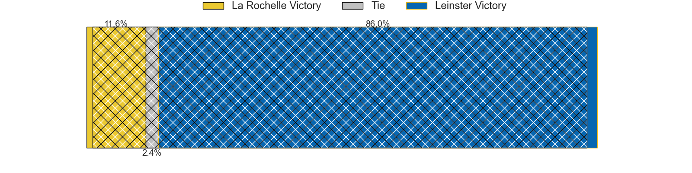

---  
layout: page  
title: La Rochelle at Leinster; 13-40  
date: 2024-04-13 18:00:00 -0500  
categories: "European Rugby Champions Cup 2023" match review  
---
# La Rochelle at Leinster; 13-40

# Club Level Predictions

The first set of predictions treats a club as the smallest object, as the club develops its members, organizes a gameplan, and deploys its players as needed for each match. This club model has a prediction of 0.772, which translates to predicting Leinster to win by 10.7.

Our Over/Under is 56.5 - and combined with the spread above, we have a predicted scoreline of 23 to 34

Each club has a rating and a rating deviation (similar to a Glicko rating), and expected performances can be generated. This allows for simulated matches and spreads like the ones below.
## Projected Performances - Club Model

## Projected Spreads - Club Model

## Projected Results - Club Model

# Player Level Predictions - Version 2

Treating teams instead as an entity made up of the currently active players, I have ratings for each player in an altogether different system. These can be combined to form team ratings once teamsheets are announced, weighting starters a bit higher than the reserves. After the match is played, players can be weighted by their minutes on the field, allowing for an accurate measure of the team's composition. With these compiled team ratings, we can make predictions, measure inaccuracy, and update the individual player ratings.
## Prediction without Player Minutes: Leinster by 10.5

Leinster by 4.3 on a neutral pitch

## Projected Performances - Player Model

## Projected Spreads - Player Model

## Projected Results - Player Model

|   Away Minutes | Away Player        |   Away Percentile |   Number |   Home Percentile | Home Player         |   Home Minutes |
|---------------:|:-------------------|------------------:|---------:|------------------:|:--------------------|---------------:|
|             53 | Louis Penverne     |             42.42 |        1 |             92.76 | Andrew Porter       |             58 |
|             53 | Tolu Latu          |             88.8  |        2 |             77.41 | Dan Sheehan         |             58 |
|             53 | Uini Atonio        |             99.52 |        3 |             98    | Tadhg Furlong       |             58 |
|             80 | Ultan Dillane      |             77.27 |        4 |             87.56 | Joe McCarthy        |             80 |
|             66 | Will Skelton       |             98.21 |        5 |             72.01 | Jason Jenkins       |             51 |
|             63 | Judicael Cancoriet |             33.64 |        6 |             88.86 | Ryan Baird          |             80 |
|             63 | Levani Botia       |             96.87 |        7 |             81.9  | Will Connors        |             49 |
|             80 | Gregory Alldritt   |             99.26 |        8 |             97.05 | Caelan Doris        |             72 |
|             44 | Tawera Kerr-Barlow |             97.26 |        9 |             96.84 | Jamison Gibson-Park |             73 |
|             80 | Antoine Hastoy     |             56.64 |       10 |             96.41 | Ross Byrne          |             63 |
|             80 | Teddy Thomas       |             88.18 |       11 |            100    | James Lowe          |             80 |
|             80 | Jonathan Danty     |             92.11 |       12 |             92.72 | Jamie Osborne       |             80 |
|             80 | Ulupano Seuteni    |             66.87 |       13 |             92.84 | Robbie Henshaw      |             80 |
|             80 | Jack Nowell        |             96.73 |       14 |             91.89 | Jordan Larmour      |             80 |
|             41 | Dillyn Leyds       |             98.25 |       15 |             59.65 | Ciaran Frawley      |             80 |
|             27 | Quentin Lespiaucq  |             72.89 |       16 |             93.91 | Ronan Kelleher      |             22 |
|             27 | Alexandre Kaddouri |             50.24 |       17 |             71.5  | Michael Milne       |             22 |
|             27 | Joel Sclavi        |             87.32 |       18 |             95.42 | Michael Ala'alatoa  |             22 |
|             14 | Thomas Lavault     |             90.91 |       19 |             94.38 | Ross Molony         |             29 |
|             17 | Paul Boudehent     |             15.08 |       20 |             98.77 | Jack Conan          |              8 |
|             17 | Yoan Tanga         |             69.04 |       21 |             98.53 | Luke McGrath        |              7 |
|             36 | Teddy Iribaren     |             84.21 |       22 |             85.64 | Harry Byrne         |             17 |
|             39 | Ihaia West         |             51.21 |       23 |             98.61 | Josh van der Flier  |             31 |

