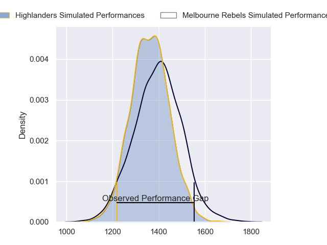
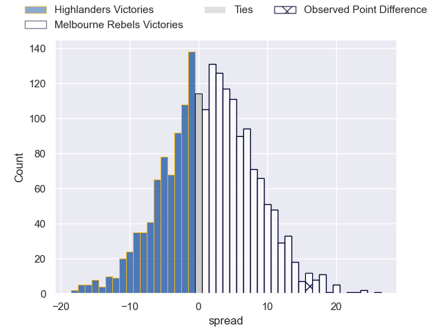
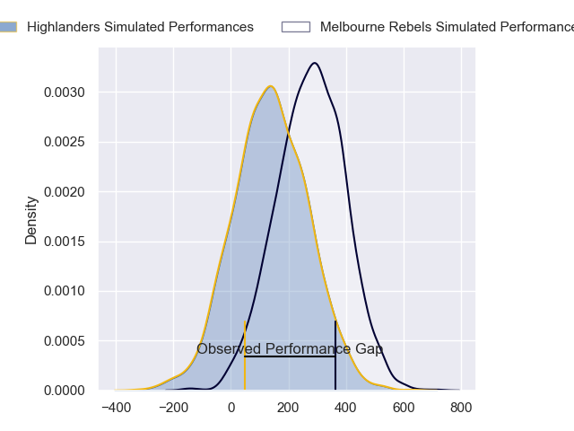
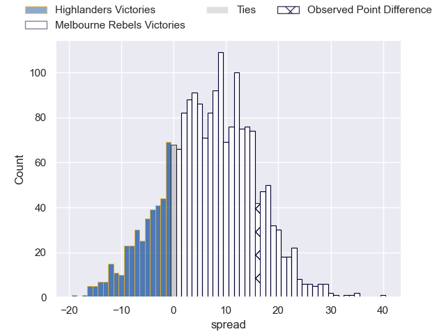
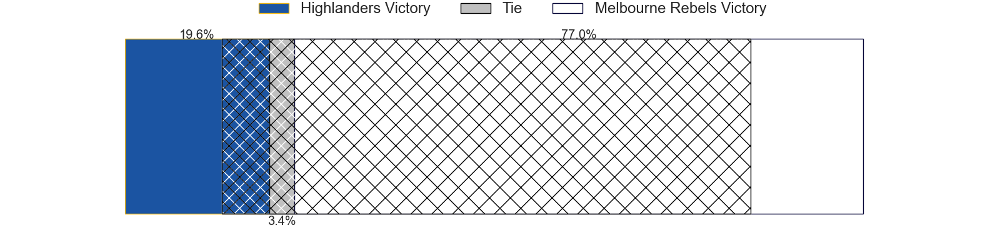

---  
layout: page  
title: Highlanders at Melbourne Rebels; 31-47  
date: 2024-04-13 18:00:00 -0500  
categories: "Super Rugby Pacific 2024" match review  
---
# Highlanders at Melbourne Rebels; 31-47

# Club Level Predictions

The first set of predictions treats a club as the smallest object, as the club develops its members, organizes a gameplan, and deploys its players as needed for each match. This club model has a prediction of 0.548, which translates to predicting Melbourne Rebels to win by 1.7.

Our Over/Under is 51.5 - and combined with the spread above, we have a predicted scoreline of 25 to 26

Each club has a rating and a rating deviation (similar to a Glicko rating), and expected performances can be generated. This allows for simulated matches and spreads like the ones below.
## Projected Performances - Club Model

## Projected Spreads - Club Model

## Projected Results - Club Model

# Player Level Predictions - Version 2

Treating teams instead as an entity made up of the currently active players, I have ratings for each player in an altogether different system. These can be combined to form team ratings once teamsheets are announced, weighting starters a bit higher than the reserves. After the match is played, players can be weighted by their minutes on the field, allowing for an accurate measure of the team's composition. With these compiled team ratings, we can make predictions, measure inaccuracy, and update the individual player ratings.
## Prediction without Player Minutes: Melbourne Rebels by 7.4

Melbourne Rebels by 3.8 on a neutral pitch

## Projected Performances - Player Model

## Projected Spreads - Player Model

## Projected Results - Player Model

|   Away Minutes | Away Player                   |   Away Percentile |   Number |   Home Percentile | Home Player          |   Home Minutes |
|---------------:|:------------------------------|------------------:|---------:|------------------:|:---------------------|---------------:|
|             47 | Dan Lienert-Brown             |             13.82 |        1 |             86.94 | Matt Gibbon          |             46 |
|             58 | Henry Bell                    |             15.13 |        2 |             59.72 | Jordan Uelese        |             41 |
|             73 | Saula Ma'u                    |             18.59 |        3 |             48.9  | Sam Talakai          |             46 |
|             80 | Oliver Haig                   |             40.49 |        4 |             80.86 | Tuaina Taii Tualima  |             61 |
|             62 | Pari Pari Parkinson           |             96.89 |        5 |             18.18 | Lukhan Salakaia-Loto |             80 |
|             80 | Sean Withy                    |              7.19 |        6 |             30.16 | Josh Kemeny          |             65 |
|             80 | Billy Harmon                  |             43.98 |        7 |             66.94 | Maciu Nabolakasi     |             80 |
|             58 | Nikora Broughton              |             24.32 |        8 |             43    | Vaiolini Ekuasi      |             80 |
|             73 | Folau Fakatava                |             41.05 |        9 |             96.21 | Ryan Louwrens        |             80 |
|             80 | Ajay Faleafaga                |             23.33 |       10 |             73.85 | Carter Gordon        |             80 |
|             62 | Jona Nareki                   |             75.9  |       11 |             73.76 | Darby Lancaster      |             80 |
|             80 | Sam Gilbert                   |             14.32 |       12 |             65.53 | David Feliuai        |             50 |
|             80 | Tanielu Tele'a                |             29.13 |       13 |             94.9  | Filipo Daugunu       |             74 |
|             80 | Timoci Tavatavanawai          |             12.05 |       14 |             47.86 | Lachie Anderson      |             61 |
|             80 | Jacob Ratumaitavuki-Kneepkens |             93.48 |       15 |             81.95 | Andrew Kellaway      |             80 |
|             22 | Ricky Jackson                 |             30.84 |       16 |             51.28 | Alex Mafi            |             39 |
|             33 | Ethan de Groot                |             53.1  |       17 |             44.9  | Isaac Aedo Kailea    |             34 |
|              7 | Rohan Wingham                 |            nan    |       18 |             97.14 | Taniela Tupou        |             34 |
|             18 | Hugo Plummer                  |             35.29 |       19 |             50    | Angelo Smith         |             19 |
|             22 | Will Stodart                  |            nan    |       20 |            nan    | Daniel Maiava        |             15 |
|              7 | James Arscott                 |              6.53 |       21 |             38.53 | Jack Maunder         |              6 |
|             76 | Matt Whaanga                  |             20.87 |       22 |             70.87 | Matt Proctor         |             19 |
|             18 | Connor Garden-Bachop          |             31.58 |       23 |             62.41 | Nick Jooste          |             30 |

