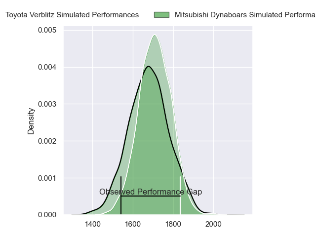
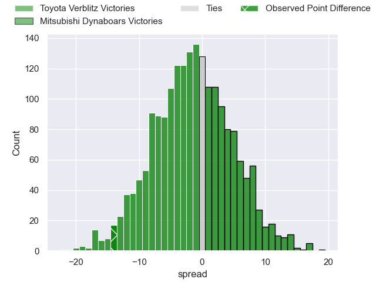
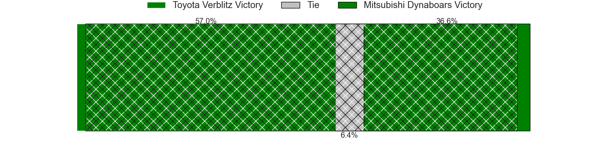
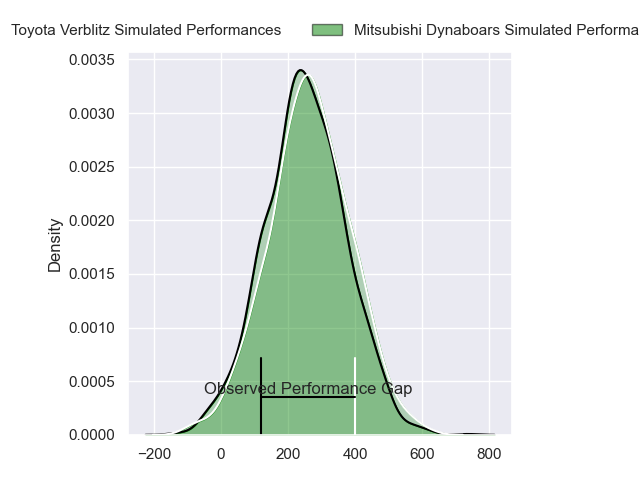
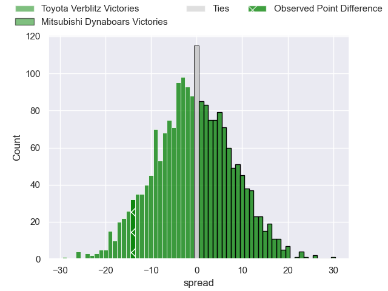
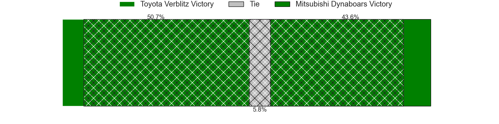

---  
layout: page  
title: Toyota Verblitz at Mitsubishi Dynaboars; 34-20  
date: 2024-04-13 18:00:00 -0500  
categories: "Japan Rugby League One 2023" match review  
---
# Toyota Verblitz at Mitsubishi Dynaboars; 34-20

# Club Level Predictions

The first set of predictions treats a club as the smallest object, as the club develops its members, organizes a gameplan, and deploys its players as needed for each match. This club model has a prediction of 0.453, which translates to predicting Toyota Verblitz to win by 1.7.

Our Over/Under is 68.5 - and combined with the spread above, we have a predicted scoreline of 35 to 33

Each club has a rating and a rating deviation (similar to a Glicko rating), and expected performances can be generated. This allows for simulated matches and spreads like the ones below.
## Projected Performances - Club Model

## Projected Spreads - Club Model

## Projected Results - Club Model

# Player Level Predictions - Version 2

Treating teams instead as an entity made up of the currently active players, I have ratings for each player in an altogether different system. These can be combined to form team ratings once teamsheets are announced, weighting starters a bit higher than the reserves. After the match is played, players can be weighted by their minutes on the field, allowing for an accurate measure of the team's composition. With these compiled team ratings, we can make predictions, measure inaccuracy, and update the individual player ratings.
## Prediction without Player Minutes: Mitsubishi Dynaboars by 0.3

Toyota Verblitz by 2.5 on a neutral pitch

## Projected Performances - Player Model

## Projected Spreads - Player Model

## Projected Results - Player Model

|   Away Minutes | Away Player          |   Away Percentile |   Number |   Home Percentile | Home Player            |   Home Minutes |
|---------------:|:---------------------|------------------:|---------:|------------------:|:-----------------------|---------------:|
|             63 | Shogo Miura          |             91.71 |        1 |             14.39 | Mototsugu Hachiya      |             67 |
|             63 | Ryusei Kato          |             62.48 |        2 |             76.03 | Yoshimitsu Yasue       |             67 |
|             45 | Runya Choi           |             87.99 |        3 |             42.99 | Kanzo Schinckel        |             70 |
|             80 | Josh Dickson         |             45.93 |        4 |             69.98 | Walt Steenkamp         |             67 |
|             74 | Daichi Akiyama       |             73.44 |        5 |             10.77 | Epineri Uluiviti       |             69 |
|             67 | Will Tupou           |             15.78 |        6 |             78.07 | Kyo Yoshida            |             80 |
|             80 | Kazuki Himeno        |             71.35 |        7 |             31.09 | Yusuke Sakamoto        |             80 |
|             80 | Pieter-Steph du Toit |             85.26 |        8 |             72.24 | Jackson Hemopo         |             80 |
|             69 | Aaron Smith          |             96.42 |        9 |             78.11 | Kota Iwamura           |             67 |
|             80 | Beauden Barrett      |            100    |       10 |             67.18 | James Grayson          |             67 |
|             69 | Yuichiro Wada        |             54.73 |       11 |             69.71 | Honeti Taumoha'apai    |             69 |
|             80 | Charlie Lawrence     |             89.08 |       12 |             29.73 | Tonishio Vaiahu        |             80 |
|             80 | Siosaia Fifita       |              0.97 |       13 |             52.06 | Matt Vaega             |             80 |
|             52 | Shuhei Yamaguchi     |             61.94 |       14 |             58.67 | Ben Paltridge          |             80 |
|             80 | Taichi Takahashi     |             83.96 |       15 |             10.53 | Kazuki Ishida          |             80 |
|             35 | Yusuke Kizu          |             46.52 |       16 |             88.21 | Jack Stratton          |             13 |
|             28 | Yuki Okada           |             86.6  |       17 |             53.76 | Brackin Karauria-Henry |             13 |
|             17 | Ryuhei Arita         |            nan    |       18 |             39.1  | Yuki Miyazato          |             13 |
|             17 | Shunsuke Asaoka      |            nan    |       19 |             22.6  | Marino Mikaele-Tu'u    |             13 |
|             13 | Masato Furukawa      |             55.92 |       20 |              7.24 | Hayato Hosoda          |             13 |
|             11 | Kaito Shigeno        |            nan    |       21 |             31.94 | Daniel Linde           |             11 |
|             11 | Tiaan Falcon         |             83.33 |       22 |            nan    | Ryoto Fukuyama         |             11 |
|              6 | Ryusei Koike         |             58    |       23 |             96.66 | Tomoaki Ishii          |             10 |

