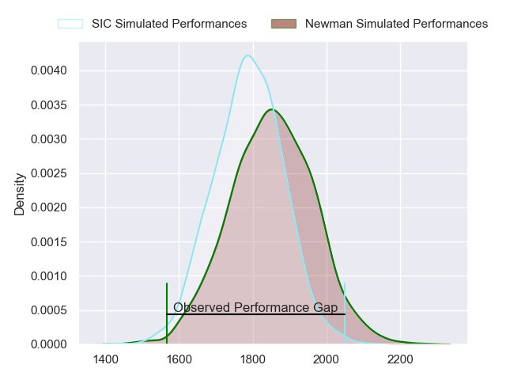
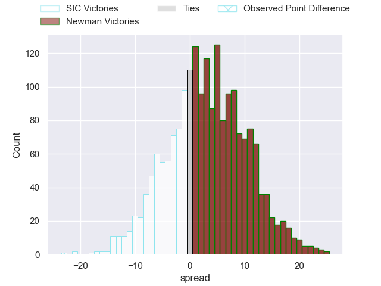
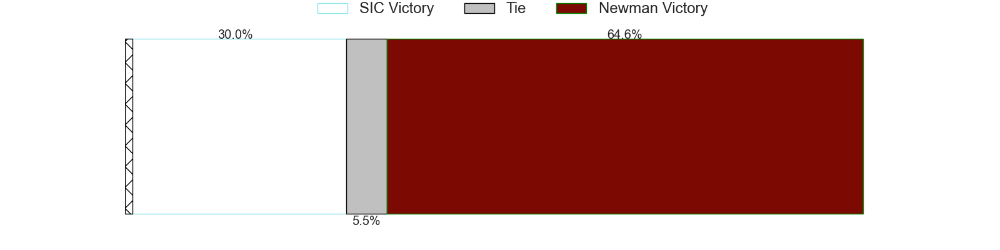
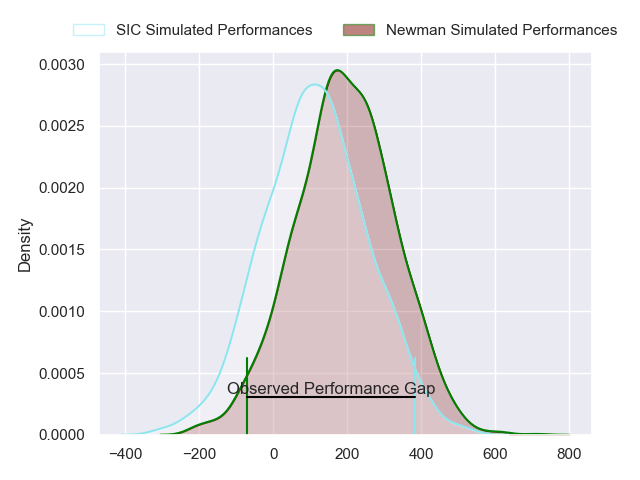
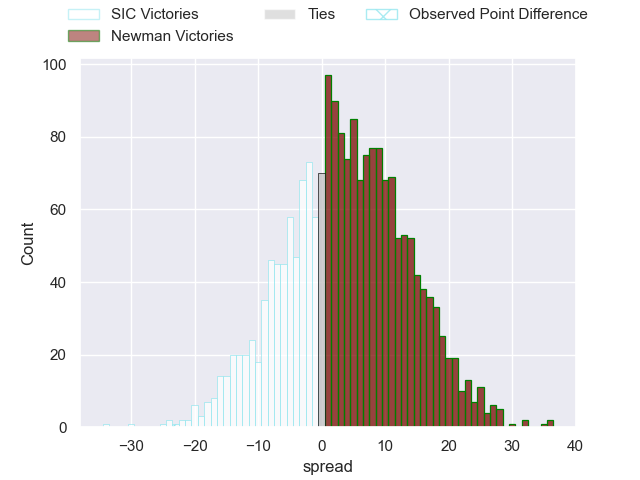
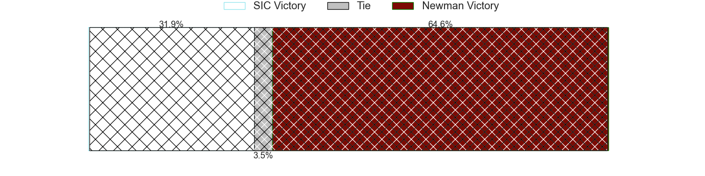

---  
layout: page  
title: SIC at Newman; 35-12  
date: 2024-04-13 18:00:00 -0500  
categories: "URBA Top 12 2024" match review  
---
# SIC at Newman; 35-12

# Club Level Predictions

The first set of predictions treats a club as the smallest object, as the club develops its members, organizes a gameplan, and deploys its players as needed for each match. This club model has a prediction of 0.585, which translates to predicting Newman to win by 3.1.

Our Over/Under is 50.5 - and combined with the spread above, we have a predicted scoreline of 23 to 27

Each club has a rating and a rating deviation (similar to a Glicko rating), and expected performances can be generated. This allows for simulated matches and spreads like the ones below.
## Projected Performances - Club Model

## Projected Spreads - Club Model

## Projected Results - Club Model

# Player Level Predictions - Version 2

Treating teams instead as an entity made up of the currently active players, I have ratings for each player in an altogether different system. These can be combined to form team ratings once teamsheets are announced, weighting starters a bit higher than the reserves. After the match is played, players can be weighted by their minutes on the field, allowing for an accurate measure of the team's composition. With these compiled team ratings, we can make predictions, measure inaccuracy, and update the individual player ratings.
## Prediction without Player Minutes: Newman by 4.1

SIC by 0.0 on a neutral pitch

## Projected Performances - Player Model

## Projected Spreads - Player Model

## Projected Results - Player Model

|   Away Minutes | Away Player                  |   Away Percentile |   Number |   Home Percentile | Home Player               |   Home Minutes |
|---------------:|:-----------------------------|------------------:|---------:|------------------:|:--------------------------|---------------:|
|             80 | Marcos Piccinini             |             82.36 |        1 |             24.59 | Miguel Prince             |             80 |
|             80 | Lucas Rocha                  |             80.35 |        2 |             25.54 | Marcelo Brandi            |             80 |
|             80 | Benjamin Chiappe             |             77.12 |        3 |             21.73 | Bautista Bosch            |             80 |
|             80 | Tomas Borghi                 |             72.49 |        4 |             29.55 | Alejandro Urtubey         |             80 |
|             80 | Bautista Viero               |             77.99 |        5 |             30.26 | Tomas Ureta               |             80 |
|             80 | Andrea Panzarini             |             71.11 |        6 |             19.14 | Mateo Montoya             |             80 |
|             80 | Franco Delger                |             72.97 |        7 |             23.78 | Miguel Urtubey            |             80 |
|             80 | Tomas Meyrelles              |             63.14 |        8 |             24.36 | Joaquin de la Vega        |             80 |
|             80 | Felipe Sascaro               |             74.74 |        9 |             28.21 | Felix Branca              |             80 |
|             80 | Santiago Pavlovsky           |             72.31 |       10 |             24.62 | Gonzalo Guiterrez Taboada |             80 |
|             80 | Nicanor Acosta               |             67.34 |       11 |             22.97 | Agustin Gosio             |             80 |
|             80 | Santos Rubio                 |             71.72 |       12 |             26.09 | Tomas Keena               |             80 |
|             80 | Carlos Piran                 |             62.01 |       13 |             28.64 | Benjamin Lanfranco        |             80 |
|             80 | Franco Moneta                |             77.03 |       14 |             28.83 | Leandro Leivas            |             80 |
|             80 | Jacinto Campbell             |             71.68 |       15 |             23.81 | Francisco Pasman          |             80 |
|              0 | Segundo Rubio                |            nan    |       16 |            nan    | James Wright              |              0 |
|              0 | Ricardo Alberto Macchiavello |            nan    |       17 |            nan    | Isidro Bosch              |              0 |
|              0 | Juan Pedro Olcese            |            nan    |       18 |             48.52 | Luciano Borio             |              0 |
|              0 | Pedro Georgalo               |            nan    |       19 |            nan    | Francisco Shaw            |              0 |
|              0 | Alejo Daireaux               |             59.4  |       20 |             46.44 | Rodrigo Diaz de Vivar     |              0 |
|              0 | Albanase Lucas               |            nan    |       21 |            nan    | Pablo Tezanos Pinto       |              0 |
|              0 | Agustin Sascaro              |            nan    |       22 |            nan    | Carlos Menendez           |              0 |
|              0 | Ramon Martinez Tomietto      |            nan    |       23 |            nan    | Santiago Marolda          |              0 |

